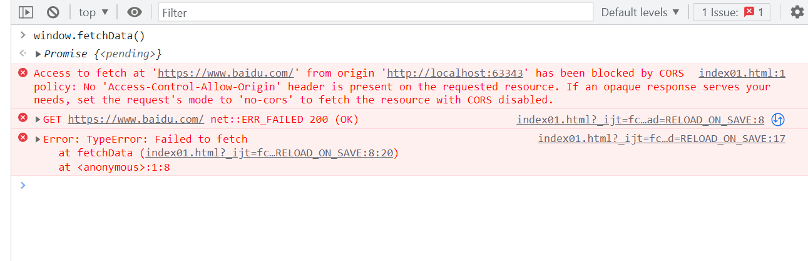

# FAQ1





## 错误描述

```
Access to fetch at 'https://www.baidu.com/' from origin 'http://localhost:63343' has been blocked by CORS policy: No 'Access-Control-Allow-Origin' header is present on the requested resource. If an opaque response serves your needs, set the request's mode to 'no-cors' to fetch the resource with CORS disabled.
```

我提取关键字：CORS policy。翻译过来就是CORS 策略。我想就是CORS 策略上的问题。在往下读：No 'Access-Control-Allow-Origin'。

注意：百度未开放 CORS。也就是说百度的响应头 **没有设置 `Access-Control-Allow-Origin`**，因此浏览器会拦截响应，前端代码无法读取数据。即使请求成功（HTTP 200），你也无法通过 `response.text()` 或 `response.json()` 获取内容。