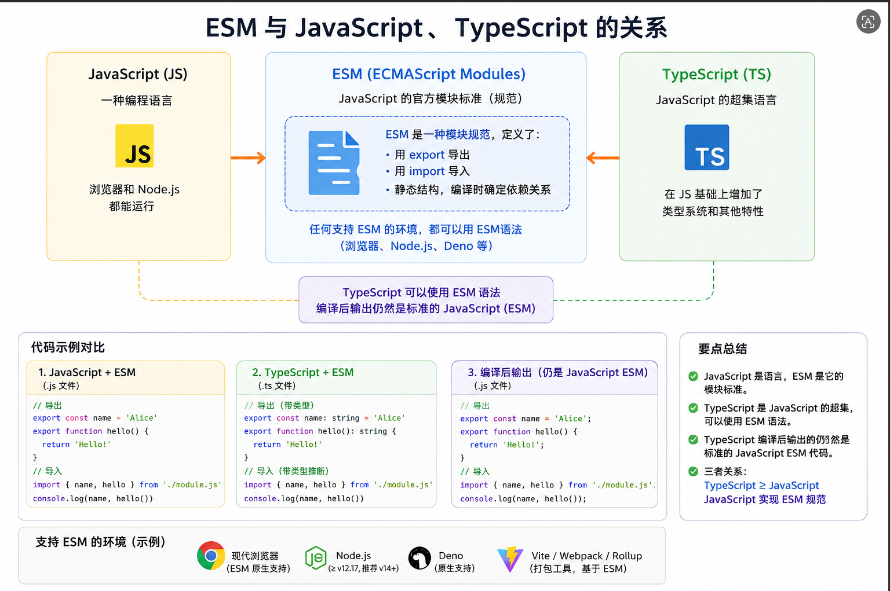

# esm与javaScript、typeScript、node.js、CommonJs是什么样的关系？

```js
JavaScript (JS)
│
├─ 标准语言层面
│   └─ ECMAScript 规范
│       ├─ ES6+ 功能（let/const, class, arrow fn…）
│       └─ ES Modules (ESM)
│           ├─ export / export default
│           └─ import
│
├─ Node.js 运行环境
│   ├─ 支持 CommonJS (require/module.exports)
│   └─ 支持 ESM (import/export, type:"module")
│
└─ 浏览器
    ├─ 支持 ESM (<script type="module">)
    └─ 不支持 CommonJS（必须用打包工具转换）

TypeScript (TS)
│
├─ 是 JavaScript 的超集 (Superset of JS)
│   ├─ 支持类型检查
│   ├─ 支持接口、泛型、枚举等
│   └─ 可以写 ESM 或 CommonJS
│
└─ 编译输出
    ├─ 可以编译成 ESM 的 JS
    │   export default / import
    └─ 可以编译成 CommonJS 的 JS
        module.exports / require
```




、


