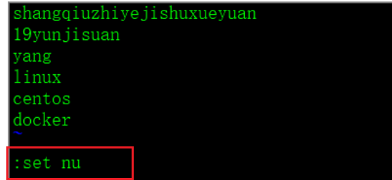
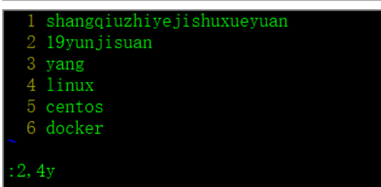
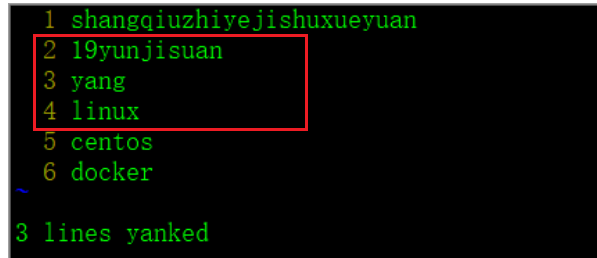
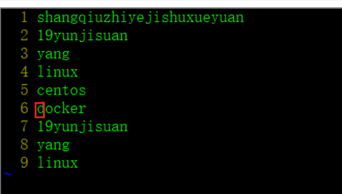
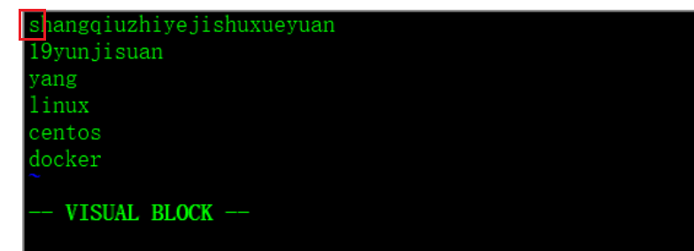
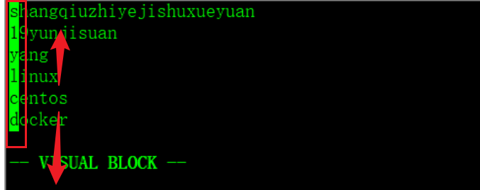
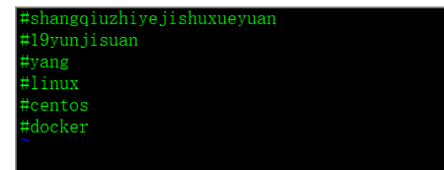
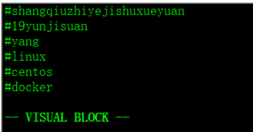
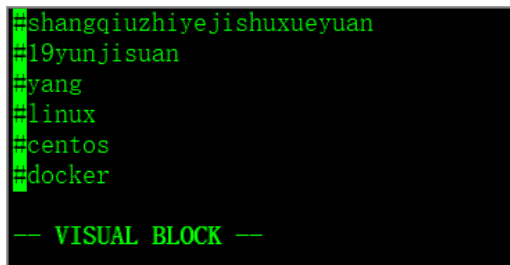
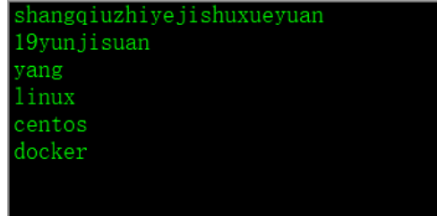

# vim命令

ubuntu、centos都支持。

## 复制粘贴多行语句方法(一)

1. 将光标放在要复制的多行语句**行首**，算出要复制多少行（n）；
2. 输入命令“nyy”（n是要复制的行数）；**注意**：是二个y哟。
3. 将光标移动到粘贴的位置，输入“p”完成粘贴。

## 复制粘贴多行语句方法(二)【快】

1. 在命令模式输入“：set nu”显示行号
2. 通过行号确定要复制的行；
3. 命令输入“：2,4y”，敲回车键复制2~4行
4. 将光标移动到粘贴的位置，输入“p”完成粘贴

第一步：显示行号，命令行模式。

第二步：确定要复制的范围。

第三步：移动光标。

第四步：输入p复制。

## 同时注释多行

1. 首先，将光标放在要注释的行首，然后按CTRL+V进入列**(也叫区块)**模式；
2. 在行首使用上下键选择要注释的多行；
3. 用大写“I”(shift+i)进入插入模式；
4. 然后输入注释符#(任一符号、字母、数字都可以插入)；
5. 最后按下ESC键。(稍等会自动注释)。

第一步：

第二步：

第三步：输入大写的i；

## 删除多行注释

1. 首先，将光标放在要注释的**行首**，然后按CTRL+V进入列(也叫区块)模式；
2. 在行首使用上下键选择要删除注释的多行；
3. 按下“x”或“d”删除；

d是删除常见了。delete。😄

第一步：没有删除前的效果。

第二步：选中的效果。

第三步：按下d或x按钮。

## 删除一行数据

1. 输入dd，直接删除一行数据。

## 撤销

编辑过程中注释、删除、复制、粘贴等操作无意出错都可以用“u”键恢复上一步操作

