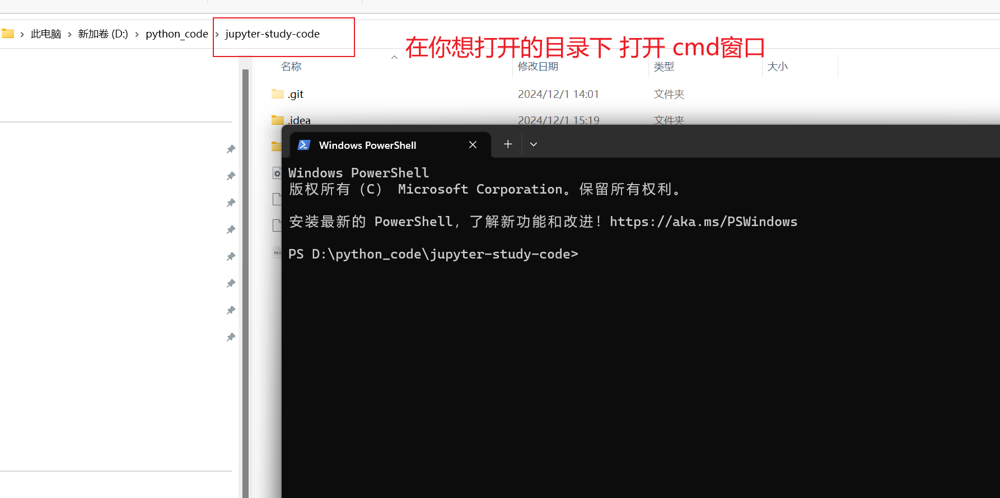

# jupyter的启动

jupyter的安装就不在描述了。直接到官方网站去有完整的安装流程。

我们要怎么正确的启动jupyter呢？




## 启动命令

输入如下的命令：

```powershell
jupyter notebook
```


可以注意下执行上面命令的打印控制台日志描述：

```powershell
[I 2025-03-19 10:51:20.462 LabApp] JupyterLab extension loaded from C:\Users\32802\anaconda3\lib\site-packages\jupyterlab
[I 2025-03-19 10:51:20.462 LabApp] JupyterLab application directory is C:\Users\32802\anaconda3\share\jupyter\lab
[I 10:51:20.462 NotebookApp] Serving notebooks from local directory: D:\python_code\jupyter-study-code
[I 10:51:20.462 NotebookApp] Jupyter Notebook 6.3.0 is running at:
[I 10:51:20.462 NotebookApp] http://localhost:8888/?token=bf63b32299366c9c863740e837993daf8fba99a55fd249dd
[I 10:51:20.462 NotebookApp]  or http://127.0.0.1:8888/?token=bf63b32299366c9c863740e837993daf8fba99a55fd249dd
[I 10:51:20.462 NotebookApp] Use Control-C to stop this server and shut down all kernels (twice to skip confirmation).
[C 10:51:20.605 NotebookApp]

    To access the notebook, open this file in a browser:
        file:///C:/Users/32802/AppData/Roaming/jupyter/runtime/nbserver-70268-open.html
    Or copy and paste one of these URLs:
        http://localhost:8888/?token=bf63b32299366c9c863740e837993daf8fba99a55fd249dd
     or http://127.0.0.1:8888/?token=bf63b32299366c9c863740e837993daf8fba99a55fd249dd

```


