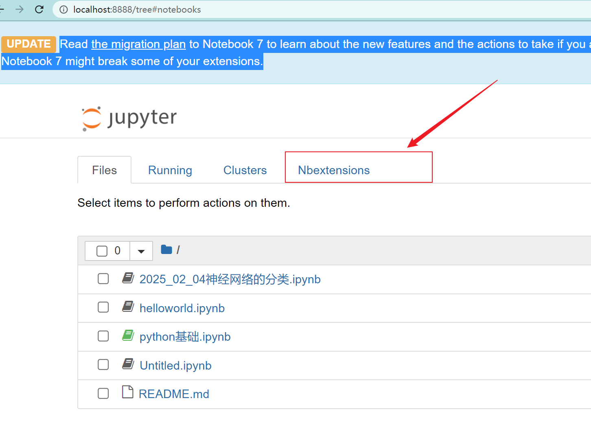
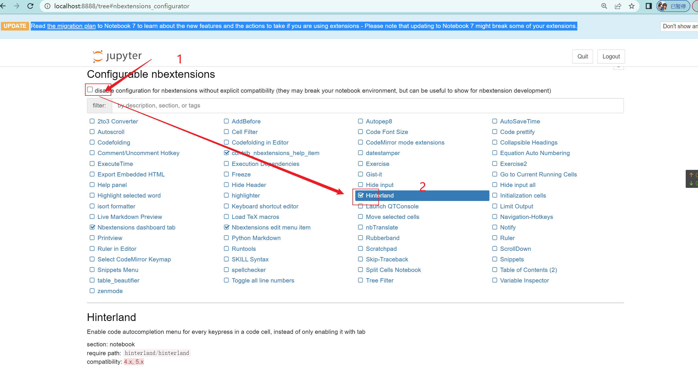
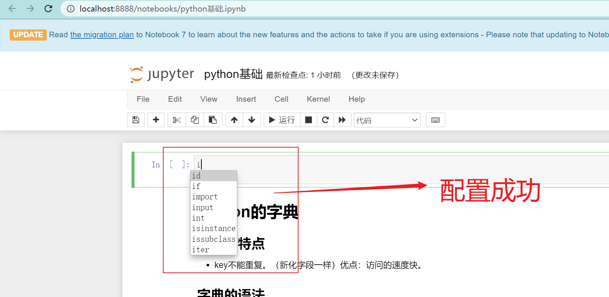

# jupyter的代码提示插件

插件的官方网站：[Installing jupyter_contrib_nbextensions — jupyter_contrib_nbextensions 0.5.0 documentation](https://jupyter-contrib-nbextensions.readthedocs.io/en/latest/install.html)

插件的名字：jupyter_contrib_nbextensions

## 问题的描述

我们在Pycharm编写python的代码的时候都有代码的提示。而我们在jupyter里面编写代码的时候没有代码提示。这个对于新手来说非常的不习惯。所以怎么解决在jupyter里面也有代码补全与提示的功能呢？


## 问题的解决

第一步：我们要在自己本地的电脑上安装jupyter_contrib_nbextensions这个第三方包。

```shell
pip install jupyter_contrib_nbextensions
```

如果上面的命令下载失败就执行下面这个。

```powershell
pip install jupyter_contrib_nbextensions -i https://pypi.mirrors.ustc.edu.cn/simple/
```

如果也没有用，出门左转问deepseek。


第二步：为什么要执行下面命令去插件的官方有答案。

```
jupyter contrib nbextension install --user
```


第三步：注意一定要从新启动jupyter。

```shell
jupyter notebook
```

## 配置jupyter插件

从新启动jupyter后就会多出一个选项栏目。



点击 " Nbextensions"。跳转的页面如下图：





进行如上的1、2操作后。保险下在从新启动下jupyter。


## 测试jupyter插件是否生效




期望效果：可以看到我们输入 “i” 的时候都有提示词了。


