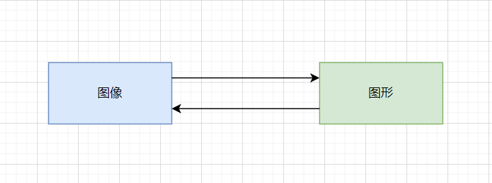

# 计算机视觉

## 图像的基本概念

图像与图形

问：什么是图像？什么是图形？

答：

- 图像是照相机、摄像机、扫描仪等输入设备捕捉实际画面产生的数字图像。
- 图形是用数学规则产生的或有一定规则的图案。特点：可以任意缩放而不会失真。

图像与图形在一定条件下可向另外方转化。

___

数字图像与其特点

问：特点都有哪一些呢？

答：信息量大、占用频带宽大、相关性大。

---

图像的灰度与灰度级

问：灰度与灰度级有区别吗？

答：灰度与灰度级是不同一个概念。灰度（值）表示图像某一个点的亮度值，值越大，像素点越亮，反之越暗。

问：灰度是什么？

答：大白话说：“灰度分为256阶,0表示黑色”。灰度表示没有色彩，RGB颜色全部相等。如看过黑白电视的人就知道。

