# 打包python项目

## 案例需求描述

- 创建一个自己的项目工程结构。
- 打包项目，上传到pypi上。
- 通过pip进行本地安装测试是否发布成功。


## 01)创建包文件

也就是一个工程目录文件结果

```
packaging_tutorial/
├── LICENSE
├── pyproject.toml
├── README.md
├── src/
│   └── example_package_YOUR_USERNAME_HERE/
│       ├── __init__.py
│       └── example.py
└── tests/
```

| 目录与文件名       | 描述           |
| ------------------ | -------------- |
| packaging_tutorial | 工程的根目录   |
| LICENSE            | 开源的协议文件 |
| pyproject.toml     |                |
| README.md          | 介绍项目的文件 |
| src                | 项目的源码目录 |
| tests              | 测试代码目录   |


## 构建

pyproject.toml文件

下面是一个简单无用的案例：配置元数据可以参看。

```
[build-system]
requires = ["hatchling"]
build-backend = "hatchling.build"
```


## 02)配置元数据

```toml
[project]
name = "tunan_ground"
version = "0.0.1"
authors = [
  { name="wutunan", email="19970694323@163.com" },
]
description = "wutunan say hello"
readme = "README.md"
requires-python = ">=3.7"
classifiers = [
    "Programming Language :: Python :: 3",
    "License :: OSI Approved :: MIT License",
    "Operating System :: OS Independent",
]

[project.urls]
Homepage = "https://github.com/pypa/sampleproject"
Issues = "https://github.com/pypa/sampleproject/issues"
```


## 创建README.md

```shell
# Example Package

This is a simple example package. You can use
[GitHub-flavored Markdown](https://guides.github.com/features/mastering-markdown/)
to write your content.
```


## 03)生成分发存档

- 第一步：确保pip是否是最新。

下一步是为包生成[分发包](https://packaging.python.org/en/latest/glossary/#term-Distribution-Package)。这些是上传到 Python 的存档 包索引，可以通过 [pip](https://packaging.python.org/en/latest/key_projects/#pip) 安装。

确保您安装了最新版本的 PyPA [版本](https://packaging.python.org/en/latest/key_projects/#build)：

```
py -m pip install --upgrade build
```

- 第二步构建

现在，从所在的同一目录运行此命令：pyproject.toml

```
py -m build
```

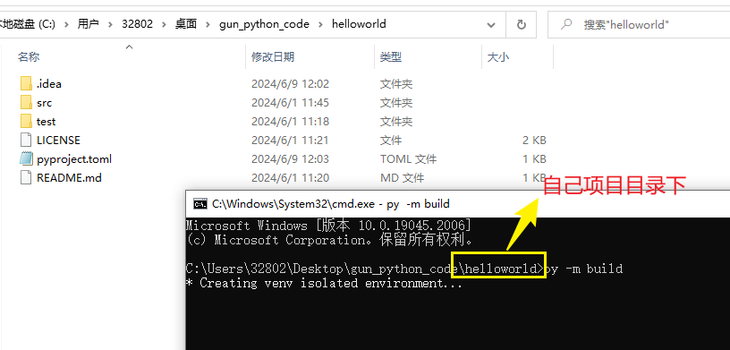

此命令应输出大量文本，完成后应生成两个 目录中的文件：`dist`

```
dist/
├── example_package_YOUR_USERNAME_HERE-0.0.1-py3-none-any.whl
└── example_package_YOUR_USERNAME_HERE-0.0.1.tar.gz
```

**开始构建的过程日志**

```shell
## 开始构建
C:\Users\32802\Desktop\gun_python_code\helloworld>py -m build

* Creating venv isolated environment...
* Installing packages in isolated environment... (setuptools >= 40.8.0)
* Getting build dependencies for sdist...
running egg_info
creating src\tunan_ground.egg-info
writing src\tunan_ground.egg-info\PKG-INFO
writing dependency_links to src\tunan_ground.egg-info\dependency_links.txt
writing top-level names to src\tunan_ground.egg-info\top_level.txt
writing manifest file 'src\tunan_ground.egg-info\SOURCES.txt'
reading manifest file 'src\tunan_ground.egg-info\SOURCES.txt'
adding license file 'LICENSE'
writing manifest file 'src\tunan_ground.egg-info\SOURCES.txt'
* Building sdist...
running sdist
running egg_info
writing src\tunan_ground.egg-info\PKG-INFO
writing dependency_links to src\tunan_ground.egg-info\dependency_links.txt
writing top-level names to src\tunan_ground.egg-info\top_level.txt
reading manifest file 'src\tunan_ground.egg-info\SOURCES.txt'
adding license file 'LICENSE'
writing manifest file 'src\tunan_ground.egg-info\SOURCES.txt'
running check
creating tunan_ground-0.0.1
creating tunan_ground-0.0.1\src
creating tunan_ground-0.0.1\src\tunan_ground
creating tunan_ground-0.0.1\src\tunan_ground.egg-info
creating tunan_ground-0.0.1\test
copying files to tunan_ground-0.0.1...
copying LICENSE -> tunan_ground-0.0.1
copying README.md -> tunan_ground-0.0.1
copying pyproject.toml -> tunan_ground-0.0.1
copying src\tunan_ground\__init__.py -> tunan_ground-0.0.1\src\tunan_ground
copying src\tunan_ground\say_hello.py -> tunan_ground-0.0.1\src\tunan_ground
copying src\tunan_ground.egg-info\PKG-INFO -> tunan_ground-0.0.1\src\tunan_ground.egg-info
copying src\tunan_ground.egg-info\SOURCES.txt -> tunan_ground-0.0.1\src\tunan_ground.egg-info
copying src\tunan_ground.egg-info\dependency_links.txt -> tunan_ground-0.0.1\src\tunan_ground.egg-info
copying src\tunan_ground.egg-info\top_level.txt -> tunan_ground-0.0.1\src\tunan_ground.egg-info
copying test\test01.py -> tunan_ground-0.0.1\test
Writing tunan_ground-0.0.1\setup.cfg
Creating tar archive
removing 'tunan_ground-0.0.1' (and everything under it)
* Building wheel from sdist
* Creating venv isolated environment...
* Installing packages in isolated environment... (setuptools >= 40.8.0)
* Getting build dependencies for wheel...
running egg_info
writing src\tunan_ground.egg-info\PKG-INFO
writing dependency_links to src\tunan_ground.egg-info\dependency_links.txt
writing top-level names to src\tunan_ground.egg-info\top_level.txt
reading manifest file 'src\tunan_ground.egg-info\SOURCES.txt'
adding license file 'LICENSE'
writing manifest file 'src\tunan_ground.egg-info\SOURCES.txt'
* Installing packages in isolated environment... (wheel)
* Building wheel...
running bdist_wheel
running build
running build_py
creating build
creating build\lib
creating build\lib\tunan_ground
copying src\tunan_ground\say_hello.py -> build\lib\tunan_ground
copying src\tunan_ground\__init__.py -> build\lib\tunan_ground
running egg_info
writing src\tunan_ground.egg-info\PKG-INFO
writing dependency_links to src\tunan_ground.egg-info\dependency_links.txt
writing top-level names to src\tunan_ground.egg-info\top_level.txt
reading manifest file 'src\tunan_ground.egg-info\SOURCES.txt'
adding license file 'LICENSE'
writing manifest file 'src\tunan_ground.egg-info\SOURCES.txt'
installing to build\bdist.win-amd64\wheel
running install
running install_lib
creating build\bdist.win-amd64
creating build\bdist.win-amd64\wheel
creating build\bdist.win-amd64\wheel\tunan_ground
copying build\lib\tunan_ground\say_hello.py -> build\bdist.win-amd64\wheel\.\tunan_ground
copying build\lib\tunan_ground\__init__.py -> build\bdist.win-amd64\wheel\.\tunan_ground
running install_egg_info
Copying src\tunan_ground.egg-info to build\bdist.win-amd64\wheel\.\tunan_ground-0.0.1-py3.7.egg-info
running install_scripts
creating build\bdist.win-amd64\wheel\tunan_ground-0.0.1.dist-info\WHEEL
creating 'C:\Users\32802\Desktop\gun_python_code\helloworld\dist\.tmp-vl9gcgme\tunan_ground-0.0.1-py3-none-any.whl' and adding 'build\bdist.win-amd64\wheel' to it
adding 'tunan_ground/__init__.py'
adding 'tunan_ground/say_hello.py'
adding 'tunan_ground-0.0.1.dist-info/LICENSE'
adding 'tunan_ground-0.0.1.dist-info/METADATA'
adding 'tunan_ground-0.0.1.dist-info/WHEEL'
adding 'tunan_ground-0.0.1.dist-info/top_level.txt'
adding 'tunan_ground-0.0.1.dist-info/RECORD'
removing build\bdist.win-amd64\wheel
Successfully built tunan_ground-0.0.1.tar.gz and tunan_ground-0.0.1-py3-none-any.whl
```


## 上传分发存档到【testPyPI】

::: tip 测试用的

- testPyPI是测试使用的环境，注意：包发布后是不可以进行修改的。谨慎操作！

:::

- 注册TestPyPI 帐户

您需要做的第一件事是在 TestPyPI 上注册一个帐户，这是用于测试和实验的包索引的单独实例。对于像本教程这样我们不一定想上传到实际索引的事情来说，这非常有用。要注册帐户，请转到 https://test.pypi.org/account/register/ 并完成该页面上的步骤。您还需要验证您的电子邮件地址，然后才能上传任何包裹。有关详细信息，请参阅使用 TestPyPI。

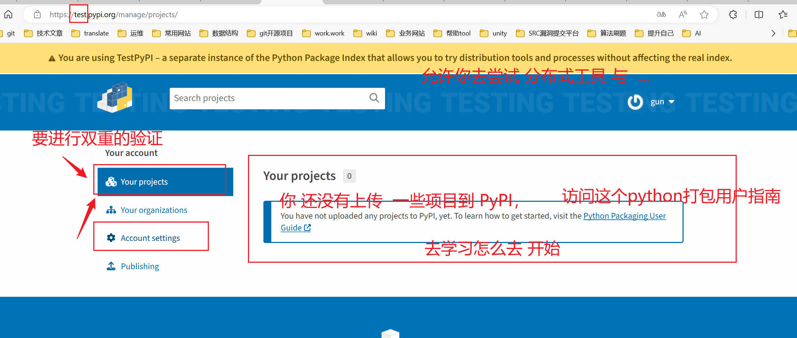


- 安全上传

若要安全地上传项目，需要 PyPI API 令牌。在 https://test.pypi.org/manage/account/#api-tokens 创建一个，将“范围”设置为“整个帐户”。在复制并保存令牌之前，不要关闭页面，因为您将不会再看到该令牌。


创建token


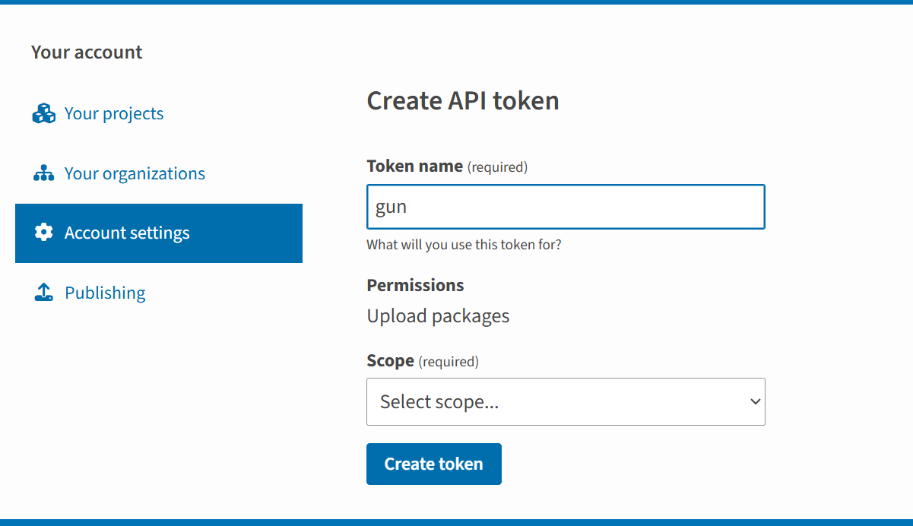


- 成功创建token

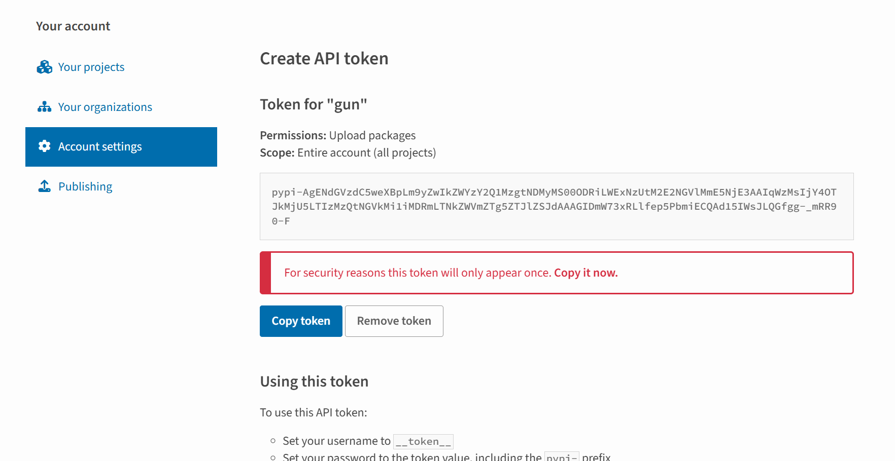


上传分发包，需要安装Twine

```shell
py -m pip install --upgrade twine
```


安装后，运行 Twine ，并上传以下所有存档：`dist`\

windows

```shell
py -m twine upload --repository testpypi dist/*
```

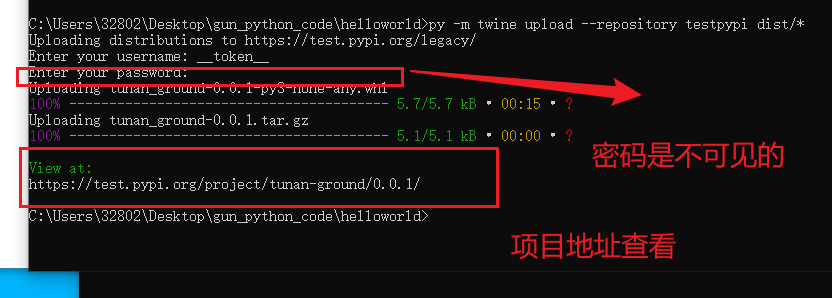


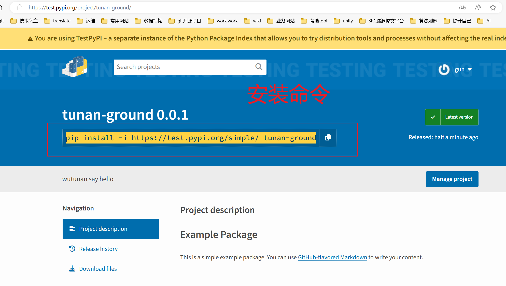


## 04)上传包到pypi

- 进行上传。注意：testpypi改为：pypi。【与上传testpypi环境同理】

```shell
py -m twine upload --repository pypi dist/*
```

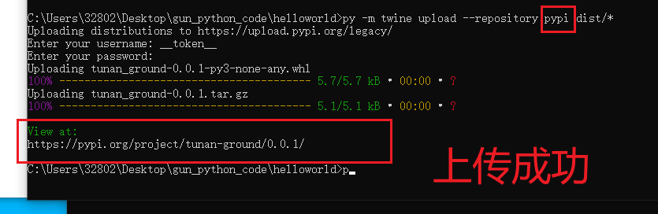


- 输入账号密码

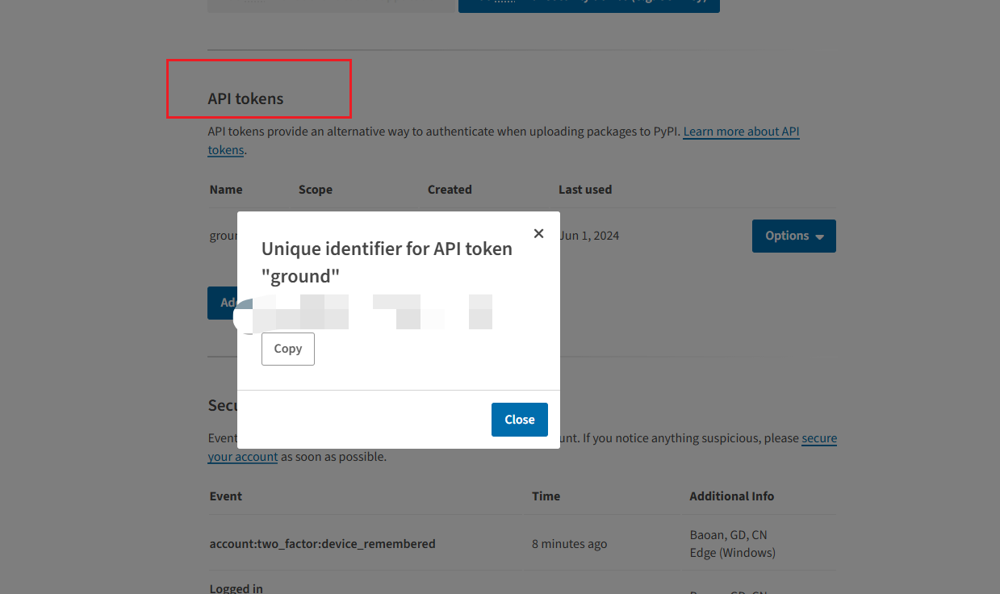


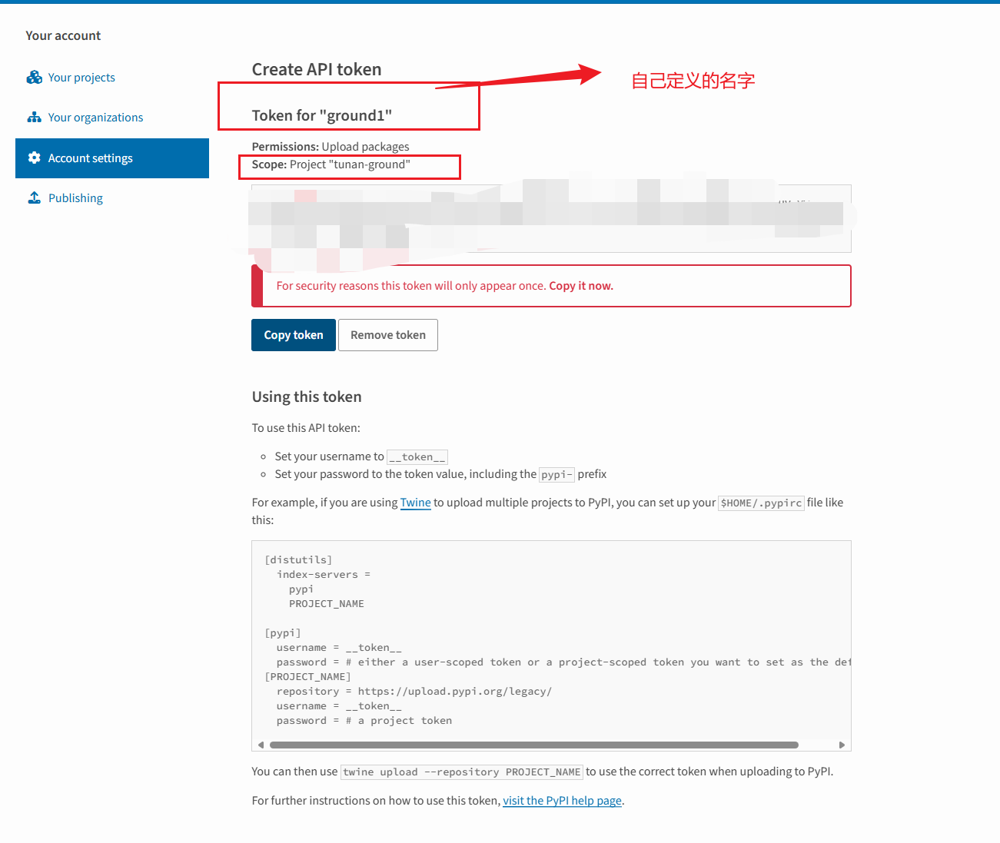

- 怎么去使用这个token。

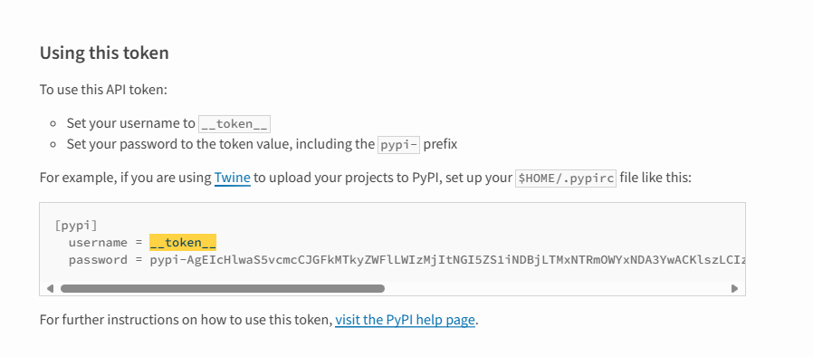

- 上传自己写的包到pypi上。登入账号去管理后台查看。

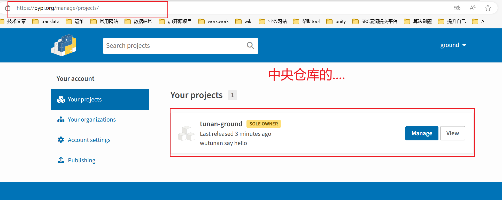


## 05)测试

- 用例代码

```python
from tunan_ground import say_hello

if __name__ == '__main__':
    say_hello.say_hello()
```

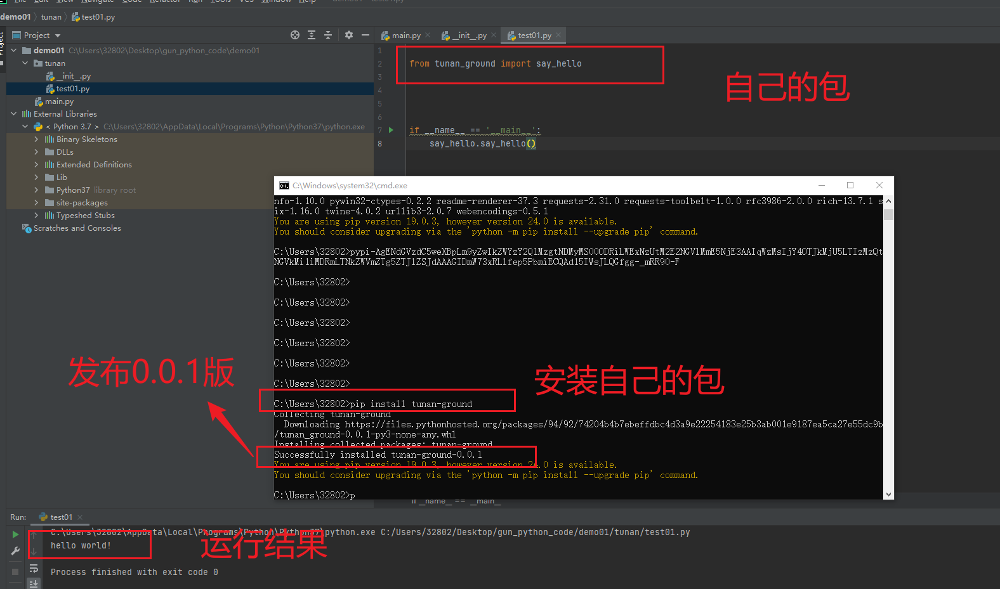


## 06项目源码编写注释

- 在自己创建的helloword工程目录中；源码方法编写注释发布到pypi上。
- 在通过pip安装自己的项目模块。

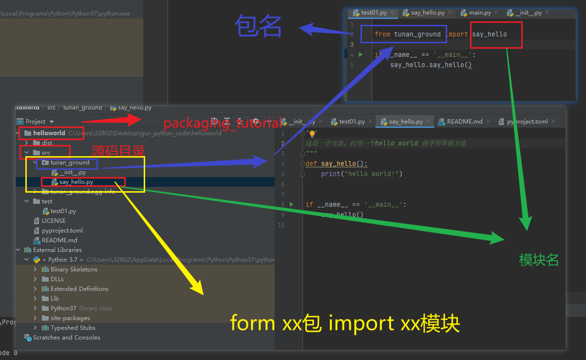


- 测试效果

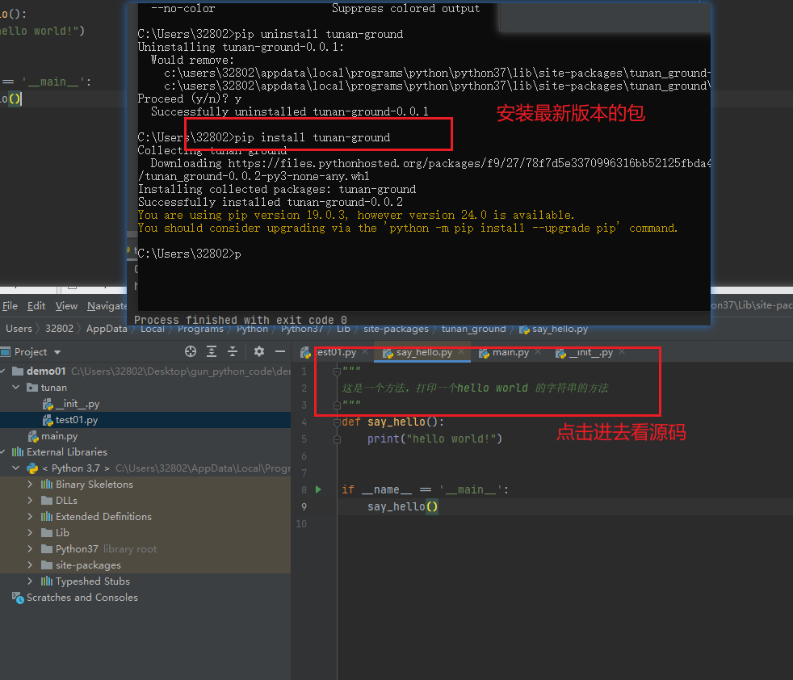


