# 创建pythonn的web项目入门


## 万事开头难

**需求描述：**

第一个项目，写一个简单的web服务器，能接收客户端发送过来的图片，并且能进行本地化保存到指定文件夹下。


**目标：**

熟悉python在web领域的开发过程。

熟悉怎么使用python建项目。

熟悉python怎么打包项目并发布、部署。


## 01)创建一个项目


注意：使用windowns安装的python环境：

Python 提供了一个命令行工具来查询 Python 的安装路径。在 Windows 下按下 `Win + R` 组合键打开运行窗口，然后输入 `cmd` 回车，打开命令行窗口。在命令行中输入以下命令：

```
python -c "import sys; print(sys.executable)"
```

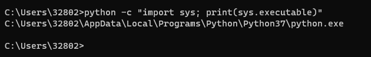


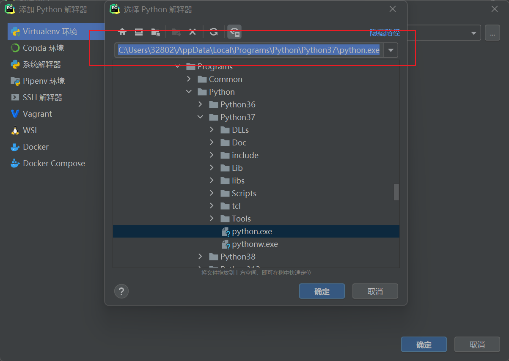

```
C:\Users\32802\AppData\Local\Programs\Python\Python37\python.exe
```


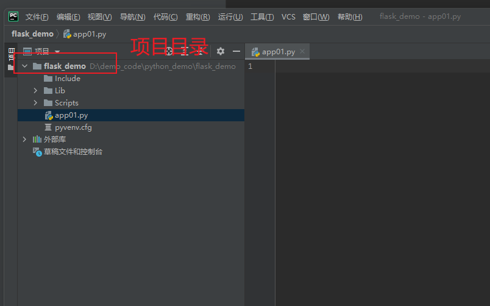


::; 注意

现在python使用的环境是虚拟环境。打开：

:::

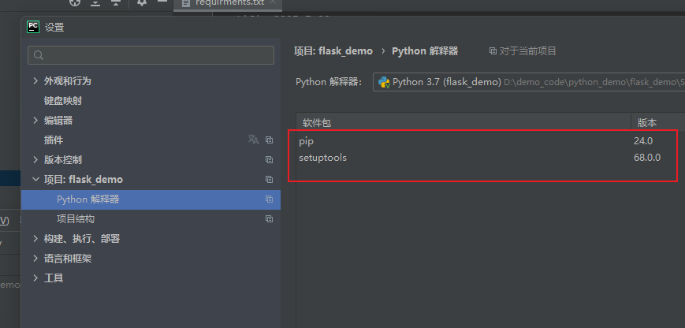


## 02)检查pip版本

使用·是·python环境是Python 3.7.4

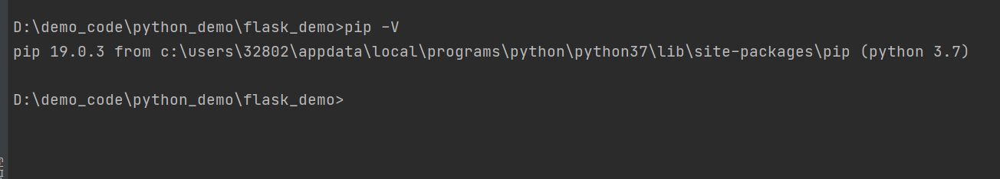

```python
pip -V
```


更新pip命令如下：

```shell
pip install --upgrade pip
```

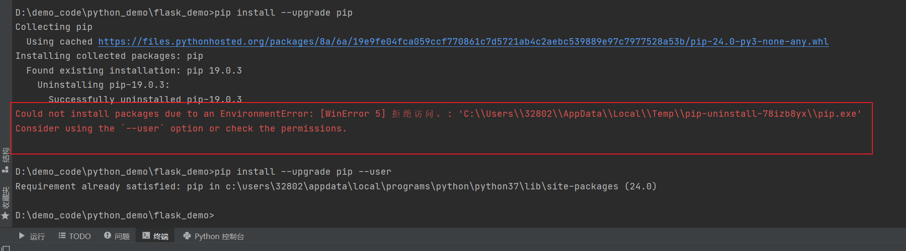

```shell
Could not install packages due to an EnvironmentError: [WinError 5] 拒绝访问。: 'C:\\Users\\32802\\AppData\\Local\\Temp\\pip-uninstall-78izb8yx\\pip.exe'
Consider using the `--user` option or check the permissions.
```

解决方案1

```shell
pip install --upgrade pip --user
```


解决方案2

Run CMD as an administrator

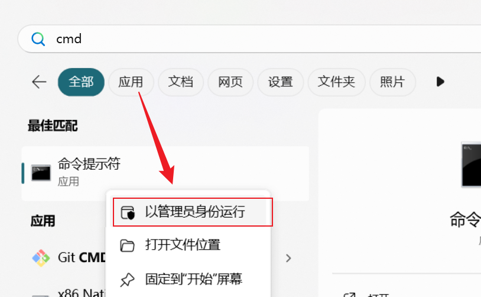


问题的描述：

原因就是：**我们没有安装包所需的权限时，会出现错误“Could not install packages due to an EnvironmentError： [WinError 5] Access is denied”。**

**要解决此错误，请使用 `--user` 选项运行命令，例如 `pip install tensorflow-gpu --user` .**


验证是否更新成功，19.0.3-24.0最新的pip的版本。

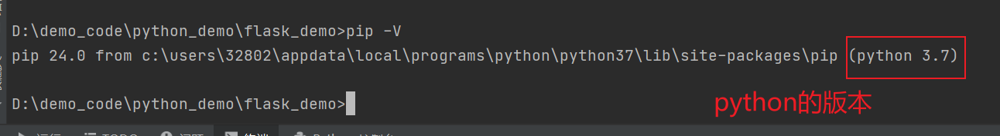

## 03)初始化项目

创建第一个文件app01.py


创建包管理文件

```
requirments.txt
```

`注意：`在项目的根目录下创建。


添加flask依赖。

```
Flask
```

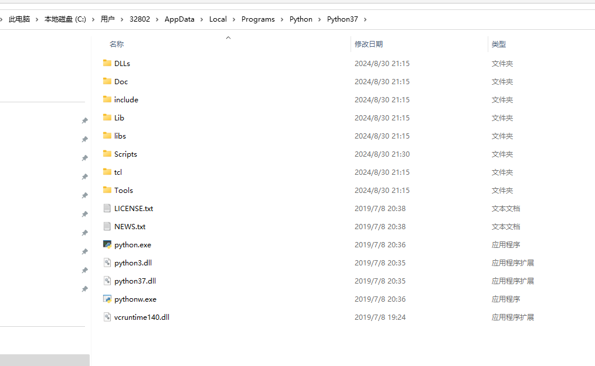


安装flask

```shell
pip install flask
```

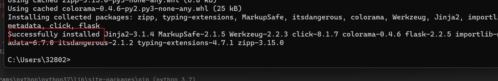


安装flask 都将包安装到哪里呢？

第一步：打开python解释器的根目录，找到lib目录。

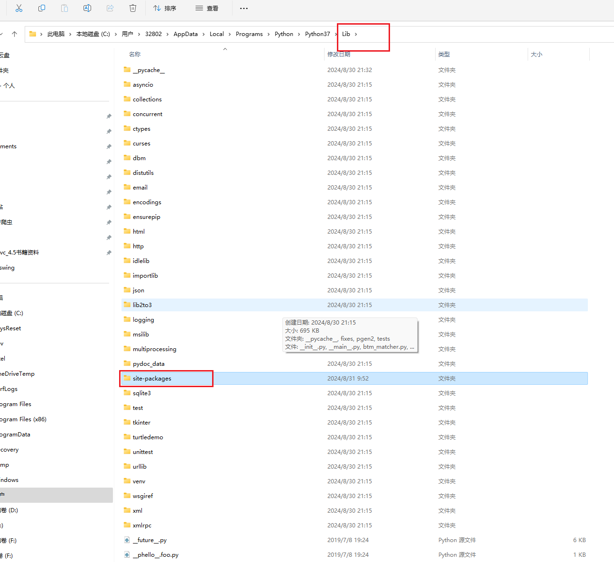


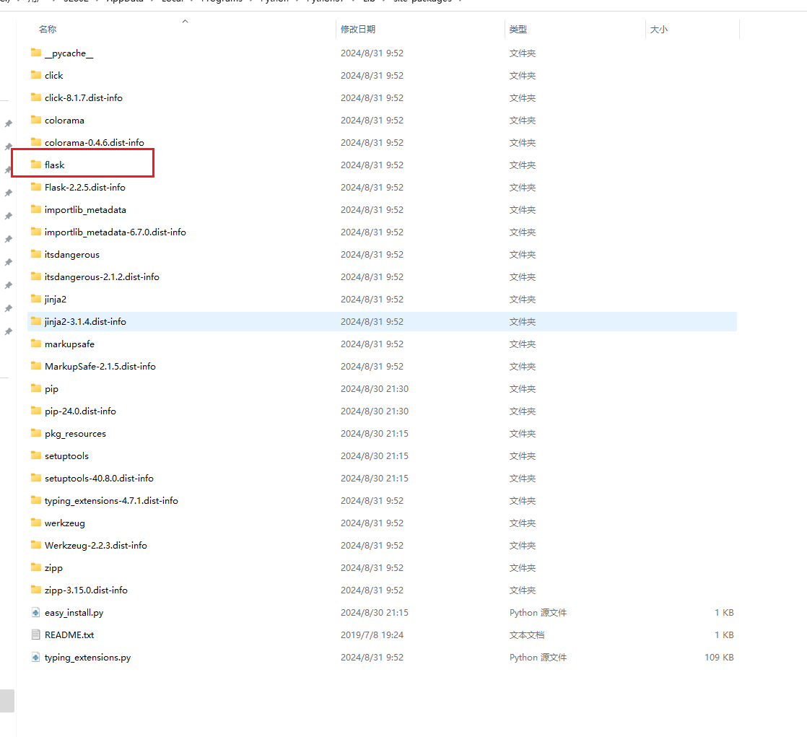

安装flask的日志。提取安装的包的名字。

```
C:\Users\32802>pip install flask
Collecting flask
  Using cached Flask-2.2.5-py3-none-any.whl.metadata (3.9 kB)
Collecting Werkzeug>=2.2.2 (from flask)
  Using cached Werkzeug-2.2.3-py3-none-any.whl.metadata (4.4 kB)
Collecting Jinja2>=3.0 (from flask)
  Using cached jinja2-3.1.4-py3-none-any.whl.metadata (2.6 kB)
Collecting itsdangerous>=2.0 (from flask)
  Using cached itsdangerous-2.1.2-py3-none-any.whl.metadata (2.9 kB)
Collecting click>=8.0 (from flask)
  Using cached click-8.1.7-py3-none-any.whl.metadata (3.0 kB)
Collecting importlib-metadata>=3.6.0 (from flask)
  Using cached importlib_metadata-6.7.0-py3-none-any.whl.metadata (4.9 kB)
Collecting colorama (from click>=8.0->flask)
  Using cached colorama-0.4.6-py2.py3-none-any.whl.metadata (17 kB)
Collecting zipp>=0.5 (from importlib-metadata>=3.6.0->flask)
  Using cached zipp-3.15.0-py3-none-any.whl.metadata (3.7 kB)
Collecting typing-extensions>=3.6.4 (from importlib-metadata>=3.6.0->flask)
  Using cached typing_extensions-4.7.1-py3-none-any.whl.metadata (3.1 kB)
Collecting MarkupSafe>=2.0 (from Jinja2>=3.0->flask)
  Using cached MarkupSafe-2.1.5-cp37-cp37m-win_amd64.whl.metadata (3.1 kB)
Using cached Flask-2.2.5-py3-none-any.whl (101 kB)
Using cached click-8.1.7-py3-none-any.whl (97 kB)
Using cached importlib_metadata-6.7.0-py3-none-any.whl (22 kB)
Using cached itsdangerous-2.1.2-py3-none-any.whl (15 kB)
Using cached jinja2-3.1.4-py3-none-any.whl (133 kB)
Using cached Werkzeug-2.2.3-py3-none-any.whl (233 kB)
Using cached MarkupSafe-2.1.5-cp37-cp37m-win_amd64.whl (17 kB)
Using cached typing_extensions-4.7.1-py3-none-any.whl (33 kB)
Using cached zipp-3.15.0-py3-none-any.whl (6.8 kB)
Using cached colorama-0.4.6-py2.py3-none-any.whl (25 kB)
Installing collected packages: zipp, typing-extensions, MarkupSafe, itsdangerous, colorama, Werkzeug, Jinja2, importlib-metadata, click, flask
Successfully installed Jinja2-3.1.4 MarkupSafe-2.1.5 Werkzeug-2.2.3 click-8.1.7 colorama-0.4.6 flask-2.2.5 importlib-metadata-6.7.0 itsdangerous-2.1.2 typing-extensions-4.7.1 zipp-3.15.0
```

安装了如下模块。

1. zipp
2. typing-extensions
3. MarkupSafe
4. itsdangerous,
5. colorama
6. Werkzeug
7. Jinja2
8. importlib-metadata
9. click
10. flask

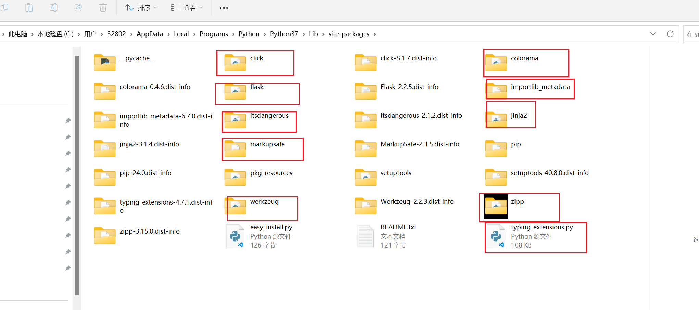


## 04)编写文件上传的代码

python端，使用flask框架编写；

1、创建一个app.py文件；

2、编写如下代码；

```python
# 从目录下导入 ， Flask 模块
from flask import Flask, request, jsonify

# 定义全局变量
port = 11111

app = Flask(__name__)

# 构建接口返回结果
def build_api_result(code, message, data,file_name,ocr_identify_time):
    result = {
        "code": code,
        "message": message,
        "data": data,
        "FileName": file_name,
        "ocrIdentifyTime": ocr_identify_time
    }

    # 对象json化
    return jsonify(result)


@app.route('/upload', methods=['POST'])
def test01():

    print(f"请求url = {request.host_url}")
    print(f"请求文件 = {request.files} 文件的类型 = {type(request.files)}")
    # 校验请求参数
    if 'file' not in request.files:
        return build_api_result(101, "请求参数错误", {},{},{})

    # 返回前端一个字符串
    # return  "liyup"


if __name__ == "__main__":
    # Run
    app.config['JSON_AS_ASCII'] = False
    app.run(host='0.0.0.0', port=port, debug=False, use_reloader=False)
```


前端：上传文件的表单可以使用apifox代替。也可以进行编写前端上传文件的表单。表单内容如下。

```html
<!DOCTYPE html>
<html lang="en">
<head>
    <meta charset="UTF-8">
    <meta name="viewport" content="width=device-width, initial-scale=1.0">
    <title>Document</title>
</head>
<body>
    <form method="post" action="http://127.0.0.1:11111/upload"  enctype="multipart/form-data">
        请选择文件：<input type="file" name="file"/>
        提交：<input type="submit"/>

    </form>
</body>
</html>
```

测试python后台打印的效果。

第一步：用单击上传指定的图片。

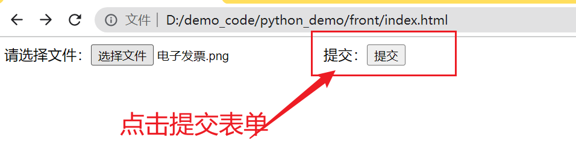


第二步：启动python的服务端，进行测试。


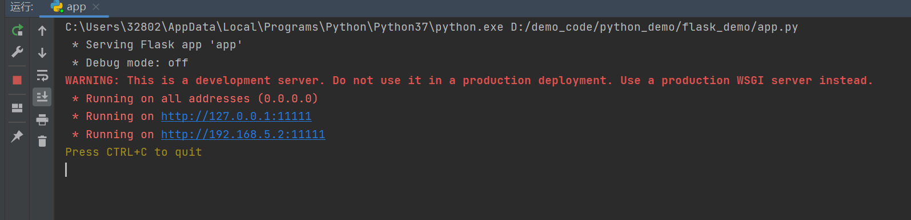


第三步：点击上传按钮，进行文件上传到服务器端。查看答应上传的文件对象是什么？

```python
    print(f"请求文件 = {request.files} 文件的类型 = {type(request.files)}")
```


```
请求文件 = ImmutableMultiDict([('file', <FileStorage: '电子发票.png' ('image/png')>)]) 文件的类型 = <class 'werkzeug.datastructures.ImmutableMultiDict'>
```

可得：文件对象files就是一个包含某某对象的数组。

数组则说明：可以上传多个文件。


