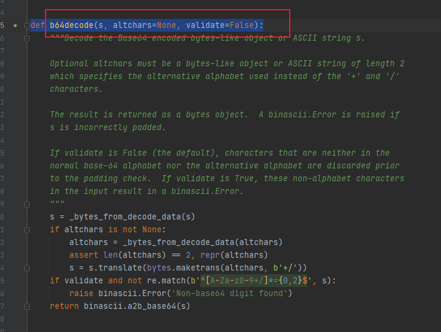

# base64模块


## b64decode()

源码的声明：



将一个字符串进行base64编码：

```python
import base64

# 密钥 写死的
skey = 'QjVlRihvMTBdQ3ZKS1hWKWlRc0ZOPidKJ0JILydqZ0o='
# 返回一个字节对象
# base64 编码
out_bytes_object = base64.b64decode(skey)

count = 0

for byte in out_bytes_object:
    print(byte)
    count += 1

print(f'一共有多少个ascll码字符：{count}')
print(out_bytes_object)

# 二进制 解码 为 人看的字符
print(f'base64编码的结果：{out_bytes_object.decode("utf-8")}')
```

输出的结果：

```shell
66
53
101
70
40
111
49
48
93
67
118
74
75
88
86
41
105
81
115
70
78
62
39
74
39
66
72
47
39
106
103
74
一共有多少个ascll码字符：32
b"B5eF(o10]CvJKXV)iQsFN>'J'BH/'jgJ"
base64编码的结果：B5eF(o10]CvJKXV)iQsFN>'J'BH/'jgJ
```


