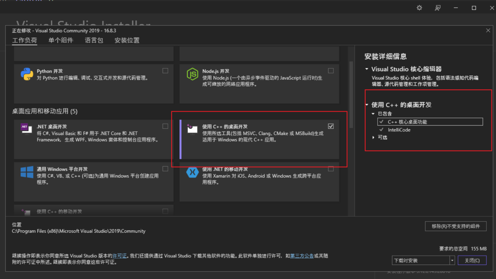
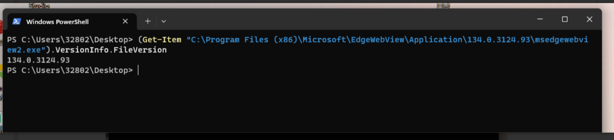
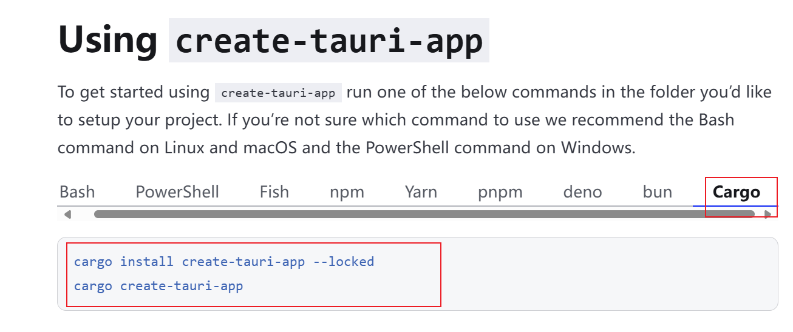
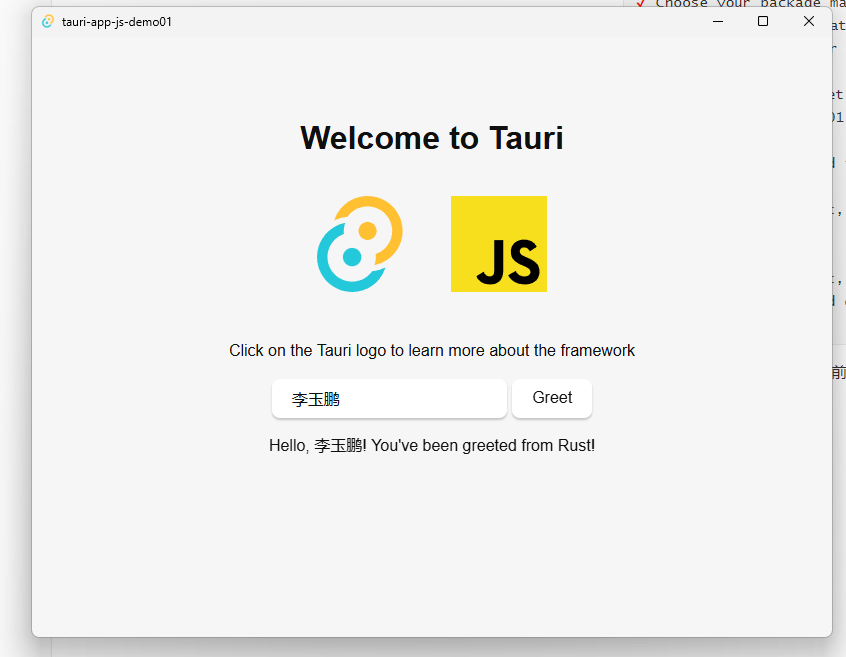

# 我的第一个tauri项目

有些人在学习某一些东西前总是犹豫不决。老是没有开始之前就已经想出各种困难的问题。有了这些羁绊之后。还没有开始就已经放弃了！abandon！abandon！总之一句话干就完了。遇山开山，遇水搭桥。

## 入门前的问题

- 我们要怎么学习tauri？答：看官网就够了，但是要多动手实战。
- 我们学习tauri要有什么基础？我缺少哪些基础？缺少的基础我又该怎么去学？

## tauri项目在windows运行条件

什么是tauri项目在windows运行条件？答：我用我自己理解的话说。就是tauri的桌面程序运行是依赖系统的。所以要依赖系统的原来一些依赖。

**系统依赖**




**验证是否安装了WebView2**

一般window10的系统都默认带有这个依赖。安装Edge浏览器就会有这个依赖：

我在我的电脑windows11上的验证方案：

```
(Get-Item "C:\Program Files (x86)\Microsoft\EdgeWebView\Application\134.0.3124.93\msedgewebview2.exe").VersionInfo.FileVersion
```



输出的结果是WebView2版本。


::: tip WebView2是什么？

Microsoft Edge WebView2 是一个现代浏览器控件，允许开发者在 Windows 应用程序中嵌入基于 Chromium 的 Microsoft Edge 浏览器功能。它是旧版 WebBrowser 控件(基于 IE)的替代品，提供更好的性能、兼容性和现代 Web 功能支持。

主要特点如下：

1. **基于 Chromium**：使用与 Microsoft Edge 相同的渲染引擎
2. **现代 Web 支持**：支持 HTML5、CSS3、JavaScript ES6+ 等最新 Web 标准
3. **混合开发**：可将 Web 技术与原生应用功能结合
4. **跨平台**：支持 Windows 10/11、Windows 7/8.1 等
5. **两种分发模式**：

- - 常青版(Evergreen)：自动更新
  - 固定版本(Fixed)：与应用捆绑

:::

Microsoft 提供了全面的 WebView2 官方文档：

1. **WebView2 官方主页**：
   https://developer.microsoft.com/microsoft-edge/webview2/
2. **官方文档中心**：
   https://learn.microsoft.com/en-us/microsoft-edge/webview2/

- **rust的安装**
- **nodejs的安装**

上面的rust的安装与nodejs的安装请去官网。

我当前的版本：

2025年4月4日，技术更新太快。

node.js的版本查看

```
PS E:\rust_demo_code\rust_tauri_test\tauri-app-js-demo01> node -v
v20.10.0
```

rust的版本查看：

```
E:\rust_demo_code\rust_tauri_test\tauri-app-js-demo01>rustc -V
rustc 1.83.0 (90b35a623 2024-11-26)
```


## cargo初始化第一个js项目

cargo是什么？对于小白来说cargo它就是一个奇怪的迷？what？我这里简单说明下cargo是什么？cargo是rust的包管理器。熟悉前端的朋友说到包管理器脑子里面一定是npm这玩意。因为npm是安装node.js的默认的一个程序。对于干过java的朋友来说cargo就相当是maven。

无论是cargo、npm、maven他们的主要职责就是管理依赖。


怎么创建项目其实官方的文档已经说明的非长清楚了！更多请看这个地址[Create a Project | Tauri](https://tauri.app/start/create-project/)



执行下面命令进行创建一个项目：

```powershell
cargo install create-tauri-app --locked
cargo create-tauri-app
```


执行`cargo install create-tauri-app --locked`的日志如下：

```powershell
PS E:\rust_demo_code\rust_tauri_test> cargo install create-tauri-app --locked
    Updating crates.io index
  Installing create-tauri-app v4.5.9
    Updating crates.io index
    Updating crates.io index
  Downloaded rust-embed-utils v8.5.0
  Downloaded rust-embed-impl v8.5.0
  Downloaded fastrand v2.1.0
  Downloaded dary_heap v0.3.6
  Downloaded cpufeatures v0.2.13
  Downloaded thiserror-impl v1.0.63
  Downloaded thiserror v1.0.63
  Downloaded console v0.15.8
  Downloaded once_cell v1.19.0
  Downloaded tempfile v3.12.0
  Downloaded encode_unicode v0.3.6
  Downloaded proc-macro2 v1.0.86
  Downloaded typenum v1.17.0
  Downloaded syn v2.0.75
  Downloaded unicode-width v0.1.13
  Downloaded libc v0.2.158
  Downloaded rust-embed v8.5.0
  Downloaded include-flate v0.3.0
  Downloaded 18 crates (3.8 MB) in 4m 17s (largest was `include-flate` at 1.1 MB)
   Compiling version_check v0.9.5
   Compiling windows_x86_64_msvc v0.52.6
   Compiling typenum v1.17.0
   Compiling cfg-if v1.0.0
   Compiling proc-macro2 v1.0.86
   Compiling unicode-ident v1.0.12
   Compiling windows_x86_64_msvc v0.48.5
   Compiling once_cell v1.19.0
   Compiling zerocopy v0.7.35
   Compiling allocator-api2 v0.2.18
   Compiling memchr v2.7.4
   Compiling rle-decode-fast v1.0.3
   Compiling option-ext v0.2.0
   Compiling crc32fast v1.4.2
   Compiling generic-array v0.14.7
   Compiling ahash v0.8.11
   Compiling libc v0.2.158
   Compiling lazy_static v1.5.0
   Compiling core2 v0.4.0
   Compiling adler32 v1.2.0
   Compiling dary_heap v0.3.6
   Compiling cpufeatures v0.2.13
   Compiling thiserror v1.0.63
   Compiling unicode-width v0.1.13
   Compiling fastrand v2.1.0
   Compiling anyhow v1.0.94
   Compiling encode_unicode v0.3.6
   Compiling windows-targets v0.52.6
   Compiling windows-sys v0.59.0
   Compiling windows-targets v0.48.5
   Compiling windows-sys v0.52.0
   Compiling windows-sys v0.48.0
   Compiling quote v1.0.36
   Compiling winapi-util v0.1.9
   Compiling hashbrown v0.14.5
   Compiling console v0.15.8
   Compiling shell-words v1.1.0
   Compiling tempfile v3.12.0
   Compiling syn v2.0.75
   Compiling same-file v1.0.6
   Compiling zeroize v1.8.1
   Compiling walkdir v2.5.0
   Compiling block-buffer v0.10.4
   Compiling crypto-common v0.1.6
   Compiling libflate_lz77 v2.1.0
   Compiling dirs-sys v0.4.1
   Compiling digest v0.10.7
   Compiling ctrlc v3.4.5
   Compiling pico-args v0.5.0
   Compiling libflate v2.1.0
   Compiling dirs v5.0.1
   Compiling sha2 v0.10.8
   Compiling shellexpand v3.1.0
   Compiling rust-embed-utils v8.5.0
   Compiling include-flate-codegen v0.2.0
   Compiling thiserror-impl v1.0.63
   Compiling rust-embed-impl v8.5.0
   Compiling include-flate v0.3.0
   Compiling rust-embed v8.5.0
   Compiling dialoguer v0.11.0
   Compiling create-tauri-app v4.5.9
    Finished `release` profile [optimized] target(s) in 4m 39s
  Installing C:\Users\32802\.cargo\bin\cargo-create-tauri-app.exe
   Installed package `create-tauri-app v4.5.9` (executable `cargo-create-tauri-app.exe`)
```

执行`cargo create-tauri-app`命令相当于vue的脚手架一样要与控制台进行交互初始化项目的信息。

输出项目的名字：

```powershell
PS E:\rust_demo_code\rust_tauri_test> cargo create-tauri-app
? Project name (tauri-app) › tauri-app-js-demo01
```

输入项目的域名地址：

```powershell
PS E:\rust_demo_code\rust_tauri_test> cargo create-tauri-app
✔ Project name · tauri-app-js-demo01
? Identifier (com.tauri-app-js-demo01.app) ›
```

选择一个包管理器：

```powershell
✔ Choose which language to use for your frontend · TypeScript / JavaScript - (pnpm, yarn, npm, deno, bun)
? Choose your package manager ›
  pnpm
  yarn
❯ npm
  deno
  bun
```

这个选择你项目的中用什么语言来写前端的界面：

```powershell
✔ Choose your UI template · Vanilla
? Choose your UI flavor ›
  TypeScript
❯ JavaScript
```


最终初始化完成的效果日志是这样的：

```powershell
PS E:\rust_demo_code\rust_tauri_test> cargo create-tauri-app
✔ Project name · tauri-app-js-demo01
✔ Identifier · com.tauri-app-js-demo01.app
✔ Choose which language to use for your frontend · TypeScript / JavaScript - (pnpm, yarn, npm, deno, bun)
✔ Choose your package manager · npm
✔ Choose your UI template · Vanilla
✔ Choose your UI flavor · JavaScript

Template created! To get started run:
  cd tauri-app-js-demo01
  npm install
  npm run tauri android init

For Desktop development, run:
  npm run tauri dev

For Android development, run:
  npm run tauri android dev

```

上面的日志信息告诉我们安装前端的依赖使用`npm install`。电脑端运行应用程序使用`npm run tauri dev`。


电脑端程序运行的结果：




tauri的js项目的工程目录结构：

```powershell
E:.
|   .gitignore
|   package-lock.json
|   package.json
|   README.md
|
+---.idea
|       .gitignore
|       modules.xml
|       tauri-app-js-demo01.iml
|       workspace.xml
|
+---.vscode
|       extensions.json
|
+---src
|   |   index.html
|   |   main.js
|   |   styles.css
|   |
|   \---assets
|           javascript.svg
|           tauri.svg
|
\---src-tauri
    |   .gitignore
    |   build.rs
    |   Cargo.lock
    |
    +---capabilities
    |       default.json
    |
    +---gen
    |   \---schemas
    |           acl-manifests.json
    |           capabilities.json
    |           desktop-schema.json
    |           windows-schema.json
    |
    +---icons
    |       128x128.png
    |       128x128@2x.png
    |       32x32.png
    |       icon.icns
    |       icon.ico
    |       icon.png
    |       Square107x107Logo.png
    |       Square142x142Logo.png
    |       Square150x150Logo.png
    |       Square284x284Logo.png
    |       Square30x30Logo.png
    |       Square310x310Logo.png
    |       Square44x44Logo.png
    |       Square71x71Logo.png
    |       Square89x89Logo.png
    |       StoreLogo.png
    |
    \---src
            lib.rs
            main.rs

```


