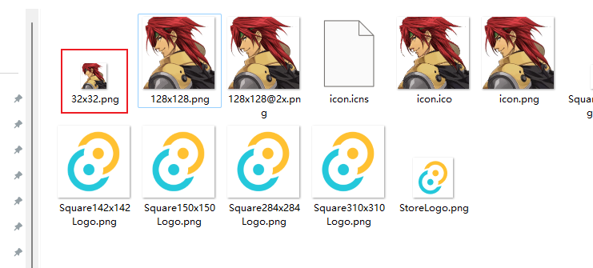

# logo图片不是RGBA问题


## 问题描述


```shell
error: proc macro panicked                                                                                                                                                                              
  --> src\lib.rs:12:14
   |
12 |         .run(tauri::generate_context!())
   |              ^^^^^^^^^^^^^^^^^^^^^^^^^^
   |
   = help: message: icon E:\rust_demo_code\rust_tauri_test\tauri-app-js-vue-demo02\src-tauri\icons/32x32.png is not RGBA

error: could not compile `tauri-app-js-vue-demo02` (lib) due to 1 previous error

```


## 问题解决后总结



没有修改前的图片信息：

```shell
$ file 32x32.png
32x32.png: PNG image data, 32 x 32, 8-bit colormap, non-interlaced
```

修改后的图片信息：

```shell
$ file 32x32.png
32x32.png: PNG image data, 32 x 32, 8-bit/color RGBA, non-interlaced
```

