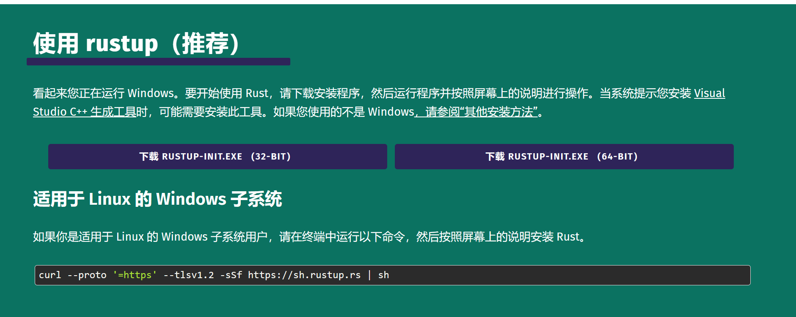
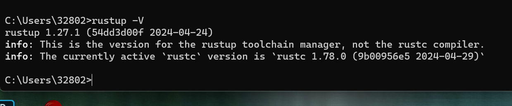

# 安装 Rust

看起来您正在运行 Windows。要开始使用 Rust，请下载安装程序，然后运行程序并按照屏幕上的说明进行操作。当系统提示您安装 [Visual Studio C++ 生成工具](https://visualstudio.microsoft.com/visual-cpp-build-tools/)时，可能需要安装此工具。如果您使用的不是 Windows[，请参阅“其他安装方法”](https://forge.rust-lang.org/infra/other-installation-methods.html)。

- 安装：[安装 Rust - Rust 编程语言 (rust-lang.org)](https://www.rust-lang.org/tools/install)




## 安装的注意事项

### 开始

如果您刚刚开始使用 Rust 并希望获得更详细的演练，请参阅我们的[入门](https://www.rust-lang.org/learn/get-started)页面

### 工具链管理`rustup`

Rust 由 [`rustup`](https://rust-lang.github.io/rustup/) 工具安装和管理。Rust 有一个 6 周的[快速发布过程](https://github.com/rust-lang/rfcs/blob/master/text/0507-release-channels.md)，并支持[一个伟大的 平台的数量](https://forge.rust-lang.org/release/platform-support.html)，因此有许多 Rust 版本可用 任何时候。 以一致的方式管理这些生成 在 Rust 支持的每个平台上，支持安装 Rust 来自测试版和夜间发布频道，以及对 其他交叉编译目标。`rustup`

如果您过去安装过，则可以更新 通过运行 .`rustup``rustup update`

有关详细信息，请参阅 [`rustup` 文档](https://rust-lang.github.io/rustup/)。

### 配置环境变量PATH

In the Rust development environment, all tools are installed to the `~/.cargo/bin` directory, and this is where you will find the Rust toolchain, including , , and . `rustc``cargo``rustup`

Accordingly, it is customary for Rust developers to include this directory in their [`PATH` environment variable](https://en.wikipedia.org/wiki/PATH_(variable)). During installation will attempt to configure the . Because of differences between platforms, command shells, and bugs in , the modifications to may not take effect until the console is restarted, or the user is logged out, or it may not succeed at all. `rustup``PATH``rustup``PATH`

If, after installation, running in the console fails, this is the most likely reason. `rustc --version`


### Uninstall Rust

If at any point you would like to uninstall Rust, you can run . We'll miss you though!

```shell
 rustup self uninstall
```


## windows安装

- 下载：安装启动器，点击运行安装就ok。




- 验证安装是否成功

```shell
C:\Users\liyp>rustup --version
rustup 1.27.1 (54dd3d00f 2024-04-24)
info: This is the version for the rustup toolchain manager, not the rustc compiler.
info: The currently active `rustc` version is `rustc 1.78.0 (9b00956e5 2024-04-29)`
```


