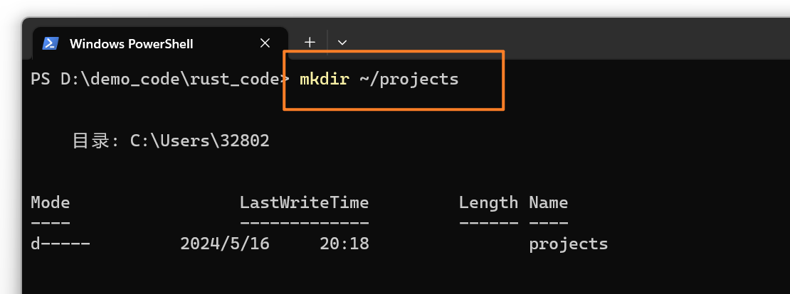
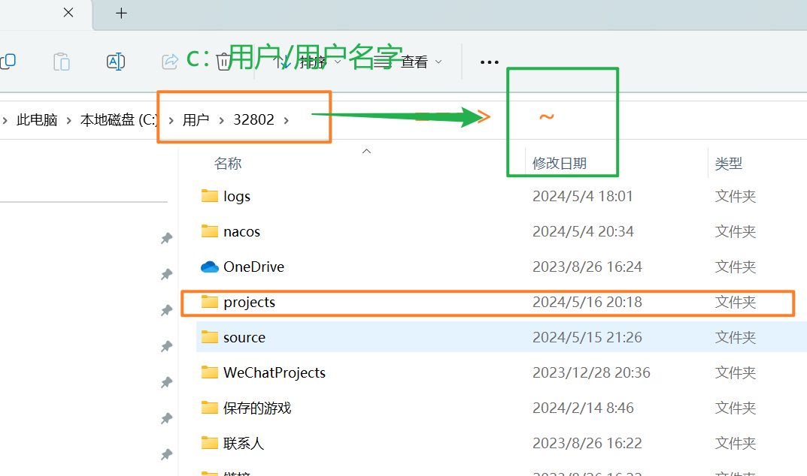
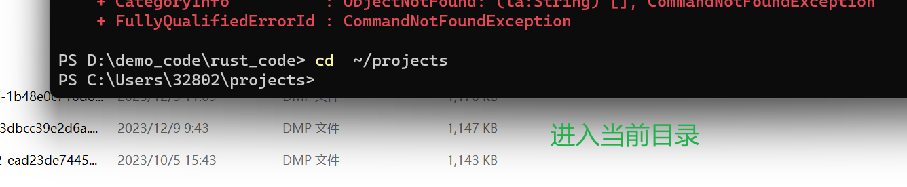
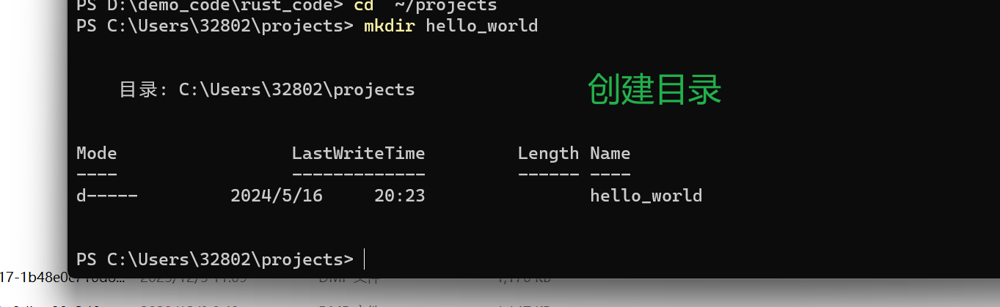
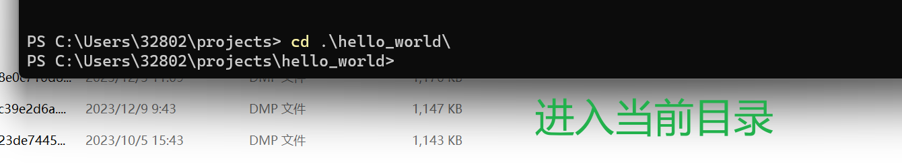
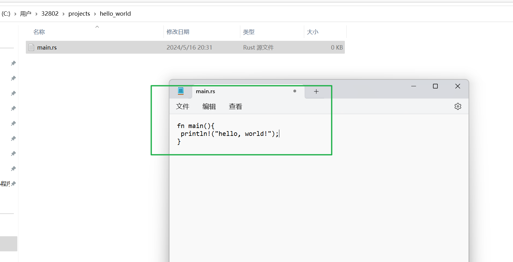
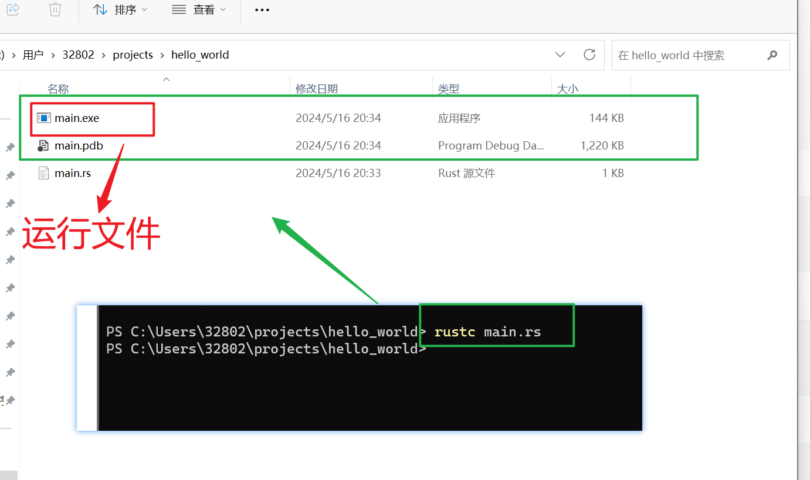
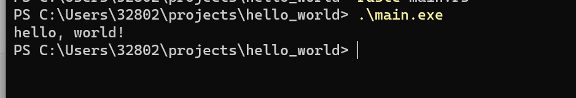
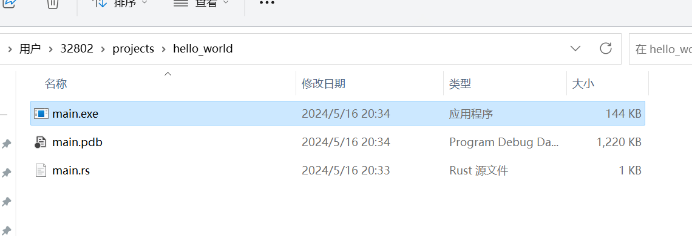

# hello world

梦开始的地方......

我们已经安装好了 Rust，接着编写第⼀个 Rust 程序。按照传统，在学习⼀⻔新语⾔ 时都会编写⼀个输出“Hello, world!”（你好，世界）的简单程序。

::: tip  注意

假定你已经熟悉基本的命令⾏。Rust 本⾝对编辑器、⼯具或代码存 放的位置都没有特殊要求。所以要是你更喜欢 IDE ⽽不是命令⾏的话，可以随 意选⽤你喜爱的 IDE。⽬前很多 IDE 都提供了⼀定程度的 Rust ⽀持。有关详细 信息，请查看 IDE 的⽂档。最近，Rust 团队⼀直致⼒于提供出⾊的 IDE ⽀持， 并且在这⽅⾯取得了迅速的进步！

:::


## 创建项目目录

创建⼀个存放 Rust  代码的⽬录。 Rust  不关⼼代码存放的位置，但是对于本书 中的练习和项⽬，我们建议在操作系统的主⽬录（ home ，在 Windows  下即⽤⼾⽬ 录）中创建⼀个 projects  ⽬录，并保存你的全部项⽬。


打开终端

输⼊下⾯命令来创建 projects  ⽬录，以在此⽬录⾥⾯创建 “Hello, world!” 项目目录。

对于 Linux 、 macOS  和 Windows  的 PowerShell ，请输⼊以下命令：

```shell
mkdir ~/projects
cd ~/projects
mkdir hello_world
cd hello_world
```

对于 Windows CMD ，输⼊以下内容：

```shell
mkdir "%USERPROFILE%\projects"
cd /d "%USERPROFILE%\projects"
mkdir hello_world
cd hello_world
```


- 在windows上







- 进入项目的目录。










## 编写和运行Rust程序

- 创建一个源文件并命名为 main.rs。
- 打开刚创建好的 main.rs 文件，输入示例 1-1 中的代码。

Rust 文件通常以.rs 扩展名结尾。如果文件名中使用了多个单词，请使用下划线将它们隔开。例如，命名为hello world.rs,而不是helloworld.rs。



文件名:main.rs

```rust
fn main(){
 println!("hello, world!");
}
```

示例1-1：打印hello world！



```shell
rustc main.rs
./main
Hello, world!
```

在 Windows  上，输⼊ .\main.exe  来代替 ./main :



```shell
rustc main.rs
.\main.exe
Hello, world!
```


## Rust程序剖析

main 函数(也称为主函数)很特殊:它始终是每个可这几行定义了 Rust 的函数。一个代码。第一行声明一个名为 main 的函数，不带参数执行 Rust 程序中运行的第也没有返回值。如果有参数，那么它们的名字会放到括号内，它们将放在括号()内。

函数主体用大括号 {}括起来。Rust需要函数体的所有内容都被括号包围起来。一种好的代码风格是将左大括号放在函数声明的同一行，且之间带有个空格。

main  函数内部是以下代码：

```rust
 println!("hello, world!");
```

首先， Rust  风格的缩进使⽤ 4  个空格，而不是制表符。

其次， println!  调⽤ Rust  宏。如果改为调⽤函数，则应该将其输⼊为 println （不含 ! ）。

什么是宏？现在只需要知道，当看到 ⼀个 ! ，则意味着调⽤的是宏⽽不是普通的函数。


## 编译和运行是独立的步骤

刚才我们运行一个新创建的程序。现在我们将分解这个过程，并检查每个步骤。

如果有C或C++语言基础，你会注意到这点和 gcc或 clang 类似。编译成功后Rust 就会输出一个二进制可执行文件。

在 Linux、macOs或Windows 的 PowerShell 中，可通过输入 ls 命令来查看可执行文件。在 Linux和 macOs 中，你将看到两个文件。使用Windows的PowerShell，你将看到与使用CMD 相同的三个文件。

```shell
$ ls
main main.rs
```

对于 Windows 的 CMD，可输入以下内容:

```shell
>dir /B%= the /B option says to only show the file names =%main.exemain.pdb
main.rs
```

这显示了带有.rs 扩展名的源代码文件，可执行文件(在Windows 上是 main.exe,在所有其他平台上是 main)，以及在使用 Windows 时包含一个带有.pdb 扩展名的调试信息的文件。在这里，运行main 或main.exe 文件，如下所示:



```
$ ./main # or .\main.exe on Windows
```

如果 main.rs  是 “Hello, world!”  程序，这将会打印 Hello, world!  到终端上。

如果你只熟悉动态语⾔，如 Ruby 、 Python  或 JavaScript ，你很可能不习惯分多个步 骤来编译和运⾏程序的⽅式。 Rust  是⼀⻔ 预编译 (ahead-of-time compiled) 语⾔，这 意味着你可以编译⼀个程序，将编译后的可执⾏⽂件给别⼈，即使他们没有安装 Rust  也可以运⾏程序。如果你为其他⼈提供 .rb 、 .py  或 .js  ⽂件，那么对⽅也需要分 别安装对应 Ruby 、 Python  或 JavaScript  的语⾔⽀持环境。但是在这些语⾔中，只 需要⼀条命令来编译和运⾏程序。⼀切都是语⾔设计权衡的结果。

使⽤ rustc  编译对简单的程序可以轻松胜任，但随着项⽬的增⻓，你将会想要管理 项⽬中所有相关内容，并想让其他⽤⼾和项⽬能够容易共享你的代码。接下来，我们 将引⼊ Cargo  ⼯具【同java里面的maven工具、前端的npm工具、gradle构建工具】，这将帮助你学会编写真实开发环境的 Rust  程序。


