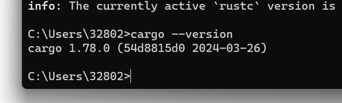

# Hello Cargo

## 学习目标

- 使用Cargo 的惯例来创建和运行一个新项目。


- 什么是Cargo？

Cargo  是 Rust  的构建系统和包管理器。



## 依赖dependency 

⼤多数 Rustacean  们使⽤ Cargo  来管理他 们的 Rust  项⽬，因为它可以为你处理很多任务，⽐如构建代码、下载依赖库，以及 编译这些库。（我们把代码所需要的库叫做 依赖（ dependency ））。


## 使用Cargo创建项目

```shell
$cargo new hello_cargo
s cd hello_cargo
```

第一行命令新建了名为 hello_cargo 的目录。我们将项目命名为 hello_cargo，同时Cargo 在一个同名目录中创建项目文件。

进入 he/lo_cargo 目录并列出文件。将会看到Cargo 生成了两个文件和一个目录：个Cargo.tom/文件，一个src目录，以及位于src目录中的 main.rs 文件。

它也在 he/lo_cargo 目录初始化了一个 Git 仓库，并带有一个.gitignore 文件。如果在


