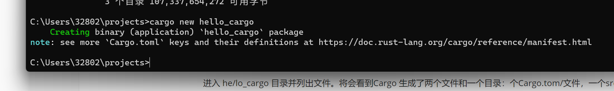
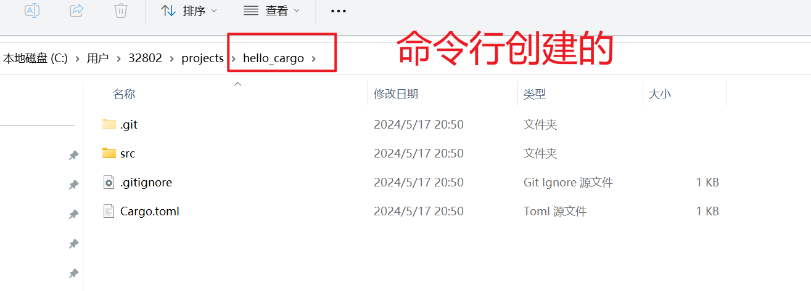
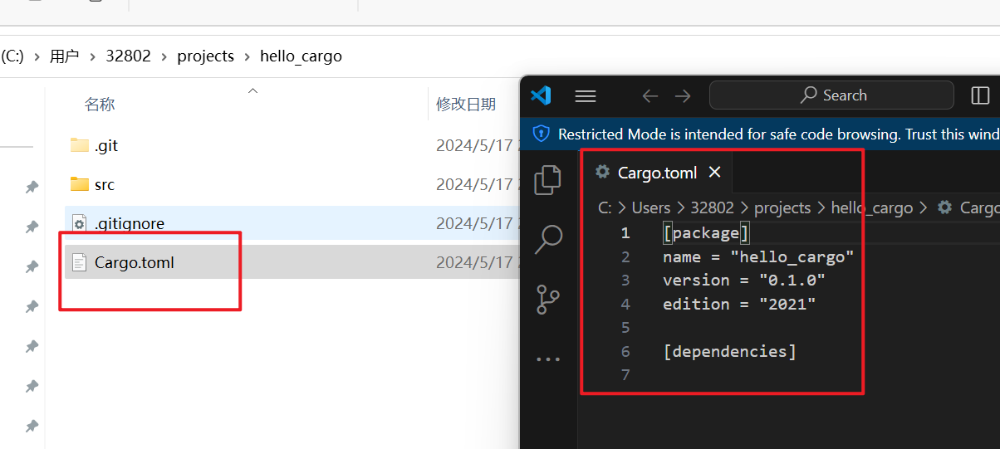
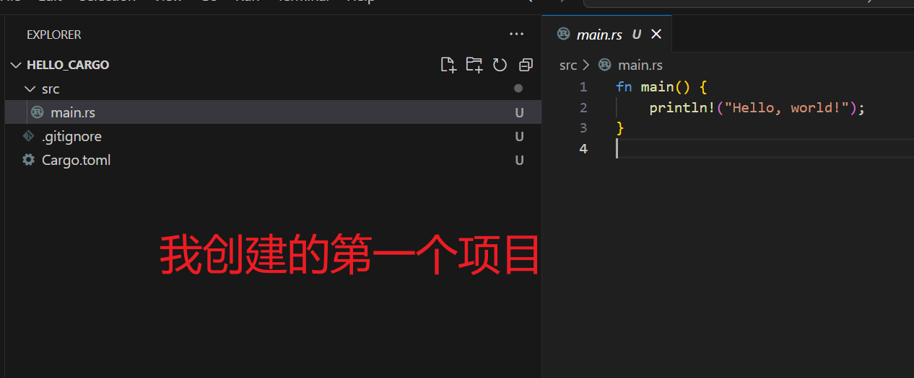
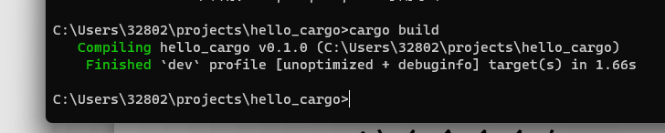
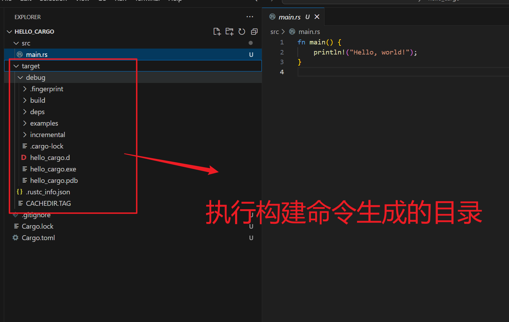
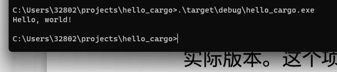
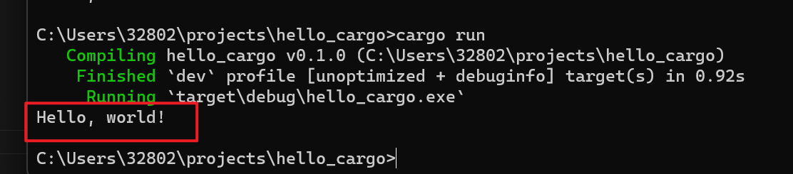

# Hello Cargo

## 学习目标

- 使用Cargo 的惯例来创建和运行一个新项目。

- 什么是Cargo？

Cargo  是 Rust  的构建系统和包管理器。


## 依赖dependency 

⼤多数 Rustacean  们使⽤ Cargo  来管理他 们的 Rust  项⽬，因为它可以为你处理很多任务，⽐如构建代码、下载依赖库，以及 编译这些库。（我们把代码所需要的库叫做 依赖（ dependency ））。


## 使用Cargo创建项目

```shell
cargo new hello_cargo
cd hello_cargo
```



::: ditails 翻译

note: see more `Cargo.toml` keys and their definitions at https://doc.rust-lang.org/cargo/reference/manifest.html

注意：更多“Cargo.toml”键及其定义，请访问https://doc.rust-lang.org/cargo/reference/manifest.html

:::



- 运行第一行命令，生成git文件。

第一行命令新建了名为 hello_cargo 的目录。我们将项目命名为 hello_cargo，同时Cargo 在一个同名目录中创建项目文件。

进入 he/lo_cargo 目录并列出文件。将会看到Cargo 生成了两个文件和一个目录：个Cargo.tom/文件，一个src目录，以及位于src目录中的 main.rs 文件。

它也在 he/lo_cargo 目录初始化了一个 Git 仓库，并带有一个.gitignore 文件。如果在


- 不生成Git文件。

如果在现有的 Git  仓库中运行 ，则不会⽣成 Git 文件；

```shell
cargo new 项目的名字
```

- 帮助

```
cargo new --help
```

- 使用编辑器。

使⽤你喜欢的⽂本编辑器打开 Cargo.toml  ⽂件。




```shell
[package]
name = "hello_cargo"
version = "0.1.0"
edition = "2021"

[dependencies]

```


| 代码块               | 描述                                                         |
| -------------------- | ------------------------------------------------------------ |
| [package]            | 表明下⾯的语句⽤来配置⼀个 包（ package ）。随着我们在这个⽂件增加更多的信息，还将增加其他表块。 |
| name = "hello_cargo" | 配置⼀个 包（ package ）                                     |
| version = "0.1.0"    | 版本号                                                       |
| edition = "2021"     | edition ，区别于 version。Rust 的核⼼版本，即 2015 、 2018 、 2021  版等）  的值。 |
| [dependencies]       | 是⼀个表块的开头，你可以在其中列出你的项⽬所依赖 的任何包。  |

- 代码包是什么？

在 Rust  中，代码包被称为 crate 。这个项⽬并不需要其他的 crate。

- 怎么些一个项目依赖？




## 构建并运行Cargo项目

在 hello_cargo  ⽬录下，输⼊下⾯的命令来构建项⽬：

```shell
cargo build
```

```
C:\Users\32802\projects\hello_cargo>cargo build
   Compiling hello_cargo v0.1.0 (C:\Users\32802\projects\hello_cargo)
    Finished `dev` profile [unoptimized + debuginfo] target(s) in 1.66s
```




- 执行命令的结果。



这个命令会在 target/debug/hello_cargo  下创建⼀个可执⾏⽂件（在 Windows  上是 target\debug\hello_cargo.exe ），⽽不是放在⽬前⽬录下。

- 使用命令执行它。

```
./target/debug/hello_cargo
# windows上执行代码
.\target\debug\hello_cargo.exe
```




## 运行与编译

我们刚刚使⽤ cargo build  构建了项⽬，并使⽤ ./target/debug/hello_cargo  运 ⾏了程序，但是，我们也可以使⽤ cargo run  命令，⼀次性完成代码编译和运⾏的 操作：

```shell
cargo run 
```




## 检察代码命令

该命令快速检查代码确保其可以编 译，但并不产⽣可执行文件：

```
 cargo check
```

## 发布构建

当项目最终准备好发布时，可以使用 cargo build --release 来优化编译项目。这会在 target/release 而不是 target/debug 下生成可执行文件。这些优化可以让 Rust代码运行的更快，不过启用这些优化也需要消耗更长的编译时间。这也就是为什么会有两种不同的配置:一种是为了开发，你需要经常快速重新构建;另一种是为用户构建最终程序，它们不会经常重新构建，并且希望程序运行得越快越好。如果你要对代码运行时间进行基准测试，请确保运行 cargo build --release 并使用target/release 下的可执行文件进行测试。


## 把使用Cargo当作习惯

尽管 hello_cargo 项目很简单，其所使用的很多实用工具，在你将来的 Rust 生涯中也会用得到。

