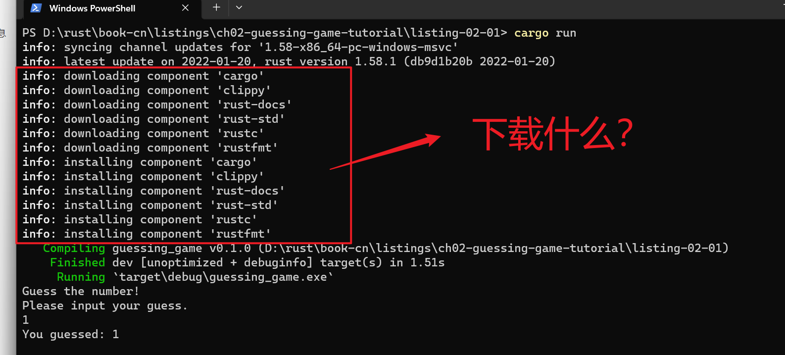
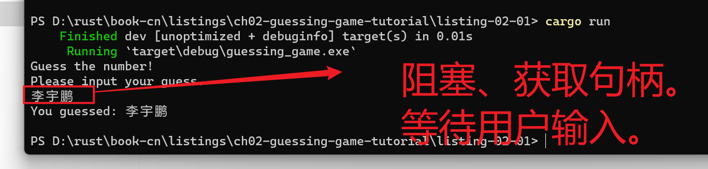

# rust编写猜数字游戏


## 需求描述

我们会实现一个经典的新手编程问题:猜数字游戏。这是它的工作原理:程序会随机生成一个1到 100 之间的整数。接着它会提示玩家猜一个数并输入，然后指出猜测是大了还是小了。如果猜对了，它会打印祝贺信息并退出。

## 需求设计

- 打印输出提示信息
- 使用变量存储值
- 接受用户的输入
- 占位符打印

## 01)打印输出提示信息

1. 引入io 输入/输出库。io来自标准库。标准 库也被称为 std ：

```rust
use std::io;
```

::: details 注意

默认情况下，Rust会将少量标准库中定义的程序项（item）引⼊到每个程序的作⽤ 域中。这些项称作 prelude，可以在标准库⽂档中了解到关于它的所有知识。

如果需要的类型不在 prelude 中，你必须使⽤ use 语句显式地将其引⼊作⽤域。 std::io 库提供很多有⽤的功能，包括接收⽤⼾输⼊的功能。

:::

 println! 是⼀个在屏幕上打印字符串的宏！

```rust
    println!("Guess the number!");

    println!("Please input your guess.");
```

::: details 提问环节

- 什么是宏？【这个先不管，记住就行。】

:::

## 02)使用变量存储值

- **变量**(variable)

- 创建一个变量。【对比不同的代码】

java

左类型， 右名字，等号赋值。

```java
int a; // 声明
a = 0; // 赋值
```

rust

- let创建变量

```rust
let apples = 5;
```

- mut （mutability，可变性）；创建变量。

```rust
let apples = 5; // 不可变
let mut bananas = 5; // 可变
```

- 创建一个变量。

```rust
    //使用关联函数（associated function），String的 新实例
    let mut guess = String::new();
```


## 03)接受用户的输入

```rust
use std::io;
    // ANCHOR: read
    io::stdin()
        .read_line(&mut guess)
```

std是 标准库。

io是 模块。

stdin()是 模块调用函数。

::: details 描述

我们仍可以通过 std::io::stdin 来调⽤函数。 stdin 函数返回⼀个 std::io::Stdin 的实例，这是 ⼀个类型，代表终端标准输⼊的句柄。

.read_line(&mut guess) 这⼀⾏调⽤了 read_line ⽅法，来从标准输⼊ 句柄中获取⽤⼾输⼊。我们还将 &mut guess 作为参数传递给 read_line() ，以告 诉它在哪个字符串存储⽤⼾输⼊。

:::

.read_line(&mut guess)

全部⼯作是，将⽤⼾在标准输⼊中 输⼊的任何内容都追加到⼀个字符串中（⽽不会覆盖其内容），所以它需要字符串作 为参数。这个字符串应是可变的，以便该⽅法可以更改其内容。

- &是什么？表⽰这个参数是⼀个引⽤**（reference）**

这为你提供了⼀种⽅法，让代码的多个 部分可以访问同⼀处数据，⽽⽆需在内存中多次拷⻉。引⽤是⼀个复杂的特性，Rust 的⼀个主要优势就是安全⽽简单的使⽤引⽤。


## 04)占位符打印

```shell
    println!("You guessed: {}", guess);
```


## 完整的代码

```rust
// ANCHOR: all
// ANCHOR: io
use std::io;
// ANCHOR_END: io
fn main() {
    
    // 1、打印输出提示信息
    // ANCHOR_END: main
    // ANCHOR: print
    println!("Guess the number!");
    println!("Please input your guess.");
    // ANCHOR_END: print

    // 2、使用变量存储值
    // ANCHOR: string
    let mut guess = String::new();
    // ANCHOR_END: string

    // 3、接受用户的输入
    // ANCHOR: read
    io::stdin()
        .read_line(&mut guess)
        .expect("Failed to read line");

    // 4、占位符打印
    println!("You guessed: {}", guess);
}

```

## 运行代码

- 第一次运行。



- 再次执行程序。




