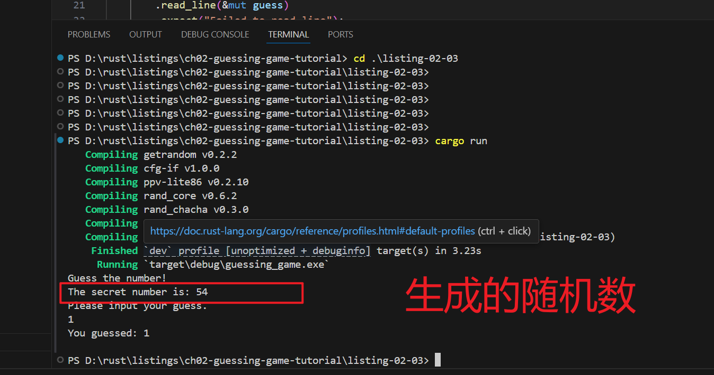

# 生成一个随机数


## 完整代码

- 导入依赖

```toml
[package]
name = "guessing_game"
version = "0.1.0"
edition = "2021"

# See more keys and their definitions at https://doc.rust-lang.org/cargo/reference/manifest.html

[dependencies]
rand = "0.8.3"

```

- 编写代码

```rust
// ANCHOR: all
use std::io;
// ANCHOR: ch07-04
use rand::Rng;

fn main() {
    // ANCHOR_END: ch07-04
    println!("Guess the number!");
    // 获取随机数
    let secret_number = rand::thread_rng().gen_range(1..101);

    // 打印生成的随机数
    println!("The secret number is: {}", secret_number);
    
    // 请输入你猜的数字
    println!("Please input your guess.");
    let mut guess = String::new();
    io::stdin()
        .read_line(&mut guess)
        .expect("Failed to read line");

    
    // 打印 输入的数字
    println!("You guessed: {}", guess);

}
```


## 运行代码

