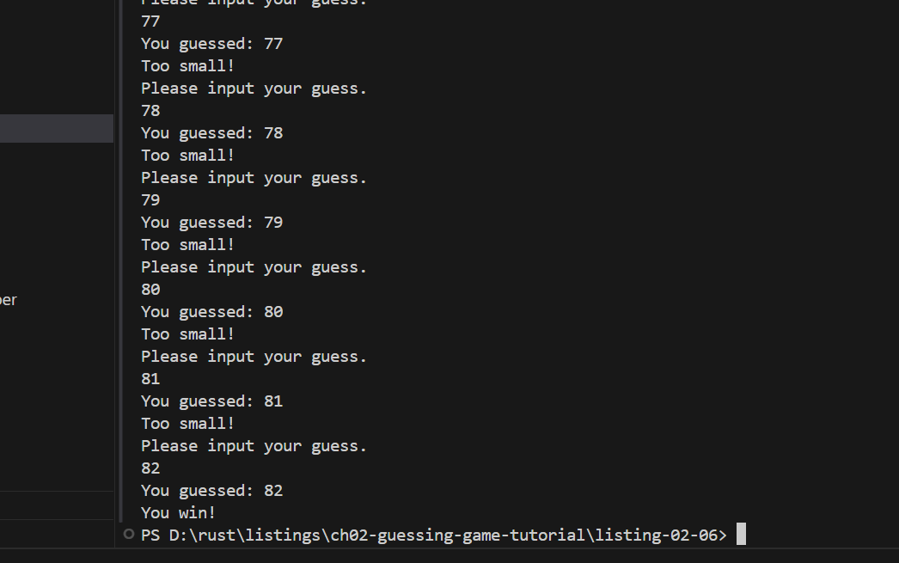

# 比较猜测的数字和秘密数字


## 完整代码

```rust
use rand::Rng;
use std::cmp::Ordering;
use std::io;

fn main() {
    println!("Guess the number!");

    let secret_number = rand::thread_rng().gen_range(1..101);

    loop {
        println!("Please input your guess.");

        let mut guess = String::new();

        io::stdin()
            .read_line(&mut guess)
            .expect("Failed to read line");

        let guess: u32 = match guess.trim().parse() {
            Ok(num) => num,
            Err(_) => continue,
        };

        println!("You guessed: {}", guess);

        match guess.cmp(&secret_number) {
            Ordering::Less => println!("Too small!"),
            Ordering::Greater => println!("Too big!"),
            Ordering::Equal => {
                println!("You win!");
                break;
            }
        }
    }
}

```


## 执行效果




