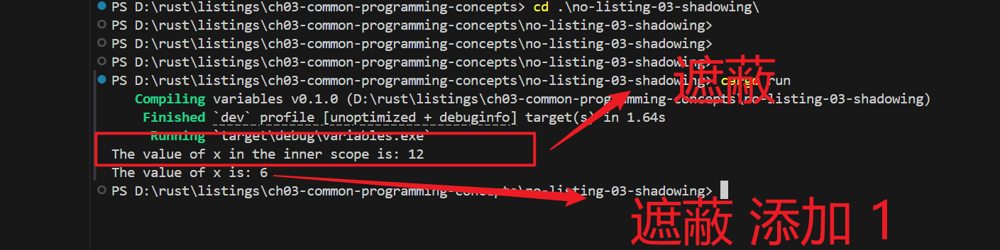

# 通用编程概念


## 关键字keywords


## 变量&可变性

**不可变的（immutable）**

当变量不可变时，这意味着⼀旦⼀个值绑定到⼀个变量名后，就不能更改该值了。

代码案例

```rust
fn main() {
    // 声明 不可变的变量
    let x = 5;
    println!("The value of x is: {}", x);
    // 不可以再次的修改
    x = 6;
    println!("The value of x is: {}", x);
}
```

- 执行运行命令，下面报错。

```shell
error[E0384]: cannot assign twice to immutable variable `x`
--> src\main.rs:4:5
|
2 |     let x = 5;
|         -
|         |
|         first assignment to `x`
|         help: consider making this binding mutable: `mut x`
3 |     println!("The value of x is: {}", x);
4 |     x = 6;
|     ^^^^^ cannot assign twice to immutable variable

For more information about this error, try `rustc --explain E0384`.
```

::: details 翻译编译报错信息

错误[E0384]：不能为不可变变量`x赋值两次`
-->src\main.rs:4:5
|
2|设x=5；
|         -
|         |
|第一个分配给`x`
|帮助：考虑使此绑定可变：`mut x`
3|println！（“x的值为：｛｝”，x）；
4|x=6；
|不能将两次赋值给不可变变量
有关此错误的详细信息，请尝试“rustc--explain E0384”。

:::

不可变好处：

当我们尝试改变⼀个前⾯指定为不可变的值时我们会得到编译期错误，这点很重要， 因为这种情况很可能导致 bug。如果我们代码的⼀部分假设某个值永远不会更改，⽽ 代码的另⼀部分更改了该值，那很可能第⼀部分代码以不可意料的⽅式运⾏。这个 bug 的根源在实际开发中可能很难追踪，特别是第⼆部分代码只是偶尔变更了原来的 值。Rust 编译器保证了当我们声明了⼀个值不会改变时，那它就真的不可改变，所 以你不必亲⾃跟踪这个值。这可以使得代码更容易理解。

可变性的重要有哪些好处：

但可变性有时也相当重要，可使代码更⽅便编写。变量只是默认不可变的；像第 2 章 所做的那样，我们可以通过在变量名前加上 mut 使得它们可变。增加 mut 的操作还 向以后的读代码的⼈传达了代码的其他部分将会改变这个变量值。


## 常量count

- 常量的定义

```shell
const THREE_HOURS_IN_SECONDS: u32 = 60 * 60 * 3;
```

- 常量应用

在声明的作⽤域内，常量在程序运⾏的整个过程中都有效。对于应⽤程序域中程序的 多个部分可能都需要知道的值的时候，常量是⼀个很有⽤的选择，例如游戏中允许玩 家赚取的最⾼分或光速。 

- 常量好处

将整个程序中⽤到的硬编码（hardcode）值命名为常量，对于将该值的含义传达给 代码的未来维护者很有⽤。如果将来需要更改硬编码的值，则只需要在代码中改动⼀ 处就可以了。


## 遮蔽shadow

```rust
fn main() {
    let x = 5;
    // 遮蔽 加1
    let x = x + 1;
    {
        // 遮蔽 乘2
        let x = x * 2;
        println!("The value of x in the inner scope is: {}", x);
    }
    println!("The value of x is: {}", x);
}
```

- 先将数值 5 绑定到 x 。
- 然后通过重复使⽤ let x = 来遮蔽之前的 x ， 并取原来的值加上 1 ，所以 x 的值变成了 6 。
- 在内部作⽤域内，第三个 let 语句 同样遮蔽前⾯的 x ，取之前的值并乘上 2 ，得到的 x 值为 12 。当该作⽤域结束时，内部遮蔽结束并且 x 恢复成 6 。

运行结果：




mut 和遮蔽之间的另⼀个区别是，因为我们在再次使⽤ let 关键字时有效地创建了 ⼀个新的变量，所以我们可以改变值的类型，但重复使⽤相同的名称。例如，假设我 们程序要求⽤⼾输⼊空格字符来显⽰他们想要的空格数⽬，但我们实际上想要将该输 ⼊存储为⼀个数字：

- 可以改变量的类型

```rust
let spaces = " ";
// 遮蔽
let spaces = spaces.len();
```

- 不可以改变变量的类型

```rust
let mut spaces = " ";
spaces = spaces.len();
```


## 数据类型

当我们通过举例说明时，请谨记这些规则:


