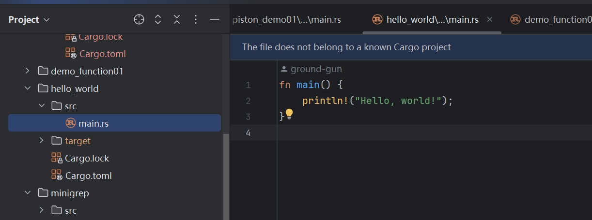
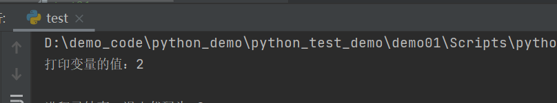
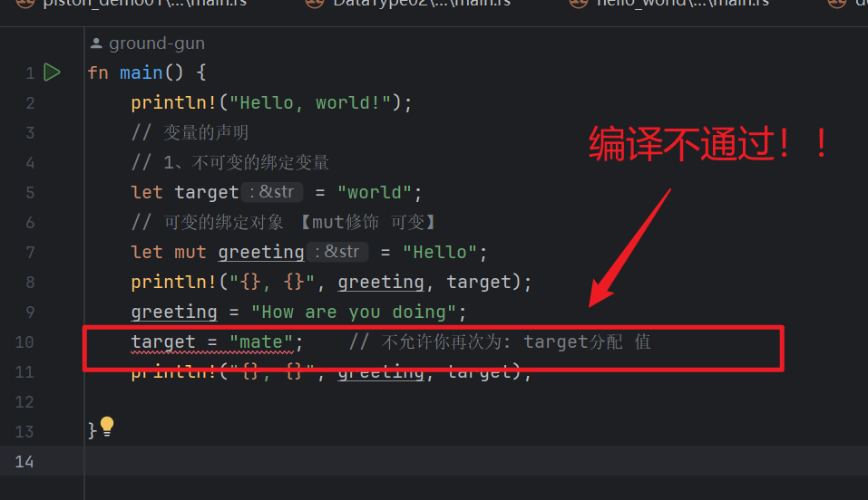
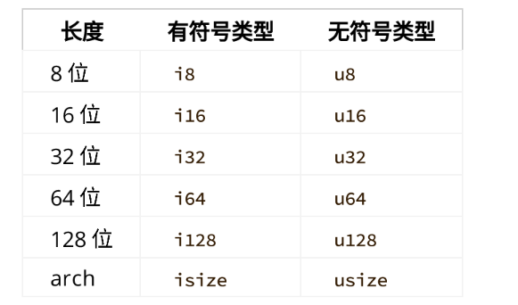
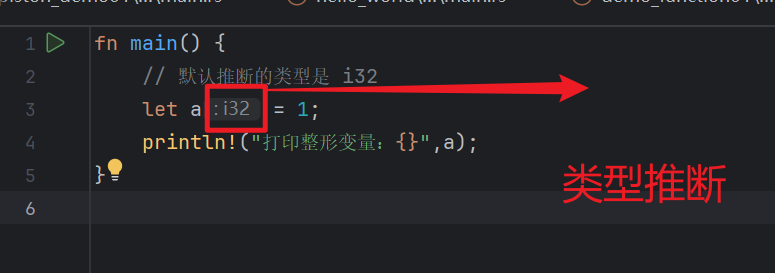
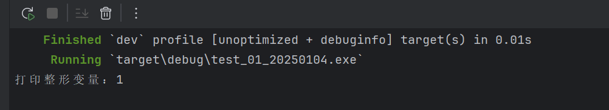
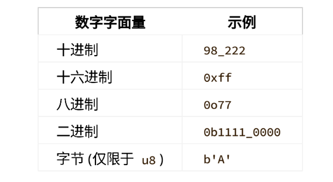

# rust怎么定义基本数据类型？

- rust是⼀种静态类型（statically typed）的语⾔，这意味着它必须在编译期知道所有变量的类型。

答：

对于其他数据类型，你将看到不同的类型标注。如i8、i64.

标量类型，标量（scalar）类型表⽰单个值。Rust 有 4 个基本的标量类型：整型、浮点型、布尔型和字符。

## 怎么打印变量？

入门的第一句就是打印：Hello, world! 在控制台上。

怎么打印变量呢？

答：可以使用占位符来打印值。



rust代码

```rust
fn main() {
    // 默认推断的类型是 i32
    let a = 1;
    // 指定类型 i64
    let b:i64 = 2;
    println!("打印整形变量：{}",a);
    println!("打印i64整形变量：{}",b);
}
```

python代码。

```python
a = 2
print(f"打印变量的值：{a}")
```



java只有日志才有这中打印方式。


## 怎么定义变量？

rust定义变量与其他语言有什么区别？

答：rust的变量分为：不可变变量用let修饰，和可变变量用 let mut 共同修饰。不可变变量的意思是不可再次对某一个变量进行赋值操作（修改变量原有的值）。

**rust案例**

```rust
fn main() {
    println!("Hello, world!");
    // 变量的声明
    // 1、不可变的绑定变量
    let target = "world";
    // 可变的绑定对象 【mut修饰 可变】
    let mut greeting = "Hello";
    println!("{}, {}", greeting, target);
    greeting = "How are you doing";
    target = "mate";    // 不允许你再次为: target分配 值
    println!("{}, {}", greeting, target);
}

```



let：让。

mut ：mutable代表是 “adj.可变的”。


::: detail 总结变量的定义

1. 在Rust中，当你使用 "let mut" 来声明一个变量时，这个变量的值可以在后续的代码中被改变。
2. “let”，这是一个用于声明变量的关键字。在许多编程语言中，包括Rust，"let" 被用来引入新的变量或者常量。

::: 

## 怎么定义整数类型？



注意：有符号的数字以：二进制补码形式存储！

整型默认是 i32



运行的结果。



下面是rust常用定义方式：

```ruby
fn main() {
    // 默认推断的类型是 i32
    let a = 1;
    // 指定类型 i64
    let b:i64 = 2;
    println!("打印整形变量：{}",a);
    println!("打印i64整形变量：{}",b);
}
```

java怎么定义整数类型的呢？

```java
public class Test01 {
    public static void main(String[] args) {
        // 定义 i 变量
        int i  = 1;
        System.out.println(i);
    }
   
}
```

## 字面量是什么？




## 怎么定义浮现类型？


