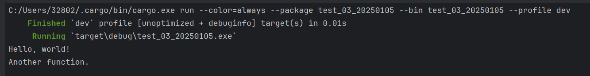
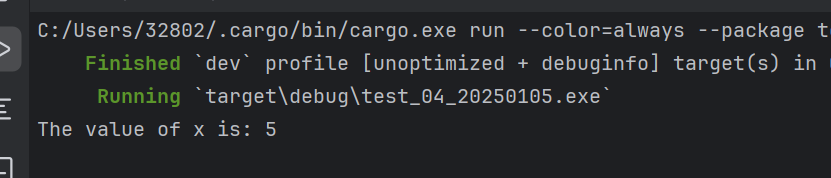
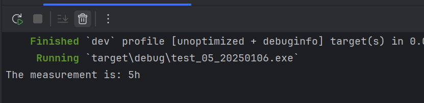
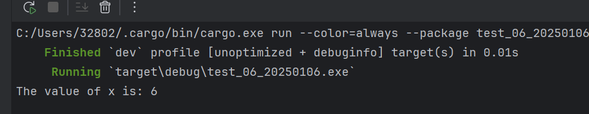

# 函数怎么定义？


## rust有什么命名规则？

| 属性     | 描述         |
| -------- | ------------ |
| 函数名字 | 下划线命名法 |
| 变量名字 | 下划线命名法 |

snake case ，直译为蛇形命名法。

在下划线命名法中，所有字⺟都是⼩写并使⽤下划线分隔单词。


## rust语句与表达式

```rust
fn main() {

    let y = {
        // 语句
        let x = 3;
        // 表达式
        x + 1
    };
    // 4
    println!("The value of y is: {}", y);
}
```


语句

- 语句不能返回。

```rust
 fn main() {
     // 错误的写法
     let x = (let y = 6);
 }
```


表达式

- 表达式的结尾是没有分号“;”。


## 函数

```rust
fn main() {
    println!("Hello, world!");
    // 调用函数
    another_function();
}
fn another_function() {
    // 函数的逻辑
    println!("Another function.");
}
```

执行结果：



:::tip
注意，源码中 another_function  定义在 main  函数 之后；也可以定义在之前。 Rust  不关⼼函数 定义于何处，只要定义了就⾏。
:::

## 有参函数

传一个参数

```rust
fn main() {
    // 函数传 形参
    another_function(5);
}
// 实参接收
fn another_function(x: i32) {
    // 打印参数变量 x
    println!("The value of x is: {}", x);
}
```

执行结果：




传多个参数

```rust
fn main() {
    print_labeled_measurement(5, 'h');
}

// int 类型 ， 字符类型
fn print_labeled_measurement(value: i32, unit_label: char) {
    println!("The measurement is: {}{}", value, unit_label);
}
```




## 带有返回值的函数

```rust
fn main() {
    let x = plus_one(5);
    println!("The value of x is: {}", x);
}

// 函数写有返回值
fn plus_one(x: i32) -> i32 {
    x + 1
}
```

执行结果：




::: danger 注意出错！！

如果上面的 x + 1表达式结尾添加分号。运行的结果是什么？

:::


