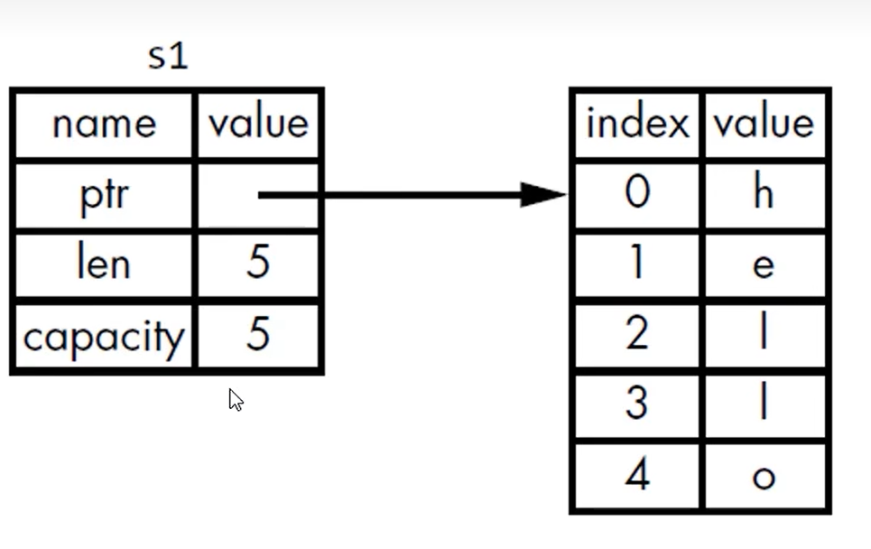

# 所有权的规则

1. 每个值都有一个变量，这个变量是该值的<font color = 'red'>所有者</font>。
2. 每个值同时只能有一个所有者。
3. 当<font color = 'red'>所有者</font>超出作用域(scope)时，该值将被删除。

什么是所有者？


## 变量作用域

在rust的语言中，当一个变量离开一个作用域的时候。rust它会调用一个叫做drop的函数。

## 变量和数据交互的方式：移动（move）

第一种情况（基础数据类型）：

多个变量可以与同一个数据使用一种独特的方式来交互

```rust
let x= 5;
let y = X;
```

整数是已知且固定大小的简单的值，这两个5被压到了stack中。

第二种情况（String类型）：

```rust
fn main() {
    // s是可变的
    let s1 = String::from("Hello");
    let s2 = s1;

    // s1 失效了
    println!("{}", s1);
}

```

解读上面的代码：

- 一个string类由3个部分组成：

1. ptr一个指向存放字符串内容的内存的指针。
2. len是一个长度。长度len，就是存放字符串内容所需要的字节数。
3. capacity是一个容量。指String类从操作系统总公获得内存总字节数。

- s1是被存放在栈种。存放字符串的内容的部分在heap上。




## 所有权与函数


## 返回值与作用域

函数在返回值的过程中同样也会发生所有权的转移的。

案例：

```rust
fn main() {
    let s1 = gives_ownership();         // gives_ownership 将返回值
    // 移给 s1

    // 通过字符串字面值得到的变量 s2
    let s2 = String::from("hello");     // s2 进入作用域

    // s2 传入 函数。 返回值 绑定到 s3上
    let s3 = takes_and_gives_back(s2);  // s2 被移动到
    // takes_and_gives_back 中,
    // 它也将返回值移给 s3
} // 这里, s3 移出作用域并被丢弃。s2 也移出作用域，但已被移走，
// 所以什么也不会发生。s1 移出作用域并被丢弃

fn gives_ownership() -> String {           // gives_ownership 将返回值移动给
    // 调用它的函数
    // some_string 变量
    let some_string = String::from("yours"); // some_string 进入作用域

    // 也就是给 main函数。
    some_string                              // 返回 some_string 并移出给调用的函数
}

// takes_and_gives_back 将传入字符串并返回该值
fn takes_and_gives_back(a_string: String) -> String { // a_string 进入作用域

    a_string  // 返回 a_string 并移出给调用的函数
}
```

一个变量的所有权总是遵循同样的模式：

- 把一个值赋值给其它变量时就会发生移动。

- 当一个包含heap数据的变量离开作用域时，它的值就会被drop函数清理，除非数据的所有权移动到另外一个变量上了。

## 怎么让函数使用某一个，但不获得其所有权？

答：有一种做法是这样的，我先上例子来看下。

```rust
fn main() {

    // 堆空间分配内存
    let s1 = String::from("hello");

    // 返回了一个元组 第一个值：字符串、第二个值：长度。
    let (s2, len) = calculate_length(s1);

    // main函数是保留了 参数 s1的所有权了。 这做法：s1参数传入函数，又要作为结果传出来。  【麻烦】

    // 打印
    println!("The length of '{}' is {}.", s2, len);
}

fn calculate_length(s: String) -> (String, usize) {

    let length = s.len(); // len() 返回字符串的长度
    //返回之后 ：s的所有权 交给了 s2
    (s, length)
}
```

main函数是保留了参数 s1的所有权了。 这做法：s1参数传入函数，又要作为结果传出来。这种方法太麻烦了。

我们可以使用rust的一个概念。——**引用**(**Reference**)


