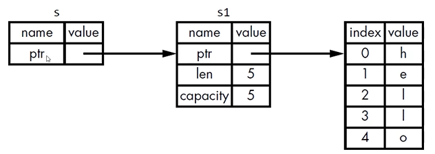
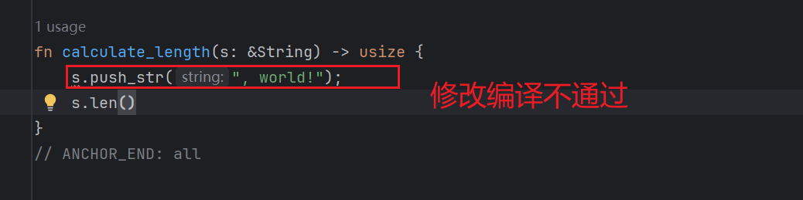
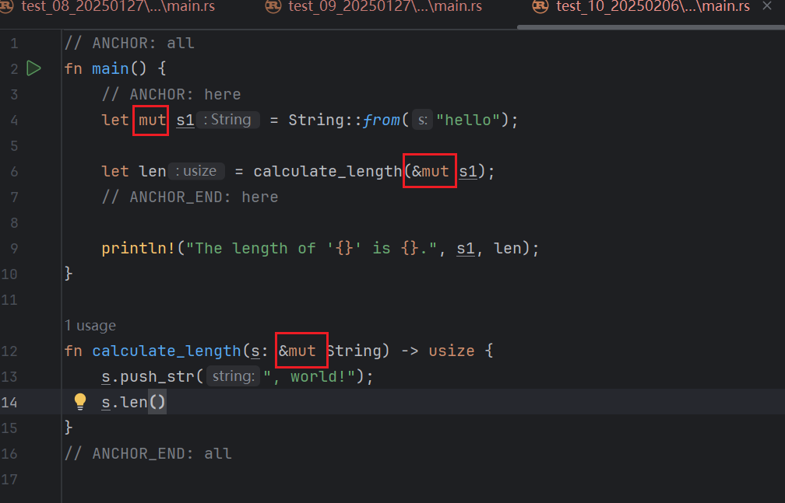

# 引用与借用

## rust中引用是什么？

答：引用是一种编程上的概念。注意：概念。

## rust的引用案例

有一个函数，它能算出一个字符串的长度。并且返回的就是字符串的长度值。但不同之处是，我们没有转移s1变量的所有权。而是把s1的引用作为参数传入函数里面。注意：&的符号就表示**传递的是引用**。

```rust
// ANCHOR: all
fn main() {
    // ANCHOR: here
    let s1 = String::from("hello");

    let len = calculate_length(&s1);
    // ANCHOR_END: here

    println!("The length of '{}' is {}.", s1, len);
}

fn calculate_length(s: &String) -> usize {
    s.len()
}
// ANCHOR_END: all
```

上面代码解析：

calculate_length函数传入了一个引用。calculate_length函数不拥护s1，&s1所有当走出作用域时&s1指向的值不会被清理掉。

我们再看calculate_length函数的里面。这个s就是&s1的引用类型变量。calculate_length的作用域结束的时候s就出了作用域。但是s不具有指向字符串的所有权。【没有所有权】所以s指向的值不会别清理掉。

s变量区别在于不会在离开函数作用域时销毁其指向的数据。因为它没有该数据的所有权。所以当一个函数使用引用作为参数，而不是真实的值作为函数的参数的时候。我们就不必为了归还所有权把这个值返回回去。因为在这种引用的情况下我们根本没有获得这个所有权。

而这种以引用获取参数的行为：我们把它叫做 **借用**。

知识点总结

- 参数的类型是 &String 而不是 String。
- &符号就表示引用:允许你引用某些值而不取得其所有权。



注意：s1变量是指向了堆空间。


## rust中什么是借用？

答：借用是一种行为。

我们把引用作为函数参数这个行为叫做借用。

## 是否可以修改借用的东西呢？

答：不行。不可以修改。

案例演示：

```rust
// ANCHOR: all
fn main() {
    // ANCHOR: here
    let s1 = String::from("hello");

    let len = calculate_length(&s1);
    // ANCHOR_END: here

    println!("The length of '{}' is {}.", s1, len);
}

fn calculate_length(s: &String) -> usize {
    s.push_str(", world!");
    s.len()
}
// ANCHOR_END: all
```



运行结果

```powershell
error[E0596]: cannot borrow `*s` as mutable, as it is behind a `&` reference
  --> src/main.rs:13:5
   |
13 |     s.push_str(", world!");
   |     ^ `s` is a `&` reference, so the data it refers to cannot be borrowed as mutable
   |
help: consider changing this to be a mutable reference
   |
12 | fn calculate_length(s: &mut String) -> usize {
   |                         +++
```

总结：

和变量一样，引用默认也是不可变的。


## 可变引用





可变引用有一个重要的限制:在特定作用域内，对某一块数据，只能有一个可变的引用。【案例如下：】

- 这样做的好处是可在编译时防止数据竞争。

```rust
fn main() {
    // ANCHOR: here
    let mut s = String::from("hello");

    let r1 = &mut s;
    let r2 = &mut s;

    println!("{}, {}", r1, r2);
    // ANCHOR_END: here
}
```

上面代码执行有问题。

```powershell
error[E0499]: cannot borrow `s` as mutable more than once at a time
 --> src/main.rs:6:14
  |
5 |     let r1 = &mut s;
  |              ------ first mutable borrow occurs here
6 |     let r2 = &mut s;
  |              ^^^^^^ second mutable borrow occurs here
7 |
8 |     println!("{}, {}", r1, r2);
  |                        -- first borrow later used here
```

以下三种行为下会发生数据竞争:

1. 两个或多个指针同时访问同一个数据
2. 至少有一个指针用于写入数据
3. 没有使用任何机制来同步对数据的访问

可以通过创建**新的作用域**，来允许非同时的创建多个可变引用【例子】

```rust
fn main() {
    // ANCHOR: here
    // 堆空间分配内存
    let mut s = String::from("hello");
    {
        // 引用变量 r1
        let r1 = &mut s;
    } // r1 在这里离开了作用域，所以我们完全可以创建一个新的引用

    // 引用变量 r2
    let r2 = &mut s;
    // ANCHOR_END: here
}// 离开作用域

```


## 另外一个限制

- 不可以同时拥有一个可变引用和一个不变的引用。
- 多个不变的引用是可以的。

## 悬空引用 

Dangling References

**悬空指针**(DanglingPointer)：一个指针引用了内存中的某个地址，而这块内存可能已经释放并分配给其它人使用了。

在Rust里，编译器可保证引用永远都不是悬空引用：

- 如果你引用了某些数据，编译器将保证在引用离开作用域之前数据不会离开作用域。【如下案例1】


案例1

```rust
fn main() {
    let reference_to_nothing = dangle();
}

fn dangle() -> &String {
    let s = String::from("hello");
    &s
} // 作用域结束，引用s执行了销毁。但是也返回了。引用指向了一个被释放的的内存地址。

```


案例1执行的结果

```powershell
error[E0106]: missing lifetime specifier
 --> src/main.rs:5:16
  |
5 | fn dangle() -> &String {
  |                ^ expected named lifetime parameter
  |
  = help: this function's return type contains a borrowed value, but there is no value for it to be borrowed from
help: consider using the `'static` lifetime, but this is uncommon unless you're returning a borrowed value from a `const` or a `static`
  |
5 | fn dangle() -> &'static String {
  |                 +++++++
help: instead, you are more likely to want to return an owned value
  |
5 - fn dangle() -> &String {
5 + fn dangle() -> String {
  |

```

this function's return type contains a borrowed value, but there is no value for it to be borrowed from

此函数的返回类型包含**借用值**，但没有可以借用的值

## 引用的规则

在任何给定的时刻，只能满足下列条件之一：

- 一个可变的引用
- 任意数量不可变的引用

引用必须一直有效。


