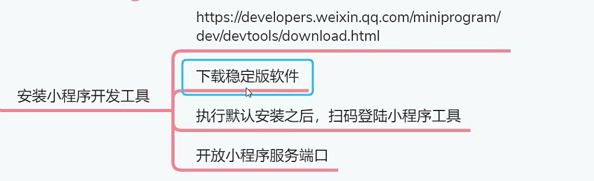
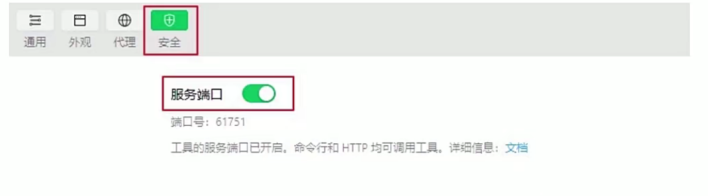
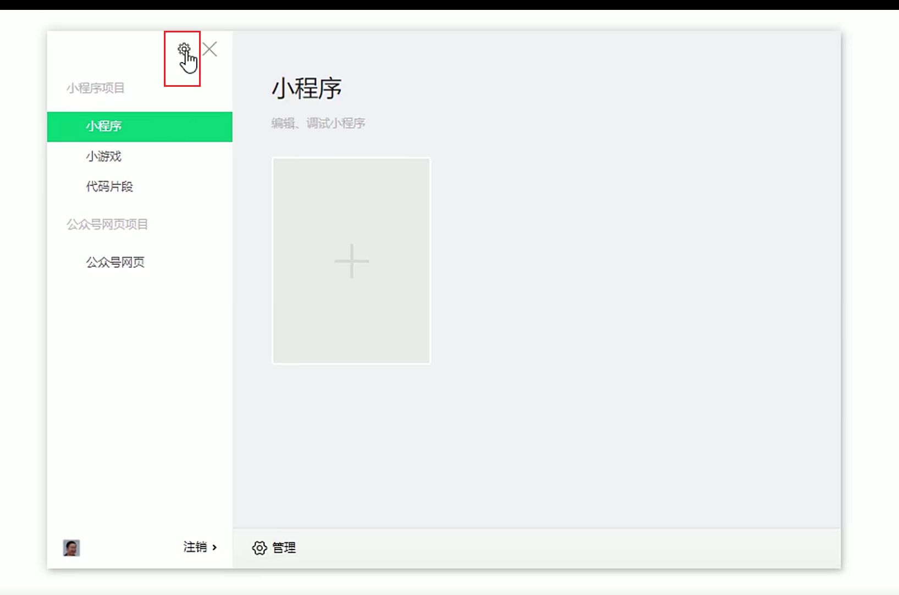
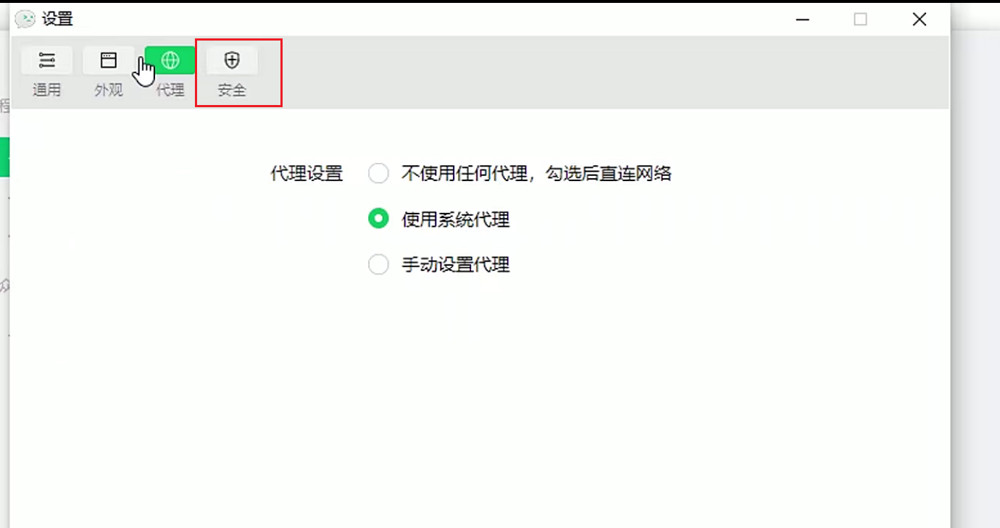

# 安装小程序开发工具

小程序开发工具是腾讯官方发布的用于开发微信小程序的IDE软件，你可以从微信网站下载到这个工
具，建议你下载稳定版本的软件。点击这里下载

1.下载安装文件，执行默认安装即可。
2.初次启动需要扫码才能登陆该软件。
3.开放小程序的服务端口。这是为了将来Hbuilderx可以把uni-app项目编译成小程序项目，通过安全端口调用小程序工具执行项目。

## 怎么打开服务端口？

点击”安全“。

