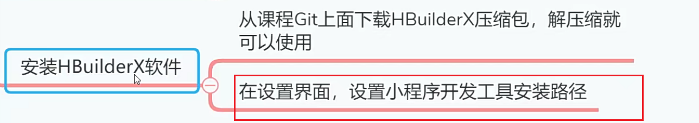
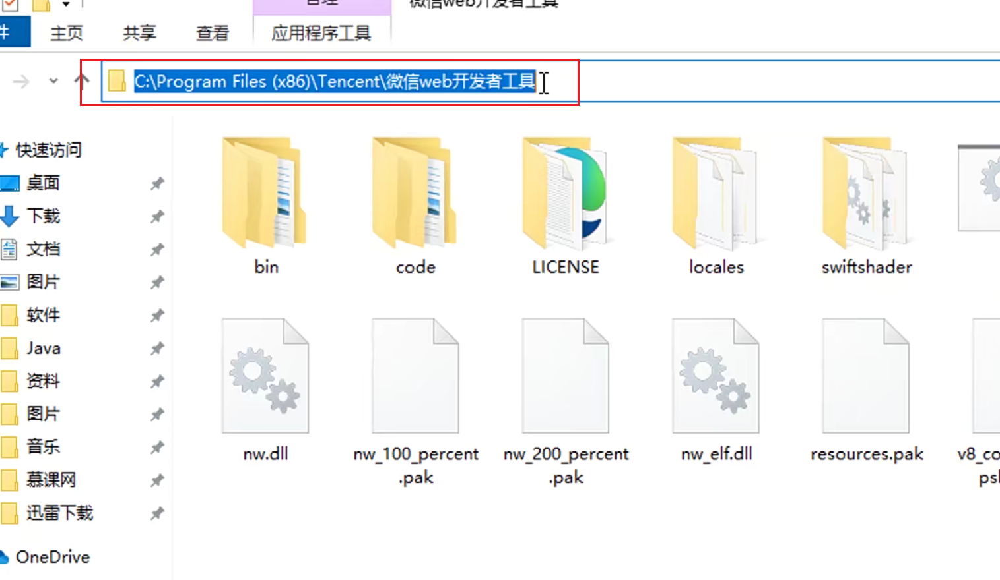
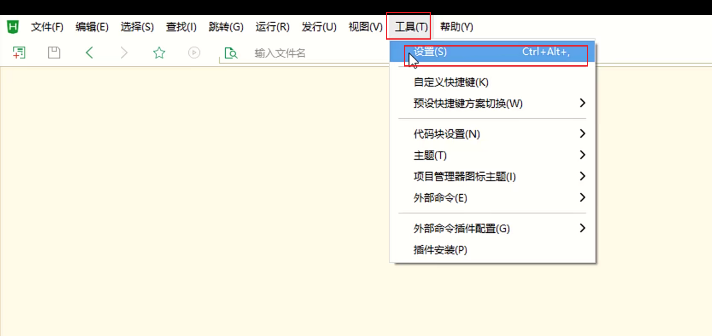
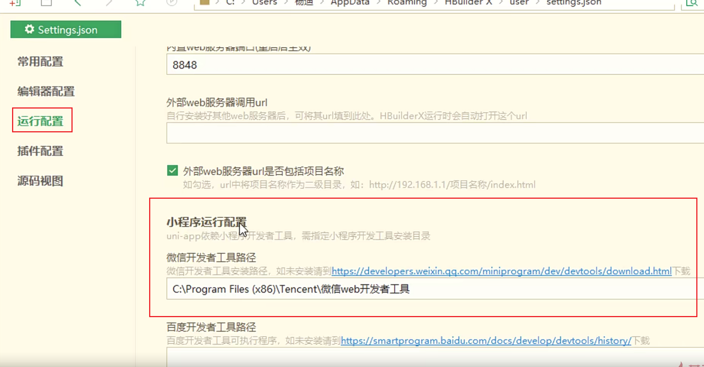

# 安装HBuilderX软件

## 为什么要安装HBuilderx？

HBuilderx工具是目前国产化软件中，开发前端和移动端项目最优秀的IDE之一，甚至比JetBrains出品的Webstorm还要好用。开发UNI-APP框架的移动端项目，**必然首选HBuilderX。**

## 安装

1.从GIT上面下载HBuilderX压缩包，解压缩就可以使用，不需要安装

## 设置小程序开发工具的安装目录

2.在设置界面中，找到运行设置选项，然后在微信开发者工具路径这里，设置小程序开发工具的安装目录。

**注意！**是目录地址，不包含EXE文件。

第一步

第二步

第三步

