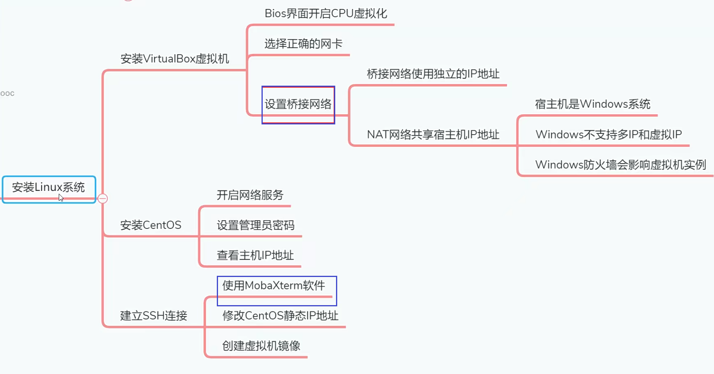
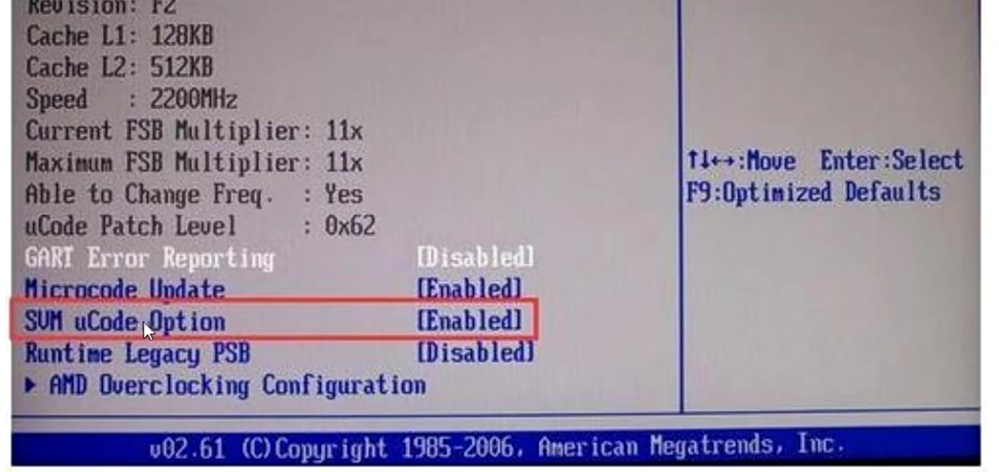
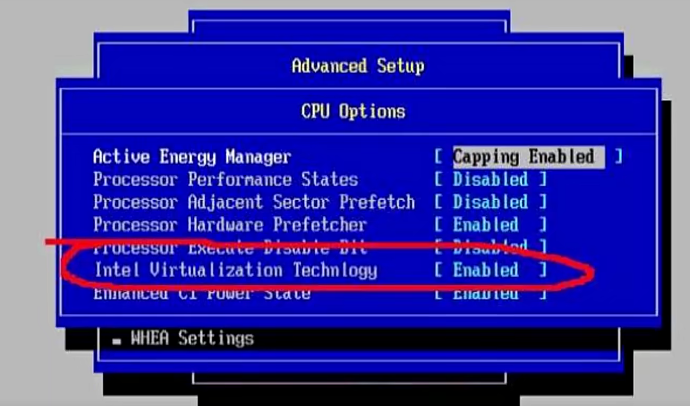

# 安装VirtualBox虚拟机

## 为什么选择VirtualBox？

VitualBo作为免费的虚拟机工具，稳定性甚至超过了Wmware虚拟机。自从VMware虚拟机15.X版本发布
以来，BUG不断，差评不断。我本人就遇到至少好几处BUG，比如说用最新版本的Win10系统安装VMware
会出现闪退的现象，安装无法进行。然后换成老版本的VMware虚拟机之后，创建好虚拟环境之后，启动虚拟
机出现了黑屏。几经周折，修改注册表，解决掉这个黑屏BUG之后。通过SSH上传文件到Linux的时候，经常
出现断网，像这种BUG层出不穷。所以在当前这门课程，我坚决放弃了VMware虚拟机，改用VirtualBox虚拟
机。经过几个月的使用，VirtualBox的稳定性真的挺不错的。VMware有的主要功能，VirtualBox都具备，所
以大家可以放心的使用VirtualBox。

## 安装的前提条件

1.在主板BIOS上面开启CPU虚拟化，为的是能在电脑上安装Docker程序。如果不开启虚拟化，是
无法安装Docker的。AMD和Intel的CPU在BIOS界面开启虚拟化的方式不同，请看下面的具体区
别

- AMD：在Bios界面找到SVM，开启这个选项。

- Intel：在Bios界面找到下面的选项，开启即可

