# 安装Centos系统

## 添加CentoS镜像

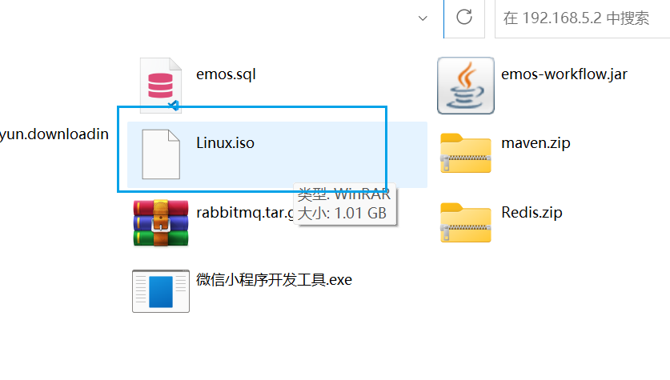

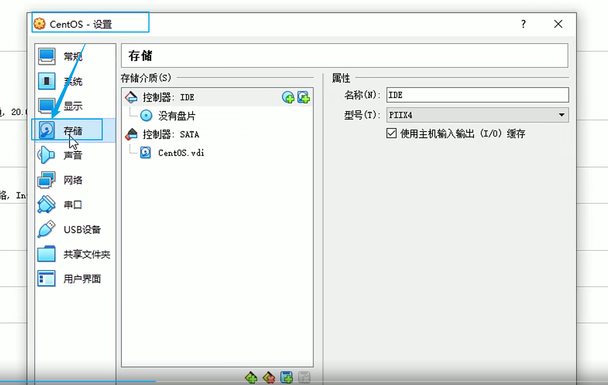


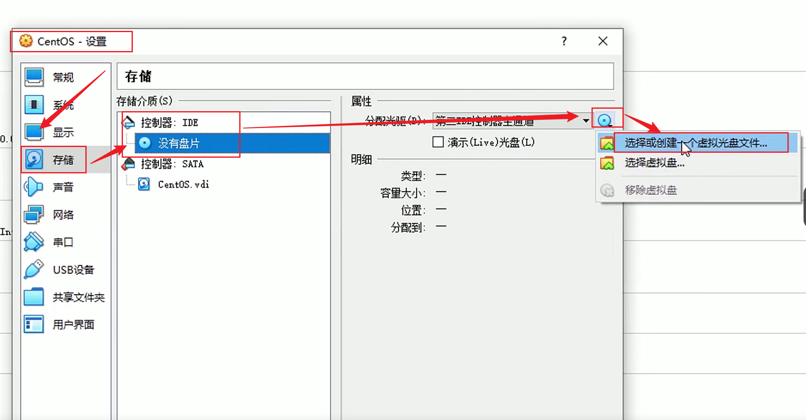


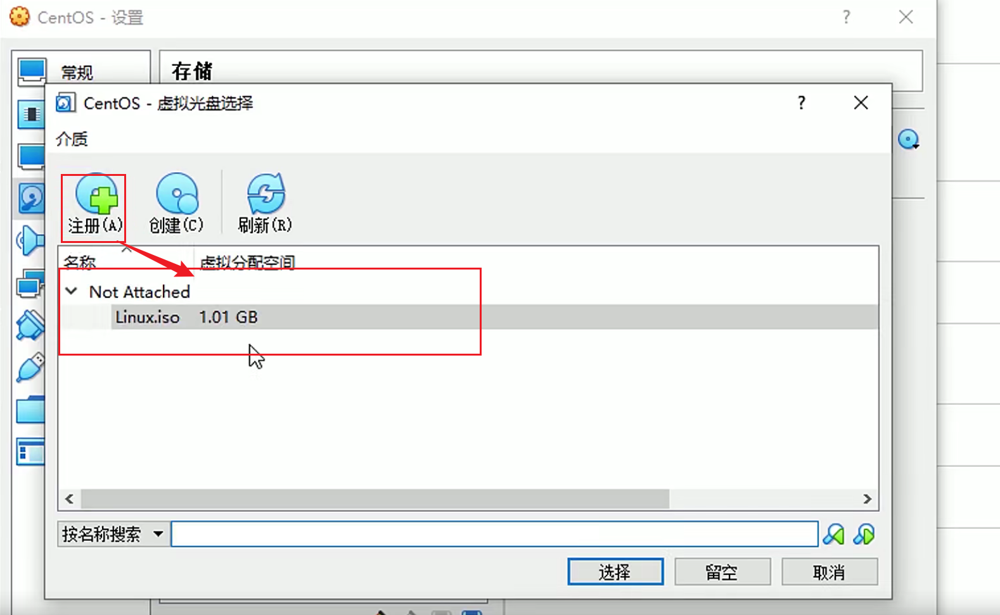


效果：

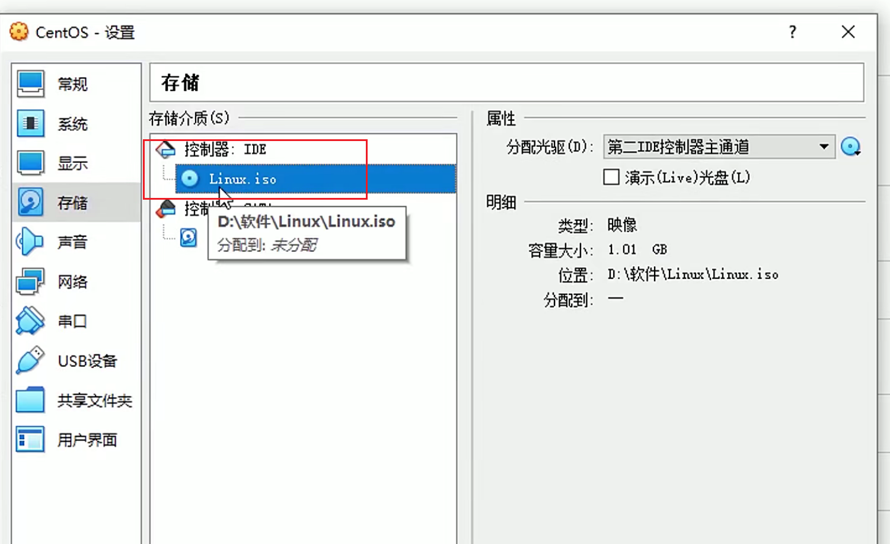


## 启动Centos系统

启动虚拟机

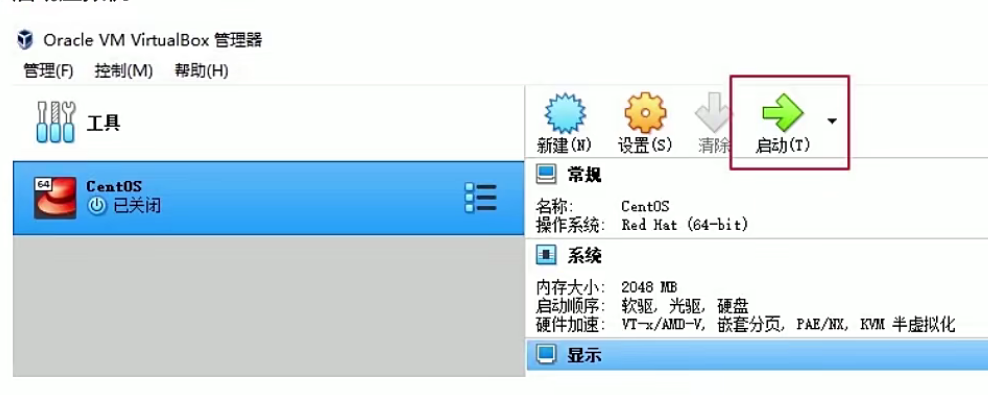


选择第一个选项，开始执行安装

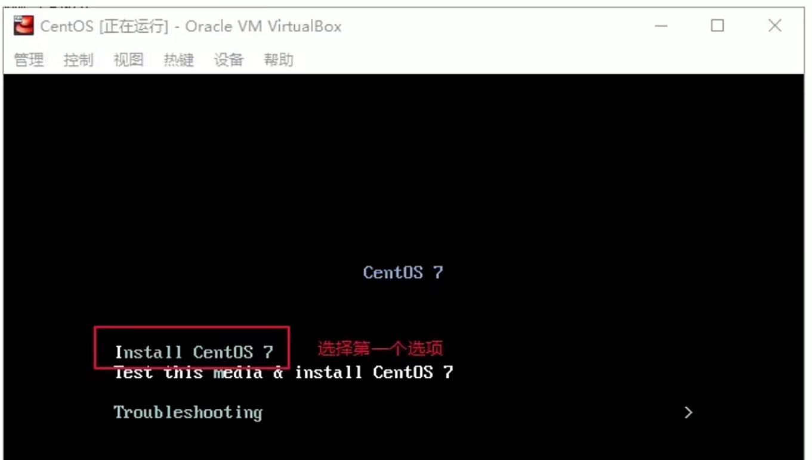


安装界面语言选择中文

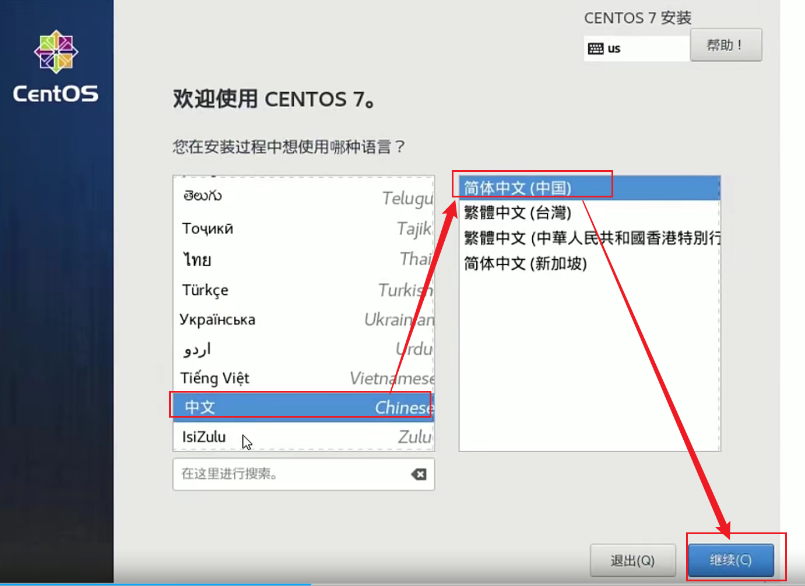

选择安装位置

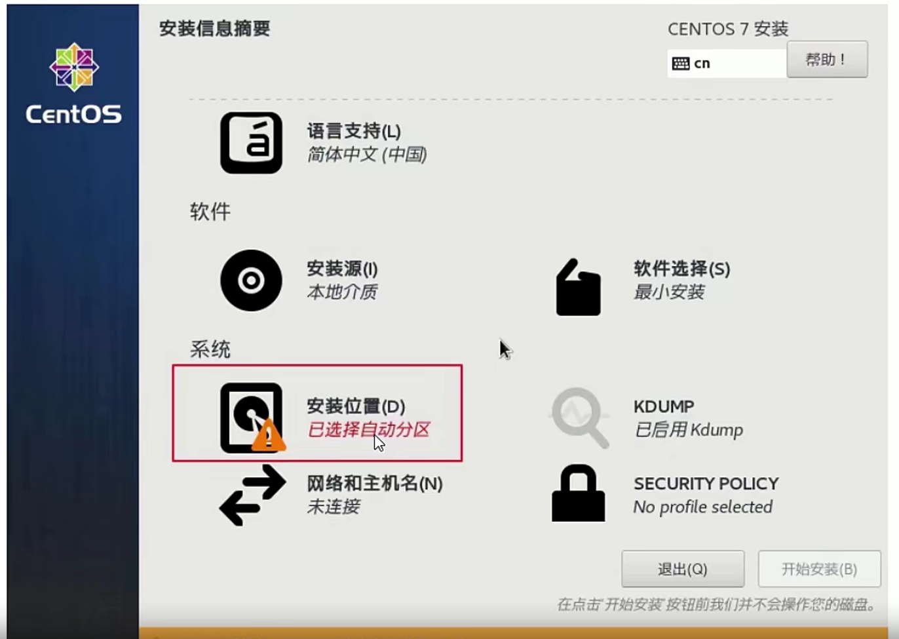


默认会自动创建分区，不需要我们干预，点击完成即可


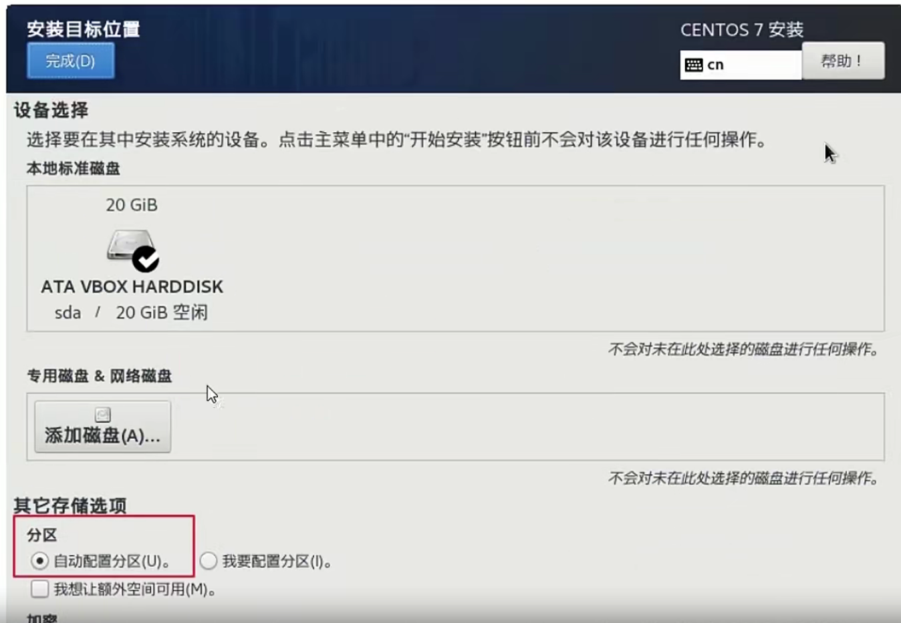

默认情况下Centos并没有开启联网功能，所以我们要手动开启联网。

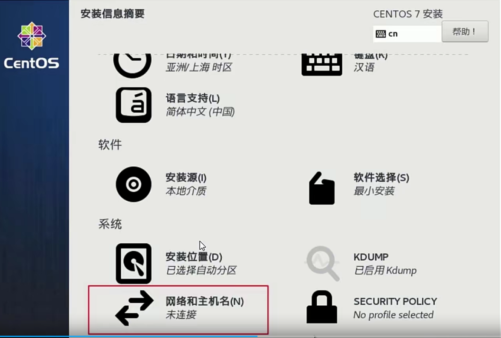


选择打开网络，然后记住你的虚拟网卡名字

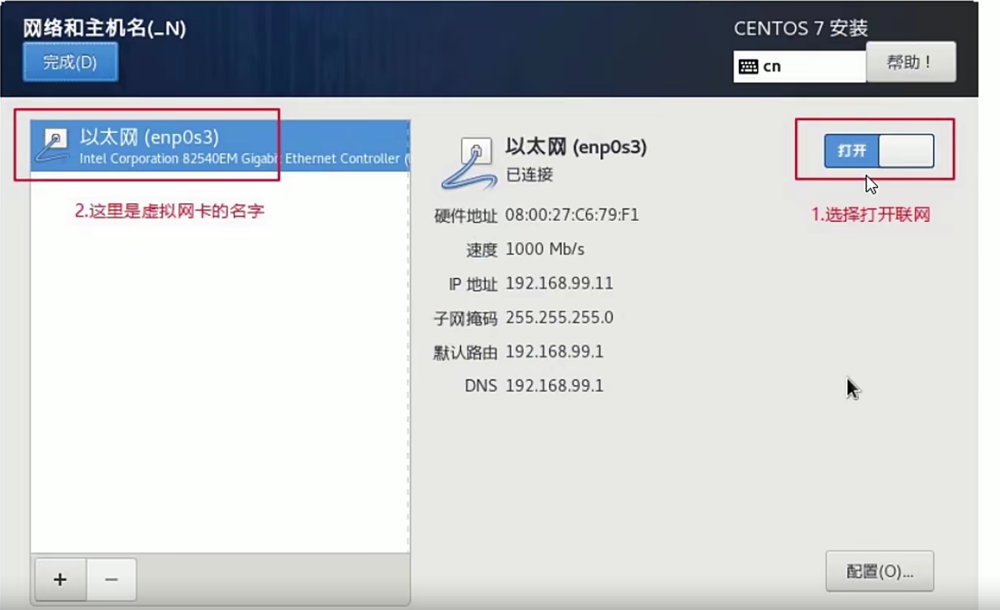

开始选择安装Centos

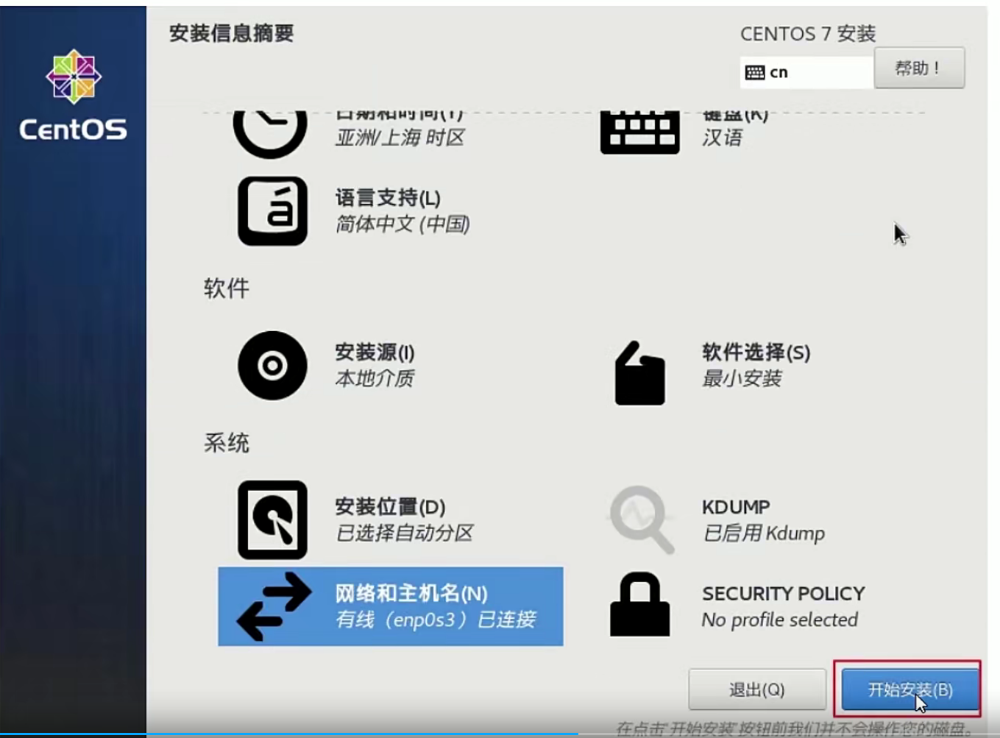


安装的过程中，可以设置root帐户密码。


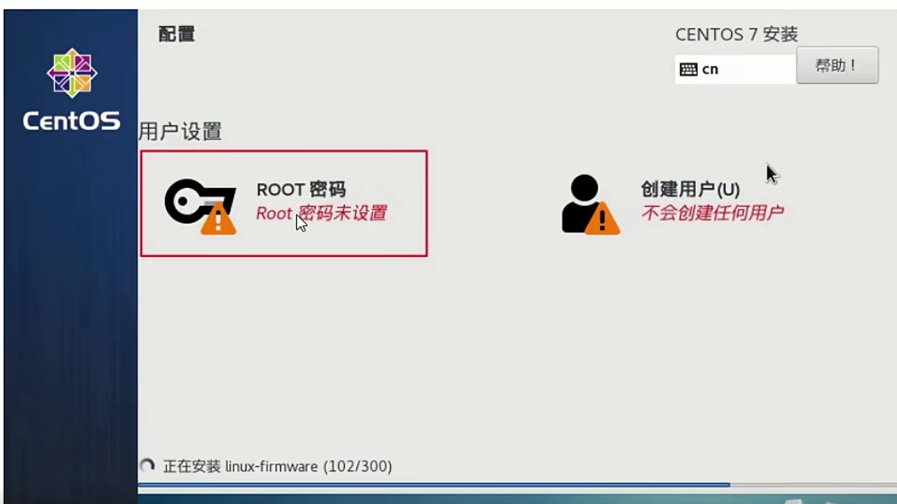


安装完成之后，用root帐户登陆Centos，查看系统的IP地址。

```
#下面的命合可以查看IP地址
ip addr
```

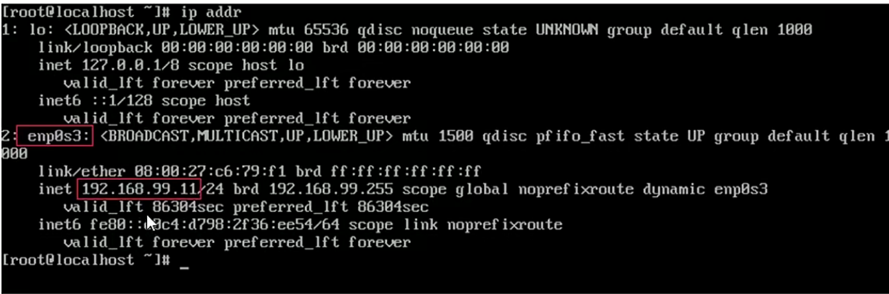


