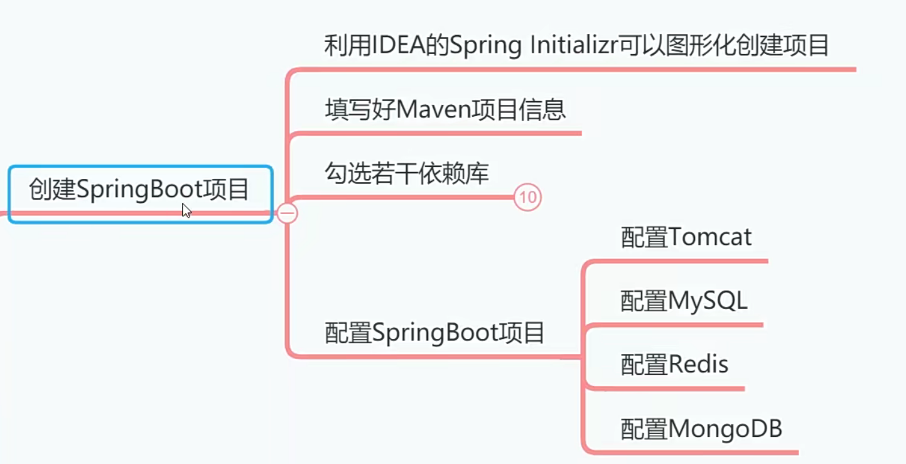
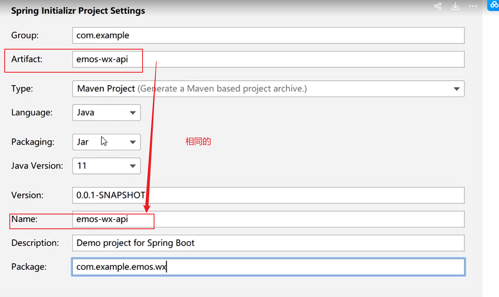
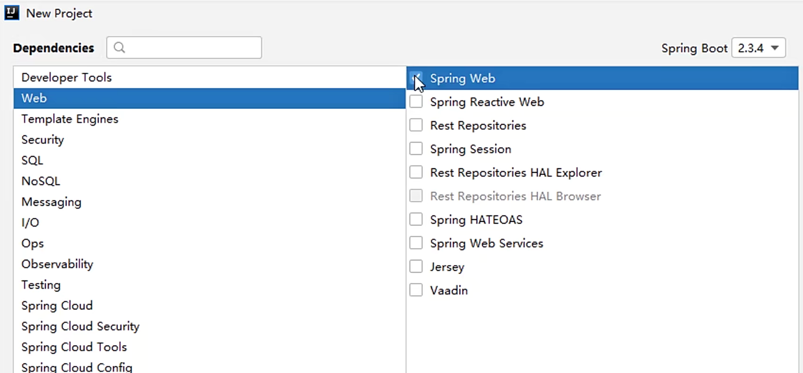
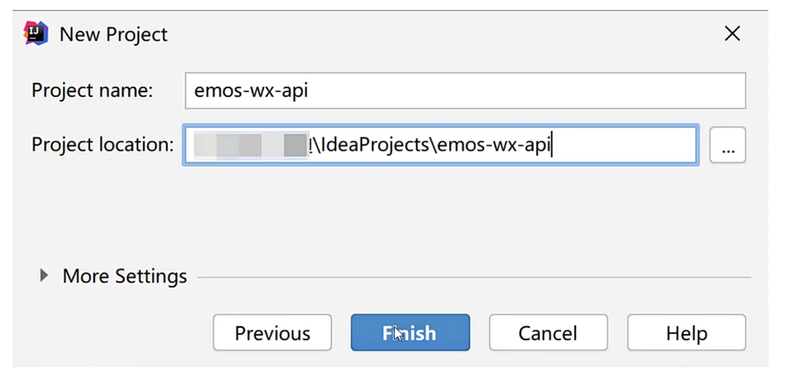
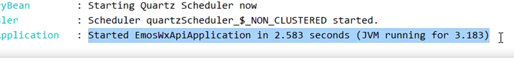

# 创建springboot项目




## 创建项目




## 勾选若干依赖库




| 序号 | 序号                | 作用              |
| ---- | ------------------- | ----------------- |
| 1    | SpringBoot DevTool  | 热部署插件        |
| 2    | Lombok              | 生成SET/GET方法   |
| 3    | Spring Web          | SpringMVC框架     |
| 4    | MySQL Driver        | MySQL数据库驱动   |
| 5    | MyBatis Framework   | MyBatis持久层框架 |
| 6    | Spring Data Redis   | 操作Redis技术     |
| 7    | Spring Data MongoDB | 操作MongoDB技术   |
| 8    | Spring For RabbitMQ | RabbitMQ驱动      |
| 9    | Java Mail Sender    | 邮件发送技术      |
| 10   | QuartZ Scheduler    | 定时器技术        |

填写项目名称



Shift+F6修改springboot.prepreoties文件该为yaml格式文件。


## 配置Tomcat

```yaml
Server：
    tomcat:
        uri-encoding: UTF-8
        threads
            max：200 # 最大线程数
            min-spare：30 # 最小
        connection-timeout: 5000ms # 超时的时间
    port:8080
    servlet：
        context-path：/emos-wx-api

```

## 配置MySQL数据源

```yaml
spring:
    datasource:
        type:com.alibaba.druid.pool.DruidDataSource
        druid:
            driver-class-name：
            com.mysql·jdbc.Driver
            url: jdbc:mysql:
            username: root
            password: abc123456
            initial-size:8  # cpu内核的2倍，如：我是8核cpu
            max-active：16
            min-idle：8
            max-wait:60000
            test-while-idle：true
            test-on-borrow： false
            test-on-return： false


```

因为使用了阿里巴巴吧的Druid连接池，所以要在pom.xml文件中添加依赖，然后让Maven执行
reload，依赖库就下载好了。

```xml
<dependency>
    <groupId>com.alibaba</groupId
    <artifactId>druid-spring-boot-starter</artifactId>
    <version>1,1.13</version>
</dependency>
```


## 配置Redis数据源

```yaml
spring
#这里省略MySOL配置信息
    redis:
        database:
        host：
        localhost
        port:6379
        password: abc123456
        jedis:  # 数据源连接池
            pool:
                max-active:1000
                max-Wait:-1ms
                max-idle:16
                min-idle：8

```


## 配置MongoDB数据源

```yaml
spring
    #这里省略MySQL配置信息
    #这里省略Redis配置信息
    data：
        morgodb:
            host: localhost
            port:27017
            database: emos
            authentication-database：admin
            username:admin
            password:abc123456

```


## 配置后主类运行

验证是否报错。




