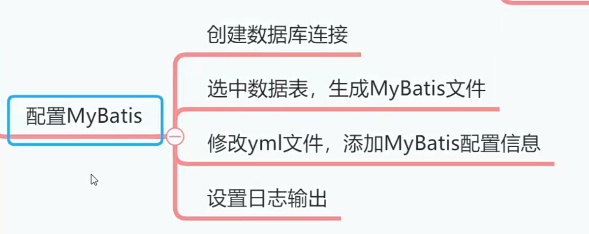
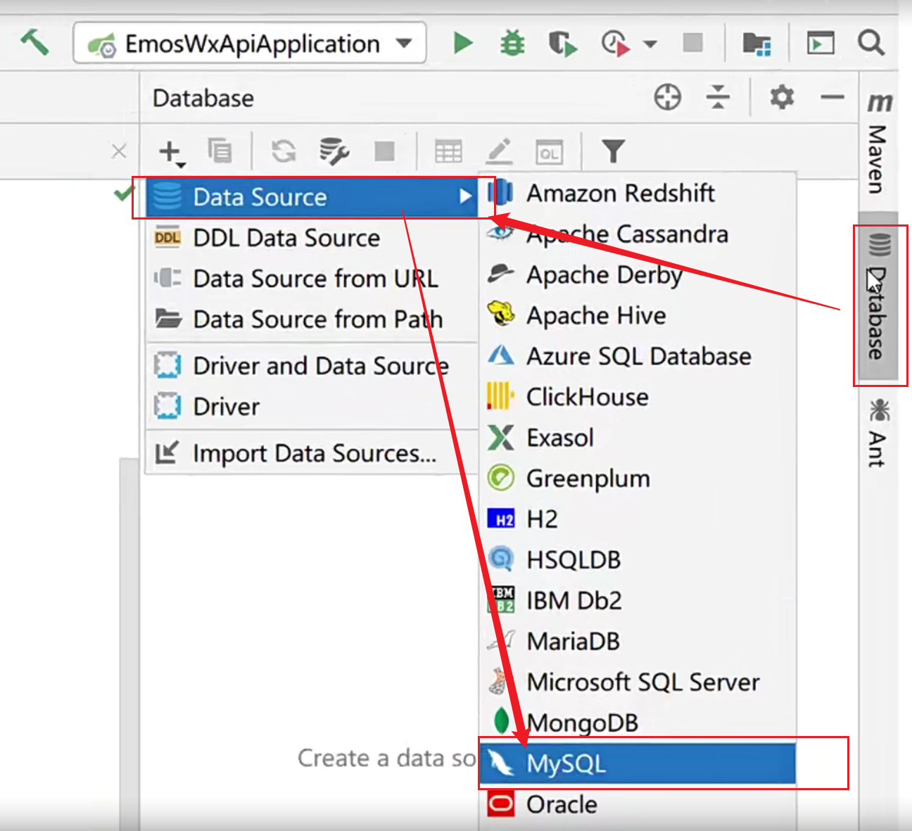
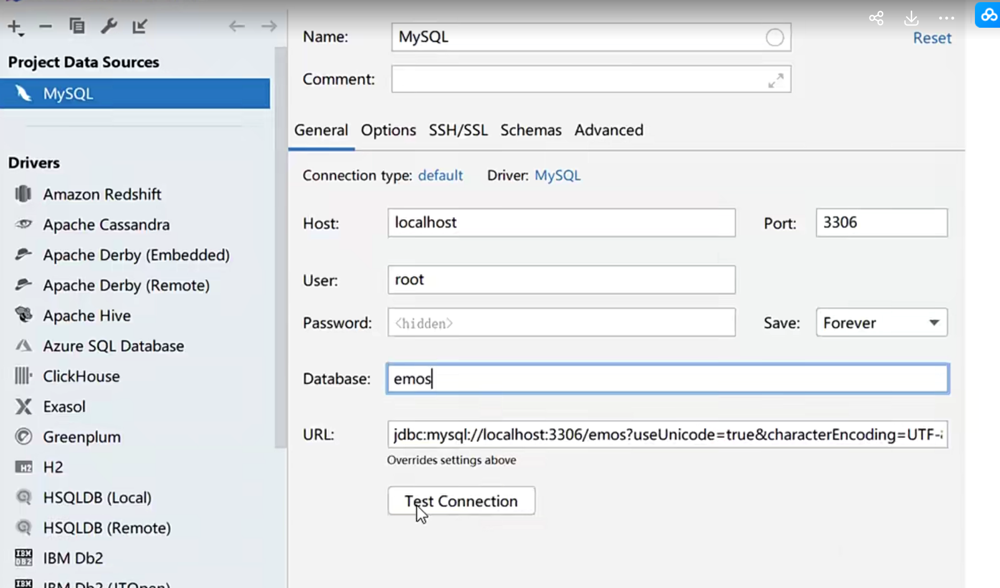
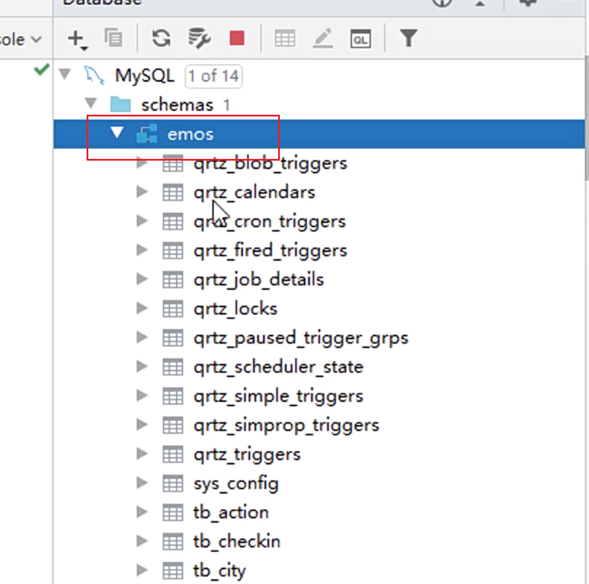
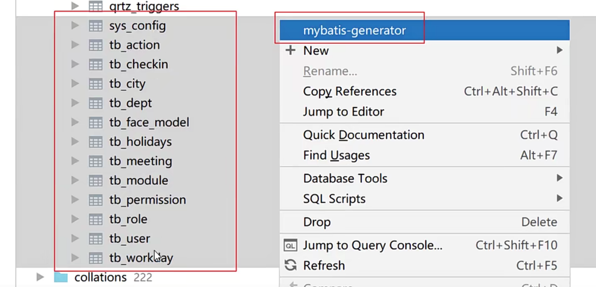
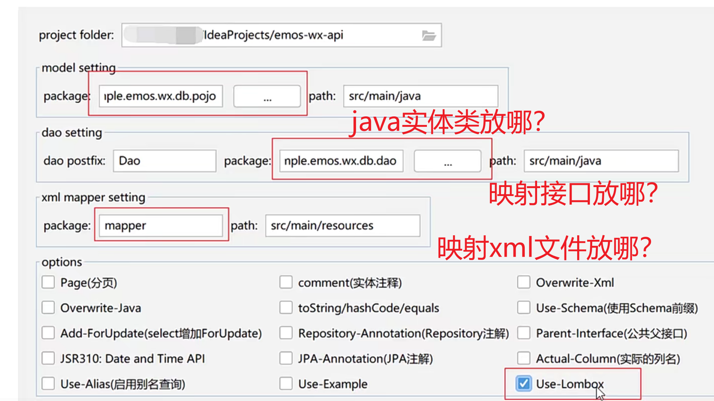
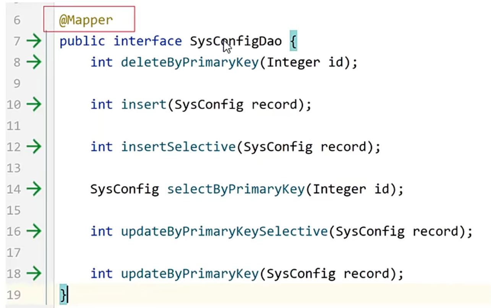

# 配置mybatis




## 创建IDEA数据库连接

因为在上一章我们已经给IDEA安装了MyBatis插件，所以我们可以利用插件的图形化界面，生成
MyBatis用到的配置文件、映射类和DAO接口。使用MyBatis插件之前，首先我们要在IDEA上面创建
数据库连接，步骤如下：

**选择创建MySQL数据库连接**









## 生成MyBatis各种文件

创建 com.example.emos.wx.db.pojo和 com.example.emos.wx.db.dao 包

选中这些数据表，然后点击右键，选择mybatis-generator




在面板中填写如下信息




每个Dao接口上都要添加注解
@Mapper

**为什么呢？**

要注册给spring框架。



## 配置MyBatis

```yaml
mybatis:
    mapper-locations:classpath*：mapper/*.xml
    type-aliases-package:com.example.emos.wx.db·pojo # javaBean对象
    configuration:
        log-impl:org.apache.ibatis.logging.stdout.StdoutImpl #控制台打印执行的sql语句 
        map-underscore-to-camel-case:true  # mybatis支持驼峰命名

```


## 配置日志输出

```
1ogging:
    level:
        root:info
        com.example.emos.wx.db.dao:warn # 日志少点
    pattern：
    console: "%d{HH:mm:ss}  %-5level %msg%n"

```


