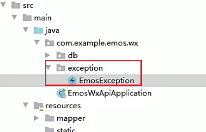

# 自定义异常[2-3]


- 为什么要自定义异常类？

因为后台Java项目是Web工程，所以有异常消息，我们要在原有异常消息的基础之上，封装状态码。所以需要我们自己创建一个异常类。

自定义异常类继承的父类，我没有选择Exception，因为Exception类型的异常，我们必须要手动显式处理，**要么上抛，要么捕获**。

**解决**：

我希望我定义的异常采用既可以采用显式处理，也可以隐式处理，所以我选择继承`RuntimeException`这个父类。RuntimeException类型的异常可以被虚拟机**隐式处理**，这样就省去了我们很多手动外理异常的麻烦

1. 创建 `com.gun.emos.wx.exception` 包
2. 创建EmosException类【可以根据自己的项目具体名字创建】

```java
package com.gun.emos.wx.exception
import 1ombok.Data;
@Data
class public EmosException extends RuntimeExceptiont

    private String msg;
    private int code = 500; // 写死


    public EmosException(String msg){
            super(msg);
            this.msg=msg;
    }

    public EmosException(String msg, Throwable e){
        super(msg，e);
        this.msg=msg;
    }

```


