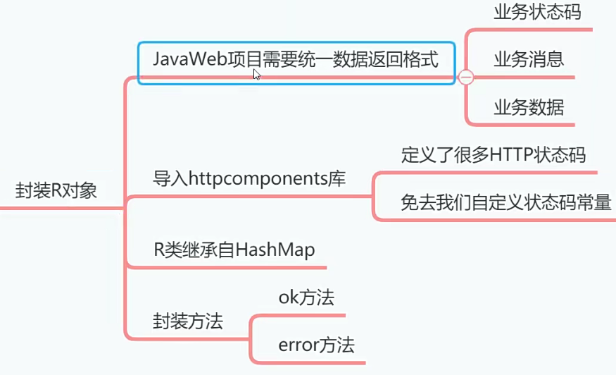

# 分装web返回的对象[2-4]




虽然SpringMVC的Controller可以自动把对象转换成JSON返回给客户端，但是我们需要制定一个统
一的标准，保证所有Controller返回的数据格式一致。最简便的办法就是定义封装类，来统一封装返
回给客户端的数据。


修改pom.xml文件，添加依赖库。Apache的httpcomponents库里面的Httpstatus类
封装了很多状态码，所以我们在Web返回对象中封装状态吗，可以用到这些状态码。

```xml
<dependency>
    <groupId>org,apache.httpcomponents</groupId
    <artifactId>httpcore</artifactId>
    <version>4.4.13</version>
</dependency>

```

先创建com.example.emos.wx.common.util包，然后创建R类。

```java
package com.example.emos.wx.common.util;

import org.apache.http.HttpStatus;

import java.util.HashMap;
import java.util.Map;

// 返回对象
public class R extends HashMap<String,Object> {
    public R(){
        put("code", HttpStatus.SC_OK);
        put("msg","success");
    }
    
    // 绑定数据到R对象实例上
    public R put(String key,Object value){
        super.put(key,value);
        return this;
    }
    
    // 静态方法
    public static R ok(){
        return new R();
    }
    public static R ok(String msg){
        R r=new R();
        r.put("msg",msg);
        return r;
    }
    public static R ok(Map<String,Object> map){
        R r=new R();
        r.putAll(map);
        return r;
    }

    public static R error(int code,String msg){
        R r=new R();
        r.put("code",code);
        r.put("msg",msg);
        return r;
    }
    public static R error(String msg){
        return error(HttpStatus.SC_INTERNAL_SERVER_ERROR,msg);
    }
    public static R error(){
        return error(HttpStatus.SC_INTERNAL_SERVER_ERROR,"未知异常，请联系管理员");
    }
}

```

