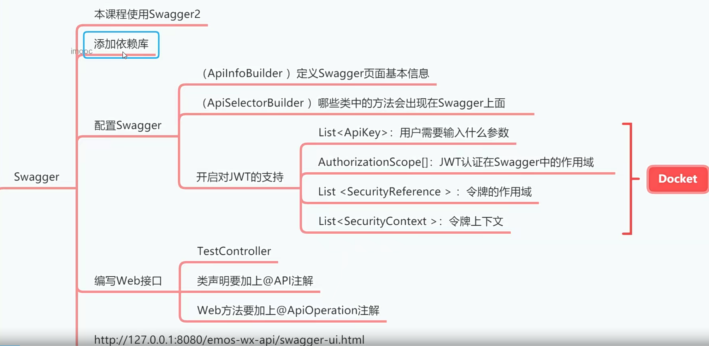

# 利用Swagger搭建REST_API[2-5]



开发前后端分离架构的项目，往往调试后端Web接口需要用到POSTMAN工具。虽然POSTMAN工具
的功能非常强大，但是请求参数很多的情况下，我们手写这些参数和数据还是非常麻烦的。因此我们
需要一个调试后端Web接口更加简便的方法。怡好Swagger提供了RESTAPI调用方式，我们不需要借
助任何工具的情况下，访问Swagger页面，就可以对Web接口进行调用和调试，这种调试方式的效率
要远超POSTMAN软件。

## 01添加依赖库

在pom.xm1文件中添加Swagger依赖库，这里我们使用的是Swagger2版本，在UI方面，比
Swagger1版本要好看很多。

```xml
        <dependency>
            <groupId>io.springfox</groupId>
            <artifactId>springfox-swagger2</artifactId>
            <version>2.9.2</version>
        </dependency>
        <dependency>
            <groupId>io.springfox</groupId>
            <artifactId>springfox-swagger-ui</artifactId>
            <version>2.9.2</version>
        </dependency>
```


## 02创建Swagger配置类

在com.example.emos.wx.ronfig包中创建 Swaggerconfig类

```java
package com.example.emos.wx.config;

import io.swagger.annotations.ApiOperation;
import org.springframework.context.annotation.Bean;
import org.springframework.context.annotation.Configuration;
import springfox.documentation.builders.ApiInfoBuilder;
import springfox.documentation.builders.PathSelectors;
import springfox.documentation.builders.RequestHandlerSelectors;
import springfox.documentation.service.ApiInfo;
import springfox.documentation.service.ApiKey;
import springfox.documentation.service.AuthorizationScope;
import springfox.documentation.service.SecurityReference;
import springfox.documentation.spi.DocumentationType;
import springfox.documentation.spi.service.contexts.SecurityContext;
import springfox.documentation.spring.web.plugins.ApiSelectorBuilder;
import springfox.documentation.spring.web.plugins.Docket;
import springfox.documentation.swagger2.annotations.EnableSwagger2;

import java.util.ArrayList;
import java.util.List;

@Configuration
@EnableSwagger2
public class SwaggerConfig {
    @Bean
    public Docket createRestApi() {
        Docket docket = new Docket(DocumentationType.SWAGGER_2);
        
        //ApiInfoBuilder用于在Swagger界面上添加各种信息

        ApiInfoBuilder builder = new ApiInfoBuilder();
        builder.title("EMOS在线办公系统");
        ApiInfo info = builder.build();
        docket.apiInfo(info);
        //ApiSelectorBuilder用来设置哪些类中的方法会生成到RESTAPI中
        ApiSelectorBuilder selectorBuilder = docket.select();
        selectorBuilder.paths(PathSelectors.any());//所有包下的类

//使用@Apioperation的方法会被提取到RESTAPI中
 selectorBuilder.apis(RequestHandlerSelectors.withMethodAnnotation(ApiOperation.class));
        docket = selectorBuilder.build();

        //下面的语句是开启对]WT的支持，当用户用swagger调用受]WT认证保护的方
//必须要先提交参数（例如合牌

        //存储用户必须提交的参数

        ApiKey apiKey = new ApiKey("token", "token", "header");
        List<ApiKey> apiKeyList = new ArrayList<>();
        apiKeyList.add(apiKey);
        docket.securitySchemes(apiKeyList);

        //如果用户]WT认证通过，则在Swagger中全局有效
        AuthorizationScope scope = new AuthorizationScope("global", "accessEverything");
        AuthorizationScope[] scopes = {scope};
        SecurityReference reference = new SecurityReference("token", scopes);
        List refList = new ArrayList();
        refList.add(reference);
        SecurityContext context = SecurityContext.builder().securityReferences(refList).build();
        List cxtList = new ArrayList();
        cxtList.add(context);
        docket.securityContexts(cxtList);

        return docket;
    }
}

```


## 03编写测试Web接口

在com.example.emos.wx.controller 包中创建 Testcontroller类。

```java
package com.example.emos.wx.controller;

import com.example.emos.wx.common.util.R;
import com.example.emos.wx.controller.form.TestSayHelloForm;
import io.swagger.annotations.Api;
import io.swagger.annotations.ApiOperation;
import org.apache.shiro.authz.annotation.Logical;
import org.apache.shiro.authz.annotation.RequiresPermissions;
import org.springframework.web.bind.annotation.*;

import javax.validation.Valid;

@RestController
@RequestMapping("/test")
@Api("测试Web接口")
public class TestController {
    @PostMapping("/sayHello")
    @ApiOperation("最简单的测试方法")
    public R sayHello(@Valid @RequestBody TestSayHelloForm form) {
        return R.ok().put("message", "Hello,"+form.getName());
    }

    @GetMapping("/hi")
    public R hi(){
        return R.ok();
    }

    @PostMapping("/addUser")
    @ApiOperation("添加用户")
    @RequiresPermissions(value = {"A","B"},logical = Logical.OR)
    public R addUser(){
        return R.ok("用户添加成功");
    }


}

```

## 04测试Web接口

打开浏览器，访问
http://127.0.0.1:8089/emos-wx-api/swagger-ui.html

