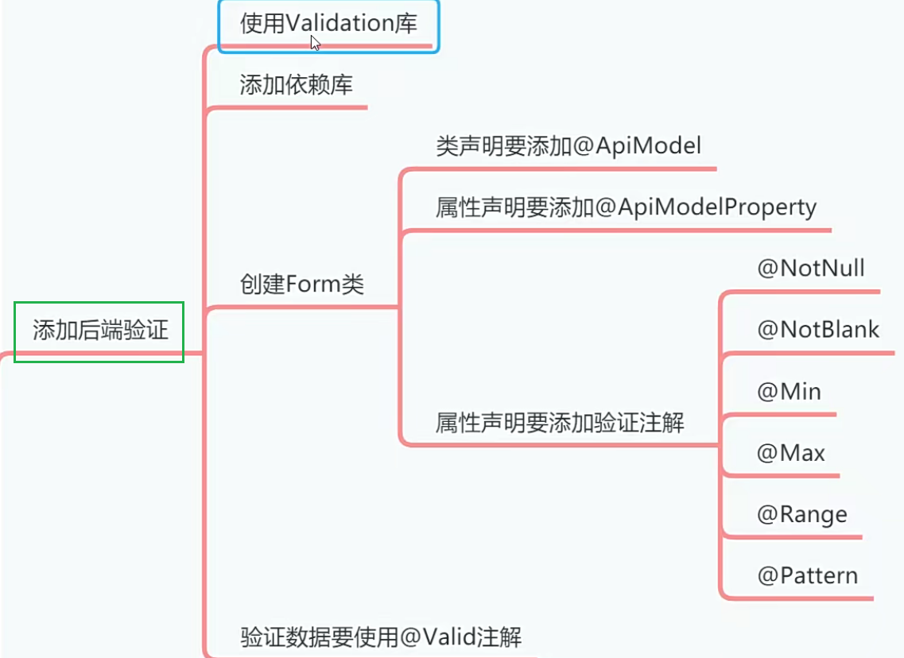
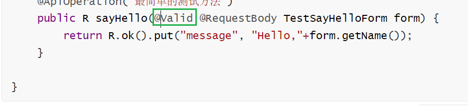
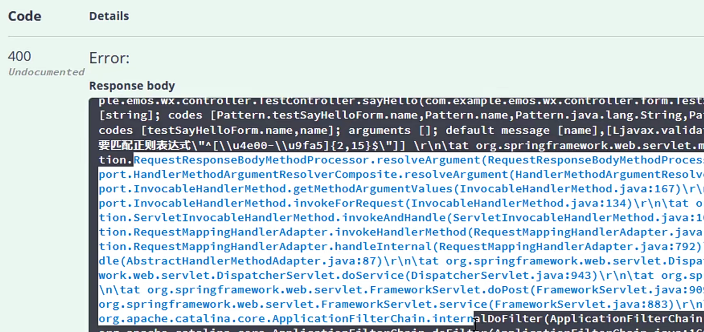
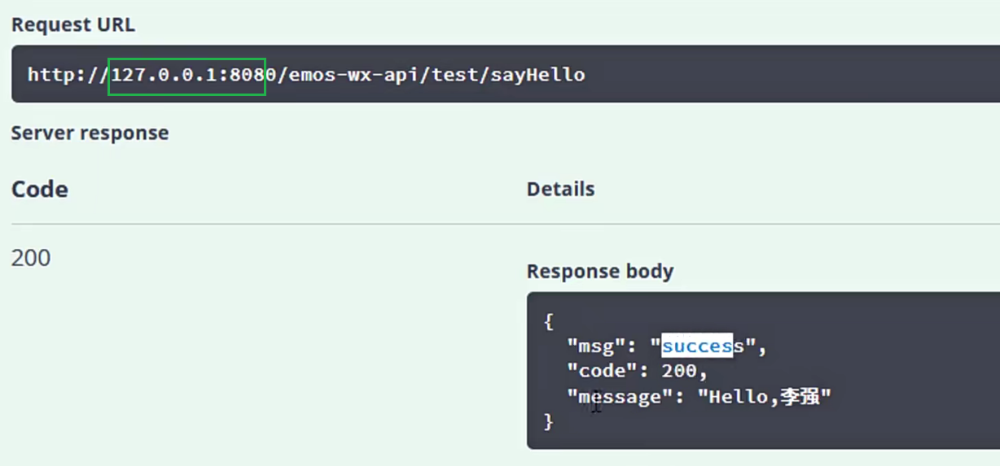

# 配置后端验证功能[2-6]



对于客户端提交表单或者Ajax中的数据，后端的Controller必须先要做验证，然后才能使用这些数
据。既然要验证数据，那么不奶我们来使用一下Validation库。

## 01添加依赖

在pom.xml文件中添加依赖，然后让Maven加载依赖库

```xml
        <dependency>
            <groupId>org.springframework.boot</groupId>
            <artifactId>spring-boot-starter-validation</artifactId>
        </dependency>
```

## 02创建Form类

validation库在做后端验证的时候，要求必须用封装类（Form类）来保存客户端提交的数据，
然后在封装类中，我们可以定义验证的规则，validation会执行这些规则，帮我们验证客户端提
交的数据。


我们为之前的Testcontroller里面的sayHel1o（）方法设置一个Form类，接受客户端提交
的name数据。我们在com.example.emos.wx.controller.form包里面创建 TestsayHelloForm类。

```java
package com.example.emos.wx.controller.form;

import io.swagger.annotations.ApiModel;
import io.swagger.annotations.ApiModelProperty;
import lombok.Data;

import javax.validation.constraints.NotBlank;
import javax.validation.constraints.Pattern;

@ApiModel  // 为出现在swagger页面上
@Data
public class TestSayHelloForm {
    @NotBlank  //数据不能为空  // 2-15个汉字
    @Pattern(regexp = "^[\\u4e00-\\u9fa5]{2,15}$",message = "不符合正则表达式")
    @ApiModelProperty("姓名")
    private String name;
}

```


03修改sayHello()方法

```java
@RestController
@RequestMapping("/test")
@Api("测试Web接口")
public class TestController {
    @PostMapping("/sayHello")
    @ApiOperation("最简单的测试方法")
    public R sayHello(@Valid @RequestBody TestSayHelloForm form) {
        return R.ok().put("message", "Hello,"+form.getName());
    }

}
```



- @Valid注解

  作用：验数据

  - 通过执行方法里的代码
  - 没有通过，不执行方法代码。


## 04验证测试


验证没有通过的返回值。

要省略写值...




成功的




