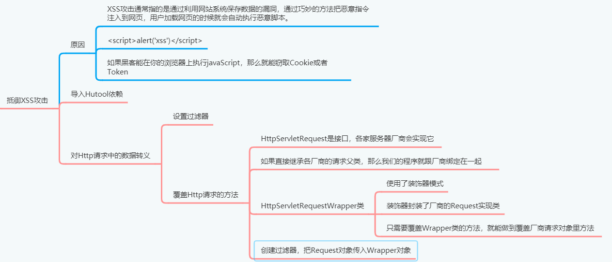

# 抵御即跨站脚本XSS攻击[2-7]



## 01XSS攻击的危害

XSS攻击通常指的是通过利用网页开发时留下的漏洞，通过巧妙的方法注入恶意指令代码到网页，使用户加载并执行攻击者恶意制造的网页程序。这些恶意网页程序通常是JavaScript，但实际上也可以包括Java、VBScript、ActiveX、Flash或者甚至是普通的HTML。攻击成功后，攻击者可能得到包括但不限于更高的权限（如执行一些操作）、私密网页内容、会话和cookie等各种内容。


例如用户在发帖或者注册的时候，在文本框中输入，

```html
<script>alert（xss）</script>
```

这段代码如果不经过转义处理，而直接保存到数据库。将来视图层漳染HTML的时候，把这段代码输出到页面上，那么<script>标签的内容就会被执行。


通常情况下，我们登陆到某个网站。如果网站使用Httpsession保存登陆凭证，那么sessionId会以cookie的形式保存在浏览器上。如果黑客在这个网页发帖的时候，填写的javaScript代码是用来获取Cookie内容的，并且把cookie内容通过Ajax发送给黑客自己的电脑。于是只要有人在这个网站上浏览黑客发的帖子，那么视图层道染HTML页面，就会执行注入的XSS脚本，于是你的Cookie信息就泄露了。黑客在自己的电脑上构建出Cookie，就可以冒充已经登陆的用户。


即便很多网站使用了JWT，登陆凭证（Token合牌）是存储在浏览器上面的。所以用XSS脚本可以轻松的从Storage中提取出Token，黑客依然可以轻松的冒充已经登陆的用户。所以避免XSS攻击最有效的办法就是对用户输入的数据进行转义，然后存储到数据库里面。等到视图层漳染HTML页面的时候。转义后的文字是不会被当做JavaScript执行的，这就可以抵御XSS攻击。

## 02导入依赖库

因为Hutool工具包带有XSS转义的工具类，所以我们要导入Hutool，然后利用Servlet规
范提供的请求包装类，定义数据转义功能。

```xml
        <dependency>
            <groupId>cn.hutool</groupId>
            <artifactId>hutool-all</artifactId>
            <version>5.4.0</version>
        </dependency>
```

## 03定义请求包装类

我们平时写Web项目遇到的HttpservletRequest，它其实是个接口。如果我们想要重新定义请求类，扩展这个接口是最不应该的。因为HttpservletRequest接口中抽象方法太多了，我们逐一实现起来太耗费时间。所以我们应该挑选一个简单一点的自定义请求类的方式。那就是继承 HttpservletRequestWrapper 父类。


JavaEE只是一个标准，具体的实现由**各家应用服务器厂商**来完成。比如说Tomcat在实现Servlet规范的时候，就自定义了HttpservletRequest接口的实现类。同时JavaEE规范还**定义**了HttpservletRequesturapper，这个类是请求类的包装类，用上了装饰器模式。不得不说这里用到的设计模式真的非常棒，无论各家应用服务器厂商怎么去实现HttpservletRequest接口，用户想要自定义请求，只需要继承HttpServletRequestwrapper，对应覆盖某个方法即可，然后把请求传入请求包装类，装饰器模式就会替代请求对象中对应的某个方法。用户的代码和服务器厂商的代码完全解耦，我们不用关心HttpServletRequest接口是怎么实现的，借助于包装类我们可以随意修改请求中的方法。同学们，如此优雅的代码设计，有时间你真该认真学习设计模式.


## 04实现

```java
package com.example.emos.wx.config.xss;

import cn.hutool.core.util.StrUtil;
import cn.hutool.http.HtmlUtil;
import cn.hutool.json.JSONUtil;

import javax.servlet.ReadListener;
import javax.servlet.ServletInputStream;
import javax.servlet.http.HttpServletRequest;
import javax.servlet.http.HttpServletRequestWrapper;
import java.io.*;
import java.nio.charset.Charset;
import java.util.LinkedHashMap;
import java.util.Map;

public class XssHttpServletRequestWrapper extends HttpServletRequestWrapper {
    public XssHttpServletRequestWrapper(HttpServletRequest request) {
        super(request);
    }

    // 获取请求的参数
    @Override
    public String getParameter(String name) {
        String value= super.getParameter(name);
        if(!StrUtil.hasEmpty(value)){
            value=HtmlUtil.filter(value);// 将参数的html代码全部过滤掉。
        }
        return value;
    }

    @Override
    public String[] getParameterValues(String name) {
        String[] values= super.getParameterValues(name);
        if(values!=null){
            for (int i=0;i<values.length;i++){
                String value=values[i];
                if(!StrUtil.hasEmpty(value)){
                    value=HtmlUtil.filter(value);
                }
                values[i]=value;
            }
        }
        return values;
    }

    // 返回一个map对象
    @Override
    public Map<String, String[]> getParameterMap() {
        Map<String, String[]> parameters = super.getParameterMap();
        LinkedHashMap<String, String[]> map=new LinkedHashMap();
        if(parameters!=null){
            for (String key:parameters.keySet()){
                String[] values=parameters.get(key);
                for (int i = 0; i < values.length; i++) {
                    String value = values[i];
                    if (!StrUtil.hasEmpty(value)) {
                        value = HtmlUtil.filter(value);
                    }
                    values[i] = value;
                }
                map.put(key,values);
            }
        }
        return map;
    }

    
    // 从请求头中获取数据
    @Override
    public String getHeader(String name) {
        String value= super.getHeader(name);
        if (!StrUtil.hasEmpty(value)) {
            value = HtmlUtil.filter(value);
        }
        return value;
    }

    
    // io流读取请求的数据
    @Override
    public ServletInputStream getInputStream() throws IOException {
        
        // 请求读数据的io
        InputStream in= super.getInputStream();
        
        // 字符流
        //Charset.forName("UTF-8")规定字符集
        InputStreamReader reader=new InputStreamReader(in, Charset.forName("UTF-8"));
        // 缓存流
        BufferedReader buffer=new BufferedReader(reader);
        
        // 字符串拼接
        StringBuffer body=new StringBuffer();
        
        // 读第1行的数据
        String line=buffer.readLine();
        while(line!=null){
            body.append(line);
            line=buffer.readLine();
        }
        
        // 读取完毕关闭流
        buffer.close();
        reader.close();
        in.close();
        
        // json字符串转换为  map对象
        Map<String,Object> map=JSONUtil.parseObj(body.toString());
        Map<String,Object> result=new LinkedHashMap<>();// 新的map对象，
        
        //   获取map的key，进行遍历，获取value，进行转义。
        for(String key:map.keySet()){
            Object val=map.get(key);
            if(val instanceof String){
                if(!StrUtil.hasEmpty(val.toString())){
                    result.put(key,HtmlUtil.filter(val.toString()));// 过滤
                }
            }else {
                result.put(key,val);
            }
        }
        
        // map对象转   json字符串
        String json=JSONUtil.toJsonStr(result);
        
        // 获取字符串的字节数组流对象
        ByteArrayInputStream bain=new ByteArrayInputStream(json.getBytes());
        
       
        return new ServletInputStream() {
            @Override
            public int read() throws IOException {
                // 流里面读数据返回
                return bain.read();
            }

            @Override
            public boolean isFinished() {
                return false;
            }

            @Override
            public boolean isReady() {
                return false;
            }

            @Override
            public void setReadListener(ReadListener readListener) {

            }
        };
    }
    
    
}

```

HttpServletRequestWrapper#getInputStream()【重点】

springMVC框架，就是通过上面的方法从请求里面提取客户端提交的数据，然后将这些数据封装到pojo对象里面。

如果：没有重写这个方法，那么后端项目就没有xss的防御效果。


## 05创建拦截请求类


```java
package com.example.emos.wx.config.xss;

import javax.servlet.*;
import javax.servlet.annotation.WebFilter;
import javax.servlet.http.HttpServletRequest;
import java.io.IOException;
@WebFilter(urlPatterns = "/*")
public class XssFilter implements Filter {
    @Override
    public void init(FilterConfig filterConfig) throws ServletException {

    }

    @Override
    public void doFilter(ServletRequest servletRequest, ServletResponse servletResponse, FilterChain filterChain) throws IOException, ServletException {
        HttpServletRequest request= (HttpServletRequest) servletRequest;
        
        // 装饰器类
        XssHttpServletRequestWrapper wrapper=new XssHttpServletRequestWrapper(request);
        
        // 放行
        filterChain.doFilter(wrapper,servletResponse);
    }

    @Override
    public void destroy() {

    }
}

```


## 06测试

```html
<script>alert（xss）</script>
```

