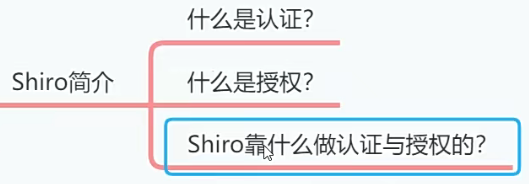
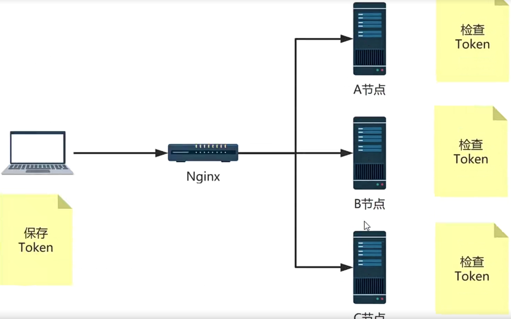

# Shiro和JWT技术[3-1]

## 01)什么是Shiro？

Shiro是Java领域非常知名的认证（Authentication）与授权（Authorization）框架，用以替代JavaEE中的JAAS功能。相较于其他认证与授权框架，Shiro设计的非常简单，所以广受好评。任意JavaWeb项目都可以使用Shiro框架，而SpringSecurity必须要使用在Spring项目中。所以Shiro的适用性更加广泛。像什么JFina1和Nutz非Spring框架都可以使用Shiro，而不能使用Spring Security框架。

## 什么是认证？

认证就是要核验用户的身份，比如说通过用户名和密码来检验用户的身份。说简单些，认证就是登陆。登陆之后Shiro要记录用户成功登陆的凭证，

## 什么是授权？

授权是比认证更加精细度的划分用户的行为。比如说一个教务管理系统中，学生登陆之后只能查看信息，不能修改信息。而班主任就可以修改学生的信息。这就是利用授权来限定不同身份用户的行为。

## Shiro靠什么做认证与授权的？

HttpSession或者Redis存储用户的登陆凭证，以及角色或者身份信息。然后Shiro可以利用利用过滤器（Filter），对每个Http请求过滤，检查请求对应的Httpsession或者Redis中的认证与授权信息。如果用户没有登陆，或者权限不够，那么Shiro会向客户端返回错误信息。

也就是说，我们写用户登陆模块的时候，用户登陆成功之后，

1. 要调用Shiro保存登陆凭证。
2. 然后查询用户的角色和权限，让Shiro存储起来。
3. 将来不管哪个方法需要登陆访问，或者拥有特定的角色跟权限才能访问，我们在方法前设置注解即可，非常简单。

## 02)JWT简介

JWT（JsonWebToken），是为了在网络应用环境间传递声明而执行的一种基于JSON的开放标准。JWT一般被用来在身份提供者和服务提供者间传递被认证的用户身份信息，以便于从资源服务器获取资源，也可以增加一些额外的其它业务逻辑所必须的声明信息，该token也可直接被用于认证，也可被加密。

## JWT可以用在单点登录的系统中

传统的javaWeb项目，利用Httpsession保存用户的登陆凭证。如果后端系统采用了负载均衡设计，当用户在A节点成功登陆，那么登陆凭证保存在A节点的Httpsession中。如果用户下一个请求被负载均衡到了B节点，因为B节点上面没有用户的登陆凭证，所以需要用户重新登录，这个**体验太糟糕**了。

如果用户的登陆凭证经过加密（Token）保存在客户端，客户端每次提交请求的时候，把Token上传给后端服务器节点。即便后端项目使用了负载均衡，每个后端节点接收到客户端上传的Token之后，经过检测，是有效的Token，于是就断定用户已经成功登陆，接下来就可以提供后A端服务了。

## JWT兼容更多的客户端

传统的Httpsession依靠浏览器的Cookie存放SessionId，所以要求客户端必须是浏览器。现在的JavaWeb系统，客户端可以是浏览器、APP、小程序，以及物联网设备。为了让这些设备都能访问到JavaWeb项目，就必须要引入JWT技术。JWT的Token是纯字符串，至于客户端怎么保Token存，没有具体要求。只要客户端发起请求的时候，附带上即可。所以像物联网设备，我们可以用数据。SQLite存储Token

