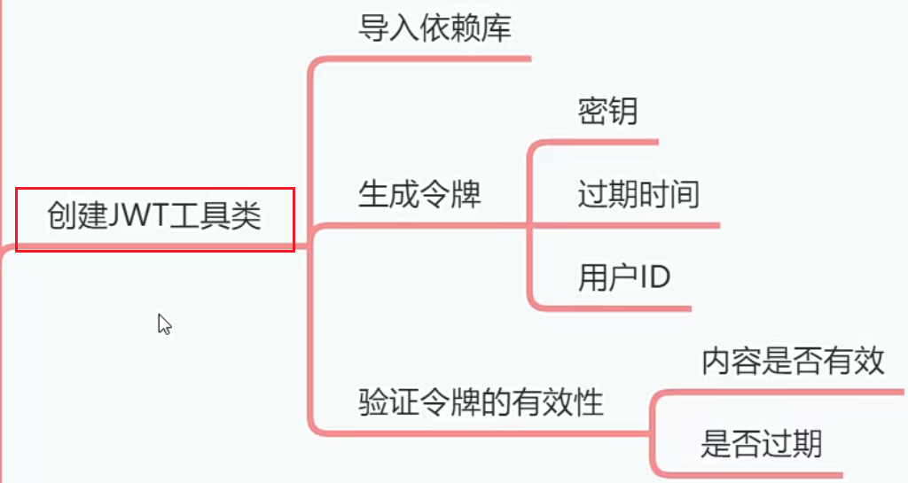

# 创建JwtUtil工具类[3-2]



令牌==token字符串

JWT的Token要经过加密才能返回给客户端，包括客户端上传的Token，后端项目需要验证核实。于是我们需要一个JWT工具类。

- 用来加密Token
- 验证Token的有效性。

## 01)导入依赖库


```xml
        <dependency>
            <groupId>org.apache.shiro</groupId>
            <artifactId>shiro-web</artifactId>
            <version>1.5.3</version>
        </dependency>
        <dependency>
            <groupId>org.apache.shiro</groupId>
            <artifactId>shiro-spring</artifactId>
            <version>1.5.3</version>
        </dependency>
        <dependency>
            <groupId>com.auth0</groupId>
            <artifactId>java-jwt</artifactId>
            <version>3.10.3</version>
        </dependency>
        <dependency>
            <groupId>org.springframework.boot</groupId>
            <artifactId>spring-boot-configuration-processor</artifactId>
            <optional>true</optional>
        </dependency>


        <dependency>
            <groupId>org.apache.commons</groupId>
            <artifactId>commons-lang3</artifactId>
            <version>3.11</version>
        </dependency>
        <dependency>
            <groupId>org.apache.httpcomponents</groupId>
            <artifactId>httpcore</artifactId>
            <version>4.4.13</version>
        </dependency>
        <dependency>
            <groupId>org.springframework.boot</groupId>
            <artifactId>spring-boot-starter-aop</artifactId>
        </dependency>

```


## 02)定义密钥和过期时间

我建议大家把密钥和过期时间定义到SpringBoot配置文件中，然后再值注入到avaBean中，这样维
护起来比较方便。

```yaml
emos:
  jwt:
    secret: abc123456
    expire: 5
    cache-expire: 10 # redis 保存token是10天。
```

 redis 保存token是10天。为什么是10天呢？【重点】

## 03)创建JWT工具类

在com,example.emos.wx.config.shiro中创建Jwtutil类。

```java
package com.example.emos.wx.config.shiro;

import cn.hutool.core.date.DateField;
import cn.hutool.core.date.DateUtil;
import com.auth0.jwt.JWT;
import com.auth0.jwt.JWTCreator;
import com.auth0.jwt.JWTVerifier;
import com.auth0.jwt.algorithms.Algorithm;
import com.auth0.jwt.interfaces.DecodedJWT;
import lombok.extern.slf4j.Slf4j;
import org.springframework.beans.factory.annotation.Value;
import org.springframework.stereotype.Component;

import java.util.Date;

@Component
@Slf4j
public class JwtUtil {
    // 后端指定的密钥。
    // 可以是自己谁便写的有意义的字符串，可以是自己谁便写的字符串
    // 通过工具自动生成的，如：uuid、雪花算法、
    @Value("${emos.jwt.secret}")
    private String secret;

    @Value("${emos.jwt.expire}")
    private int expire;

    // 创建token 
    // 通过一个用户的id
    public String createToken(int userId){
        // 对当前的日期偏移5天。
        Date date=DateUtil.offset(new Date(), DateField.DAY_OF_YEAR,5);// 1、过期时间
        // 静态工厂方法，创建加密算法对象。
        Algorithm algorithm=Algorithm.HMAC256(secret);  // 2、算法
        
        // 组装者设计模式
        // 创建内部类对象
        JWTCreator.Builder builder= JWT.create();// 创建JWT的组装者对象。
        
        String token=builder.
            withClaim("userId",userId).   //用户的信息
            withExpiresAt(date).   //  过期时间
            sign(algorithm);       // 签名算法
        
        return token;
    }

    // 通过token、解析用户的id。
    public int getUserId(String token){
        
       // 解码对象
        DecodedJWT jwt=JWT.decode(token);
        
        // 获取属性的值
        int userId=jwt.getClaim("userId").asInt();
        return userId;
    }

    // 验证token
    public void verifierToken(String token){
        
        // 算法对象
        Algorithm algorithm=Algorithm.HMAC256(secret);
        
        // 验证token的对象。
        JWTVerifier verifier=JWT.require(algorithm).build();
        
        // 1、看下这个token是否使用这个secret密钥加密的
        // 2、看下是否过期了
        
        verifier.verify(token);// 没有通过、抛异常，抛的是运行时的异常。
        // 通过没有异常产生。
    }
}

```


