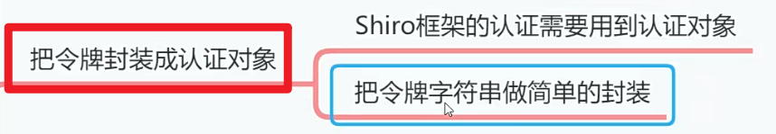
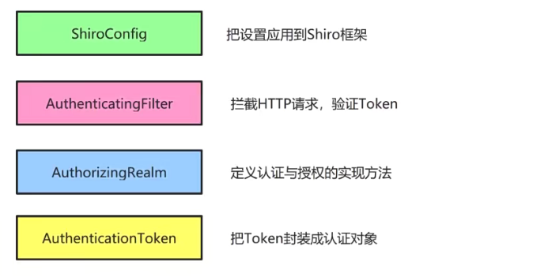
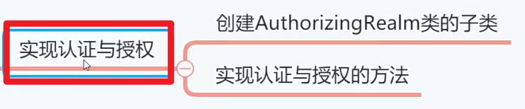
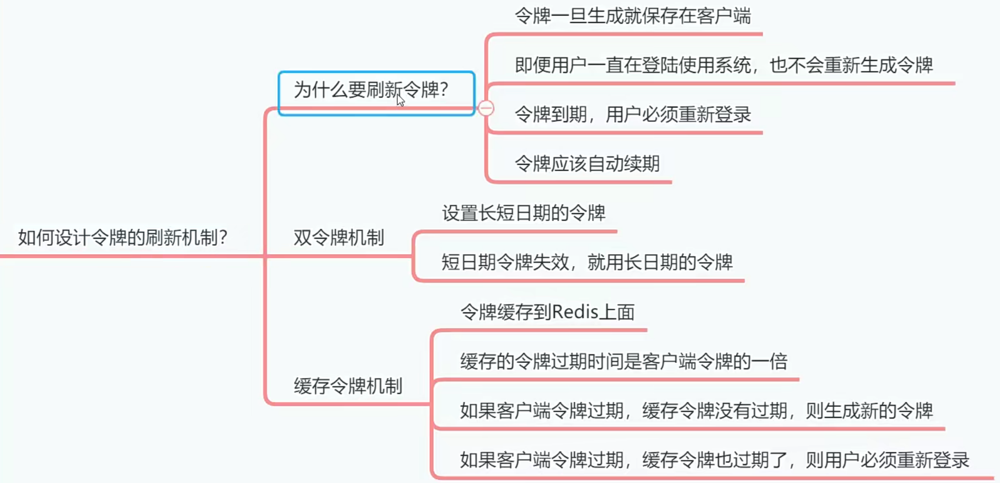
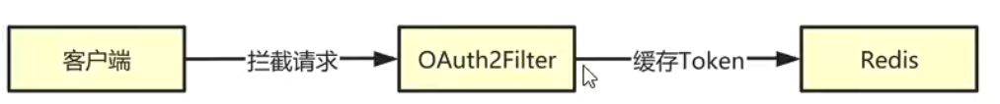
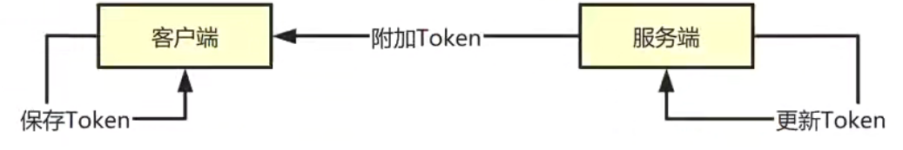
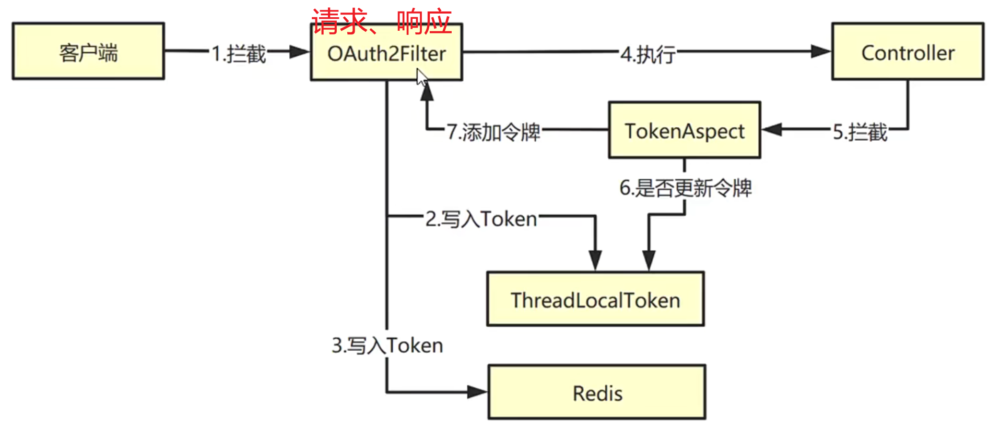

# 把令牌封装成认证对象[3-3]

JWTUtil类可以生成token字符串的，token字符串我们是要返回给客户端【浏览器】的，客户端发送请求都要带上这个令牌(token字符串)，后端项目获取令牌之后不能直接交给Shiro框架做验证，后端要进行把令牌字符串封装成Shiro可以识别的认证对象才行。



上一小节，我们通过JwtUtil类可以生成Token，这个Token我们是要返回给客户端的。接下来我们要把JWT和shiro框架对接起来，这样shiro框架就会拦截所有的Http请求，然后验证请求提交的Token是否有效。



**客户端**提交的Token不能直接交给Shiro框架，需要先封装成AuthenticationToken类型的对象，所以我们需要先创建AuthenticationToken的实现类。

## 01)把Token封装成认证对象

创建封装令牌的封装类。

在com.example.emos.wx.config.shiro 中创建 OAuth2Token类。

```java
package com.example.emos.wx.config.shiro;

import org.apache.shiro.authc.AuthenticationToken;

// AuthenticationToken实现接口
public class OAuth2Token implements AuthenticationToken {
    // 字符串变量
    private String token;

    public OAuth2Token(String token) {
        this.token = token;
    }

    @Override
    public Object getPrincipal() {
        return token;
    }

    @Override
    public Object getCredentials() {
        return token;
    }
}

```

## 02)实现认证与授权



Auth2Realm类是AuthorizingRealm的实现类，我们要在这个实现类中定义认证和授权的方法。因为认证与授权模块设计到用户模块和权限模块，现在我们还没有真正的开发业务模块，所以我们这里先暂时定义空的认证去授权方法，把Shiro和JWT整合起来，在后续章节我们再实现认证与授权。

在comexample.emos.wx·config.shiro 中创建 OAuth2zRealm类。

```java
package com.example.emos.wx.config.shiro;

import com.example.emos.wx.db.pojo.TbUser;
import com.example.emos.wx.service.UserService;
import org.apache.shiro.authc.*;
import org.apache.shiro.authz.AuthorizationInfo;
import org.apache.shiro.authz.SimpleAuthorizationInfo;
import org.apache.shiro.realm.AuthorizingRealm;
import org.apache.shiro.subject.PrincipalCollection;
import org.springframework.beans.factory.annotation.Autowired;
import org.springframework.stereotype.Component;

import java.util.Set;

//AuthorizingRealm 父类，
// 抽象类，把具体方法，进行实现。
@Component
public class OAuth2Realm extends AuthorizingRealm {
    @Autowired
    private JwtUtil jwtUtil;

    @Autowired
    private UserService userService;

    @Override
    public boolean supports(AuthenticationToken token) {
        
        // 令牌对象是不是你封装的类型
        return token instanceof OAuth2Token;
    }

    /**
     * 授权(验证权限时调用)
     */
    @Override
    protected AuthorizationInfo doGetAuthorizationInfo(PrincipalCollection collection) {
        TbUser user= (TbUser) collection.getPrimaryPrincipal();
        int userId=user.getId();
        Set<String> permsSet=userService.searchUserPermissions(userId);
        SimpleAuthorizationInfo info=new SimpleAuthorizationInfo();       
//TODO   查询用户的权限列表
//TODO  把权限列表添加到info对象中   
        info.setStringPermissions(permsSet);
        return info;
    }

    /**
     * 认证(验证登录时调用)多态参数写法
     */
    @Override
    protected AuthenticationInfo doGetAuthenticationInfo(AuthenticationToken token) throws AuthenticationException {
        //TODO从令牌中获取userId，然后检测该账户是否被冻结
        String accessToken=(String)token.getPrincipal();
        int userId=jwtUtil.getUserId(accessToken);
        TbUser user=userService.searchById(userId);
		//TODO往info对象中添加用户信息、Token字符串

        if(user==null){
            throw new LockedAccountException("账号已被锁定,请联系管理员");
        }
        SimpleAuthenticationInfo info=new SimpleAuthenticationInfo(user,accessToken,getName());
        return info;
    }
}
```

## 03)如何设计令牌的刷新机制？



- 为什么要刷新Token的过期时间？

我们在定义JwtUtil工具类的时候，生成的Token都有过期时间。那么问题来了，假设Token过期时间为15天，用户在第14天的时候，还可以免登录正常访问系统。但是到了第15天，用户的Token过期，于是用户需要重新登录系统。

Httpsession的过期时间比较优雅，默认为15分钟。如果用户连续使用系统，只要间隔时间不超过15分钟，系统就不会销毁Httpsession对象。JWT的令牌过期时间能不能做成Httpsession那样超时时间，只要用户间隔操作时间不超过15天，系统就不需要用户重新登录系统。实现这种效果的方案有两种：双Token和Token缓存，这里重点讲一下Token缓存方案。




Token缓存方案是把Token缓存到Redis，然后设置Redis里面缓存的Token过期时间为正常Token的1倍然后根据情况刷新Token的过期时间。

**Token失效，缓存也不存在的情况**

当第15天，用户的Token失效以后，我们让Shiro程序到Redis查看是否存在缓存的Token，如果这个Token不存在于Redis里面，就说明用户的操作间隔了15天，需要重新登录。

**Token失效，但是缓存还存在的情况**

如果Redis中存在缓存的Token，说明当前Token失效后，间隔时间还没有超过15天，不应该让用户重新登录。所以要生成新的Token返回给客户端，并且把这个Token缓存到Redis里面，这种操作成为刷新Token过期时间。

- 客户端如何更新令牌？

在我们的方案中，服务端刷新Token过期时间，其实就是生成一个新的Token给客户端。那么客户端怎么知道这次响应带回来的Token是更新过的呢？这个问题很容易解决。




只要用户成功登陆系统，当后端服务器更新Token的时候，就在响应中添加Token。客户端那边判断每次Ajax响应里面是否包含Token，如果包含，就把Token保存起来就可以了。

- 如何在响应中添加令牌？



我们定义OAuth2Fi1ter类拦截所有的HTTP请求。

1. 一方面它会把请求中的Token字符串提取出来，封装成对象交给Shiro框架；
2. 另一方面，它会检查Token的有效性。如果Token过期，那么会生成新的Token，<font color='blue'>分别</font>存储在<font color='red'>ThreadLocalToken</font>和<font color='red'>Redis</font>中。


之所以要把<font color='red'>新令牌</font>保存到<font color='red'>ThreadLocalToken</font>里面，是因为要向AOp切面类传递这个新今牌。虽然<font color='red'>OAuth2Filter</font>中有<font color='red'>doFilterInternal()</font>方法，我们可以得到响应并且写入新合牌。但是这个做非常麻烦，首先我们要通过I0流读取响应中的数据，然后还要把数据解析成JSON对象，最后再放入这个新令牌。如果我们定义了Aop切面类，拦截所有Web方法返回的R对象，然后在R对象里面添加新合牌，这多简单啊。但是OAuth2Filter和AOP切面类之间没有调用关系，所以我们很难把<font color='red'>新令牌</font>传给<font color='red'>AOP切面类</font>。

请看下一节...《05创建存储令牌的媒介类3-4》
