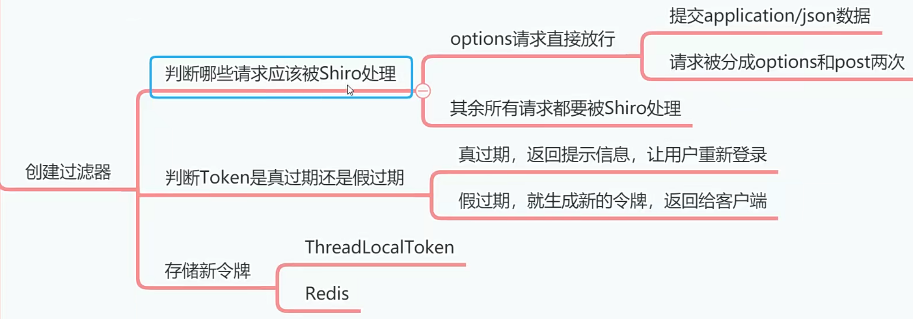
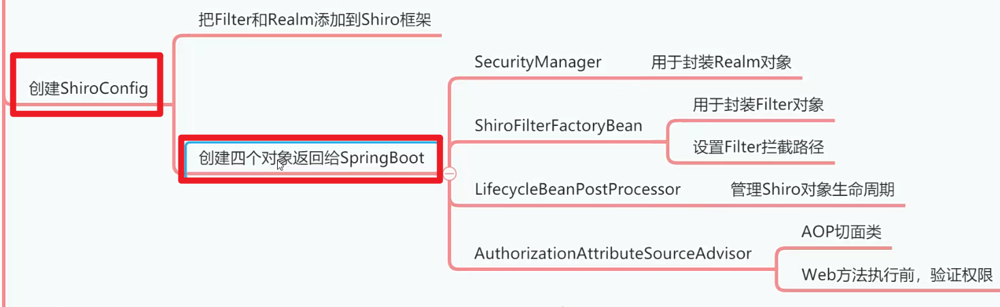
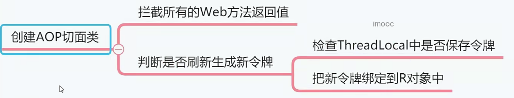

# 创建存储令牌的媒介类[3-4]

## 01)创建 ThreadLocalToken类

在com.example.emos.wx.config.shiro 中创建 ThreadLocalToken 类

```java
package com.example.emos.wx.config.shiro;

import org.springframework.stereotype.Component;

@Component
public class ThreadLocalToken {
    // 保险箱
    private ThreadLocal<String> local = new ThreadLocal<>();

    public void setToken(String token){
        // 保险箱 放入东西
        local.set(token);
    }

    public String getToken(){
         // 保险箱 获取东西
        return local.get();
    }

    public void clear(){
        local.remove();
    }
}

```


## 02)创建OAuth2Filter类



::: 注意事项

ThreadLocal中的数据，所以oAuth2Fi1ter类因为在oAuth2Fi1ter类中要读写必须要设置成多例的，否则ThreadLocal将无法使用。

:::

在配置文件中，添加JWT需要用到的密钥、过期时间和缓存过期时间。

```yaml
emos:
  jwt:
    secret: abc123456
    expire: 5
    cache-expire: 10
```

在com.example.emos.wx.config.shiro中创建OAuth2Filter类。

```java
package com.example.emos.wx.config.shiro;

import cn.hutool.core.util.StrUtil;
import com.auth0.jwt.exceptions.JWTDecodeException;
import com.auth0.jwt.exceptions.TokenExpiredException;
import org.apache.http.HttpStatus;
import org.apache.shiro.authc.AuthenticationException;
import org.apache.shiro.authc.AuthenticationToken;
import org.apache.shiro.web.filter.authc.AuthenticatingFilter;
import org.springframework.beans.factory.annotation.Autowired;
import org.springframework.beans.factory.annotation.Value;
import org.springframework.context.annotation.Scope;
import org.springframework.data.redis.core.RedisTemplate;
import org.springframework.stereotype.Component;
import org.springframework.web.bind.annotation.RequestMethod;

import javax.servlet.FilterChain;
import javax.servlet.ServletException;
import javax.servlet.ServletRequest;
import javax.servlet.ServletResponse;
import javax.servlet.http.HttpServletRequest;
import javax.servlet.http.HttpServletResponse;
import java.io.IOException;
import java.util.concurrent.TimeUnit;


//父类 :AuthenticatingFilter
@Component
@Scope("prototype")// 多例对象
public class OAuth2Filter extends AuthenticatingFilter {
    @Autowired
    private ThreadLocalToken threadLocalToken;

    @Value("${emos.jwt.cache-expire}")
    private int cacheExpire;

    // 生成token的工具类
    @Autowired
    private JwtUtil jwtUtil;

    // 使用redis
    @Autowired
    private RedisTemplate redisTemplate;

    //拦截请求之后，用于把合牌字符串封装成合牌对象4
    @Override
    protected AuthenticationToken createToken(ServletRequest request, ServletResponse response) throws Exception {
        //获取请求token
        // 请求中获取token的
        HttpServletRequest req= (HttpServletRequest) request;
        String token=getRequestToken(req);
        if(StrUtil.isBlank(token)){
            return null;
        }
        return new OAuth2Token(token);
    }

    
    //拦截请求，判断请求是否需要被shiro处理
    @Override
    protected boolean isAccessAllowed(ServletRequest request, ServletResponse response, Object mappedValue) {
        HttpServletRequest req= (HttpServletRequest) request;
        
        //Ajax提交application/json数据的时候，会先发出option请求
		//这里要放行options请求，不需要shiro处理
        if(req.getMethod().equals(RequestMethod.OPTIONS.name())){
            return true;// 放行不处理
        }
        
        //除了options请求之外，所有请求都要被shiro处理
        return false;
    }

    
    
    // 要Shiro处理调用的第一个逻辑方法。
    @Override
    protected boolean onAccessDenied(ServletRequest request, ServletResponse response) throws Exception {
        // 强制转换
        HttpServletRequest req= (HttpServletRequest) request;
        HttpServletResponse resp= (HttpServletResponse) response;
        resp.setContentType("text/html");
        resp.setCharacterEncoding("UTF-8");
        
        // 允许跨域请求
        resp.setHeader("Access-Control-Allow-Credentials", "true");
        resp.setHeader("Access-Control-Allow-Origin", req.getHeader("Origin"));

        threadLocalToken.clear();// 清空保险箱

        String token=getRequestToken(req);
        if(StrUtil.isBlank(token)){
            resp.setStatus(HttpStatus.SC_UNAUTHORIZED);
            
            // 浏览器返回消息。没有token
            resp.getWriter().print("无效的令牌");
            return false;
        }
        
        
        try{
            jwtUtil.verifierToken(token);
            
            // 捕获token验证异常
        }catch (TokenExpiredException e){
            if(redisTemplate.hasKey(token)){
                // 缓存的token删除
                redisTemplate.delete(token);
                
                // 获取新的token
                int userId=jwtUtil.getUserId(token);
                token=jwtUtil.createToken(userId);
                
                // 重新跟新缓存
                redisTemplate.opsForValue().set(token,userId+"",cacheExpire, TimeUnit.DAYS);
                threadLocalToken.setToken(token);
            }
            else{
                // 客户端的token过期了、服务端token没有
                resp.setStatus(HttpStatus.SC_UNAUTHORIZED);
                resp.getWriter().print("令牌已过期");
                return false;
            }
        }catch (Exception e){
            resp.setStatus(HttpStatus.SC_UNAUTHORIZED);
            resp.getWriter().print("无效的令牌");
            return false;
        }
        boolean bool=executeLogin(request,response);// 间接执行OAuth2Realm类
        return bool;
    }

    // Shiro在认证失败会执行这个方法
    @Override
    protected boolean onLoginFailure(AuthenticationToken token, AuthenticationException e, ServletRequest request, ServletResponse response) {
        HttpServletRequest req= (HttpServletRequest) request;
        HttpServletResponse resp= (HttpServletResponse) response;
        resp.setContentType("text/html");
        resp.setCharacterEncoding("UTF-8");
        resp.setHeader("Access-Control-Allow-Credentials", "true");
        resp.setHeader("Access-Control-Allow-Origin", req.getHeader("Origin"));
        resp.setStatus(HttpStatus.SC_UNAUTHORIZED);
        try{
            resp.getWriter().print(e.getMessage());
        }catch (Exception exception){

        }

        return false;
    }

    
    // 原来的过滤器一样
    @Override
    public void doFilterInternal(ServletRequest request, ServletResponse response, FilterChain chain) throws ServletException, IOException {
        HttpServletRequest req= (HttpServletRequest) request;
        HttpServletResponse resp= (HttpServletResponse) response;
        resp.setContentType("text/html");
        resp.setCharacterEncoding("UTF-8");
        resp.setHeader("Access-Control-Allow-Credentials", "true");
        resp.setHeader("Access-Control-Allow-Origin", req.getHeader("Origin"));
        super.doFilterInternal(request, response, chain);

    }

    //=================================================
    // 成员方法请求中获取tokend的
    private String getRequestToken(HttpServletRequest request){
        String token=request.getHeader("token");
        if(StrUtil.isBlank(token)){
            token=request.getParameter("token");
        }
        return token;
    }
}

```


## 03)创建ShiroConfig类



我们要创建的Shiroconfig类，是用来把0Auth2Filter和0Auth2Realm配置到Shiro框架，这样我们辛苦搭建的Shiro+JWT才算生效。

在com.exampleemos.wx.configshiro中创建ShiroConfig类。

```java
package com.example.emos.wx.config.shiro;

import org.apache.shiro.mgt.SecurityManager;
import org.apache.shiro.spring.LifecycleBeanPostProcessor;
import org.apache.shiro.spring.security.interceptor.AuthorizationAttributeSourceAdvisor;
import org.apache.shiro.spring.web.ShiroFilterFactoryBean;
import org.apache.shiro.web.mgt.DefaultWebSecurityManager;
import org.springframework.context.annotation.Bean;
import org.springframework.context.annotation.Configuration;

import javax.servlet.Filter;
import java.util.HashMap;
import java.util.LinkedHashMap;
import java.util.Map;

@Configuration
public class ShiroConfig {

    // 获取OAuth2Realm类对象，spring引用
    @Bean("securityManager")
    public SecurityManager securityManager(OAuth2Realm realm){
        //创建SecurityManager子类对象
        DefaultWebSecurityManager securityManager=new DefaultWebSecurityManager();
        securityManager.setRealm(realm);
        securityManager.setRememberMeManager(null);
        
        return securityManager;// 返回的对象自动注册给spring
    }

    
    // 
    //OAuth2Filter 自己定义的类
    @Bean("shiroFilter")
    public ShiroFilterFactoryBean shiroFilter(SecurityManager securityManager,OAuth2Filter filter){
        ShiroFilterFactoryBean shiroFilter=new ShiroFilterFactoryBean();
        shiroFilter.setSecurityManager(securityManager);

        Map<String , Filter> map=new HashMap<>();
        map.put("oauth2",filter);
        shiroFilter.setFilters(map);

        Map<String,String> filterMap=new LinkedHashMap<>();
        filterMap.put("/webjars/**", "anon");// 不拦截
        filterMap.put("/druid/**", "anon");
        filterMap.put("/app/**", "anon");
        filterMap.put("/sys/login", "anon");
        filterMap.put("/swagger/**", "anon");
        filterMap.put("/v2/api-docs", "anon");
        filterMap.put("/swagger-ui.html", "anon");
        filterMap.put("/swagger-resources/**", "anon");
        filterMap.put("/captcha.jpg", "anon");
        filterMap.put("/user/register", "anon");
        filterMap.put("/user/login", "anon");
        filterMap.put("/test/**", "anon");// 测试的方法
        filterMap.put("/meeting/recieveNotify", "anon");
        
        
        filterMap.put("/**", "oauth2");// 拦截要执行的类oauth2是key

        shiroFilter.setFilterChainDefinitionMap(filterMap);

        return shiroFilter;

    }

    // 固定写法
    @Bean("lifecycleBeanPostProcessor")
    public LifecycleBeanPostProcessor lifecycleBeanPostProcessor(){
        return new LifecycleBeanPostProcessor();
    }

    
    
    //切面类AOP
    @Bean
    public AuthorizationAttributeSourceAdvisor authorizationAttributeSourceAdvisor(SecurityManager securityManager){
        AuthorizationAttributeSourceAdvisor advisor=new AuthorizationAttributeSourceAdvisor();
        advisor.setSecurityManager(securityManager);
        return advisor;
    }
}

```

## 04)利用切面类向客户端返回新令牌



我们在写oAuth2Filter的时候，把更新后的令牌写到ThreadLocalToken里面的ThreadLocal。那么这个小节，我们要创建AOp切面类，拦截所有Web方法的返回值，在返回的R对象中添加更新后的令牌。

在com.example,emos.wx.aop中创建TokenAspect类。

```java
package com.example.emos.wx.aop;

import com.example.emos.wx.common.util.R;
import com.example.emos.wx.config.shiro.ThreadLocalToken;
import org.aspectj.lang.ProceedingJoinPoint;
import org.aspectj.lang.annotation.Around;
import org.aspectj.lang.annotation.Aspect;
import org.aspectj.lang.annotation.Pointcut;
import org.springframework.beans.factory.annotation.Autowired;
import org.springframework.stereotype.Component;

@Aspect
@Component
public class TokenAspect {
    
    // 媒介类
    @Autowired
    private ThreadLocalToken threadLocalToken;

    
    // 声明切点：我们要拦截哪些方法的调用
    // controller包下的全部方法，
    @Pointcut("execution(public * com.example.emos.wx.controller.*.*(..))")
    public void aspect(){

    }

    
    // 环绕事件：方法调用的参数可以拦截
    // 方法返回的结果我也可以拦截
    
    //ProceedingJoinPoint 方法执行后的返回值
    @Around("aspect()")
    public Object around(ProceedingJoinPoint point) throws Throwable{
        
        
        R r=(R)point.proceed();//方法执行结果
        
        String token=threadLocalToken.getToken();
        if(token!=null){
            r.put("token",token);
            threadLocalToken.clear();
        }
        
        // 虚拟机
        return r;
    }
}

```

