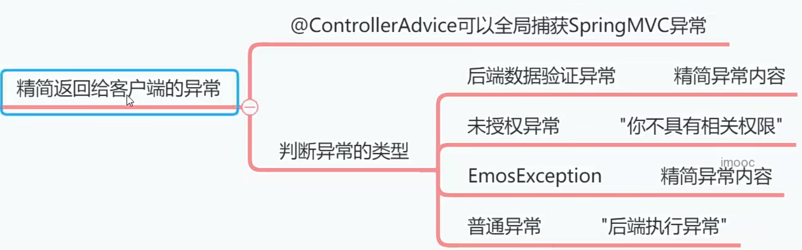
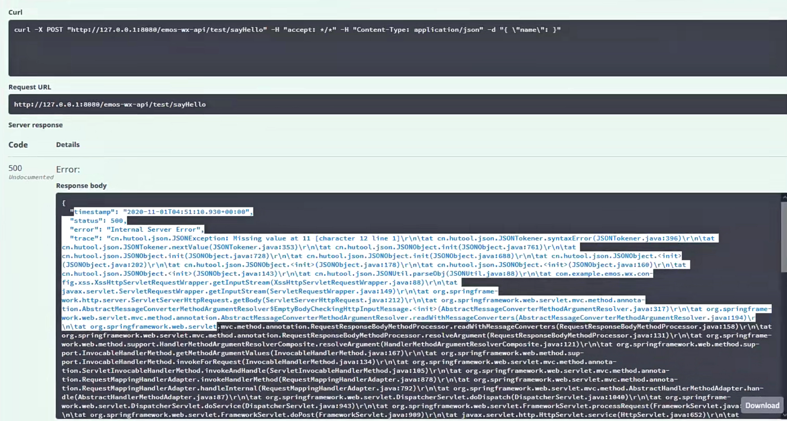

# 精简返回给客户端的异常内容[3-5]



之前我们测试sayHello0方法的时候，因为客户端提交的参数不正确，所以后端系统向客户端返回了大量的异常内容。这里我们要对返回的异常内容做一下精简。



在com，example,emos.wx.config中，创建ExceptionAdvice 类。

```java
package com.example.emos.wx.config;

import com.example.emos.wx.exception.EmosException;
import lombok.extern.slf4j.Slf4j;
import org.apache.shiro.authz.UnauthorizedException;
import org.springframework.http.HttpStatus;
import org.springframework.web.bind.MethodArgumentNotValidException;
import org.springframework.web.bind.annotation.ExceptionHandler;
import org.springframework.web.bind.annotation.ResponseBody;
import org.springframework.web.bind.annotation.ResponseStatus;
import org.springframework.web.bind.annotation.RestControllerAdvice;

@Slf4j
@RestControllerAdvice
public class ExceptionAdvice {
    @ResponseBody
    @ResponseStatus(HttpStatus.INTERNAL_SERVER_ERROR)//500
    @ExceptionHandler(Exception.class)// 捕获全局异常
    public String exceptionHandler(Exception e){
        log.error("执行异常",e);
        
        if(e instanceof MethodArgumentNotValidException){
            // 后端参数验证失败抛出的异常
            MethodArgumentNotValidException exception= (MethodArgumentNotValidException) e;
            return exception.getBindingResult().getFieldError().getDefaultMessage();
        }
        else if(e instanceof EmosException){
            EmosException exception= (EmosException) e;
            return exception.getMsg();
        }
        else if(e instanceof UnauthorizedException){
            return "你不具备相关权限";
        }
        else{
            return "后端执行异常";
        }
    }
}

```

