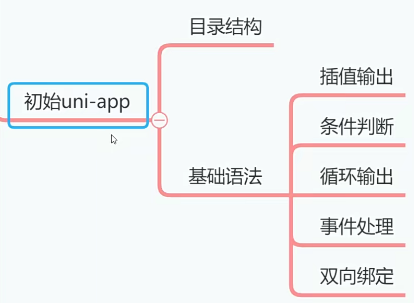
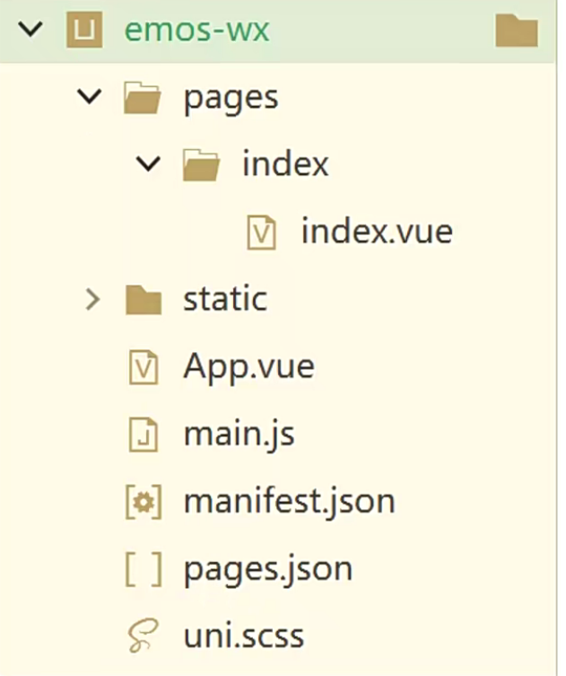
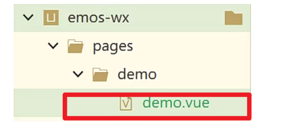
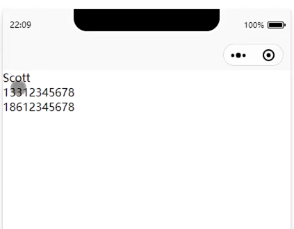
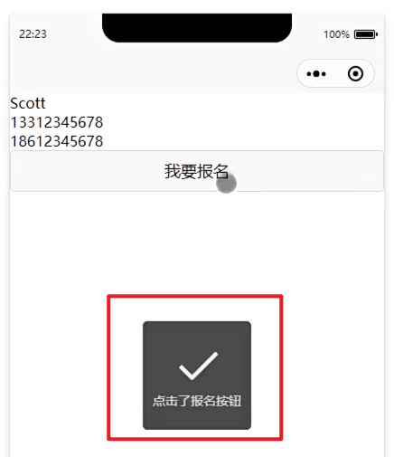
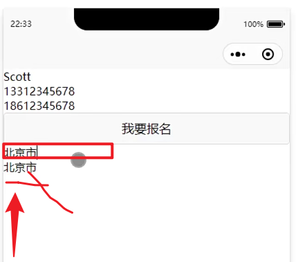
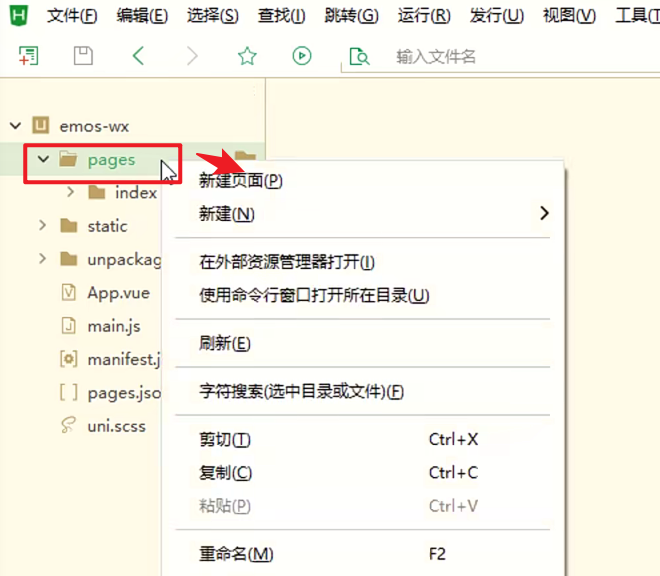
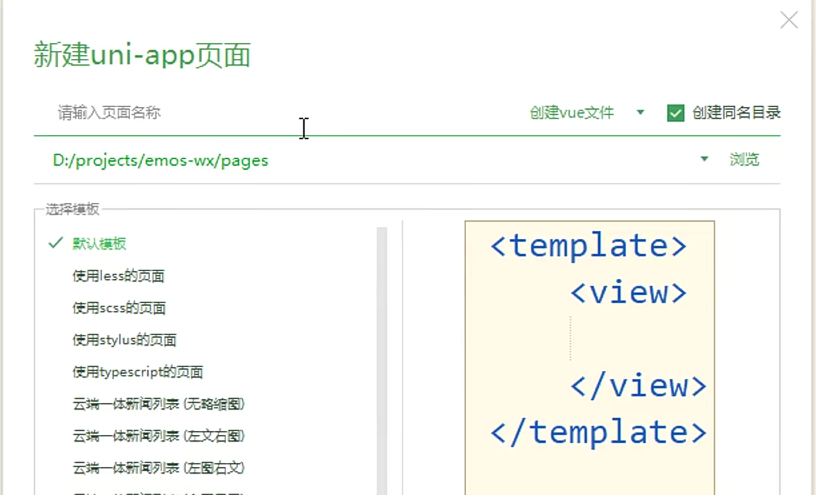

# 初始uni-app[4-3]



## 01)uni-app工程目录结构

uni-app，项目创建出来之后，目录结构如下：


| 序号 | 结构              | 用途                                                         |
| ---- | ----------------- | ------------------------------------------------------------ |
| 1    | pages目录         | 存放页面文件                                                 |
| 2    | static目录        | 存放静态文件（图片）                                         |
| 3    | App.vue文件       | 所有小程序页面都被引用到该文件运行【重要】                   |
| 4    | main.js文件       | 项目入口文件，用来初始化VUE对象，定义全局组件等【java的main()】 |
| 5    | manifest.json文件 | 工程配置文件，声明应用的名称、图标、权限等                   |
| 6    | pages.json文件    | 页面注册文件，配置页面路径、窗口样式、标题文字等             |
| 7    | uni.scss文件      | 全局样式文件                                                 |


## 02)创建练习页面

1. 在pages日录中创建demo页面



2. 在pages.json文件中，把demo页面设置为第一个页面

小程序一启动就显示demo.vue也页面。

```json
{
	"pages": [
		//pages数组中第一项表示应用启动页，参考：https://uniapp.dcloud.io/collocation/pages
		
		{
			"path": "pages/demo/demo",
			"style": {
				"navigationBarTitleText": "",
				"enablePullDownRefresh": false
			}
		},
	
}

```

3. 编写demo.vue文件

```html
<template>
    <!--   -->
	<view>
		<view>{{username}}</view>    <!--  插值变量  -->
		<view v-for="one in tel">{{one}}</view>    <!--  循环输出 -->
        
            <!--   -->
		<view v-if="age>=18">
               <!-- 捕获点击事件  -->
			<button @tap="signUp()">我要报名</button>
		</view>
        
            <!--  双向绑定 -->
		<view>
			<input type="text" v-model="address" placeholder="输入地址"/>
		</view>
		<view>{{address}}</view>
	</view>
</template>

<script>
	export default {
		data() {
			return {
				username:"Scott",  // 变量
				tel:['13312345678','18612345678'],
				age:20,
				address:""
			}
		},
        
        
        
		methods: {
            // 点击事件函数
			signUp:function(){
                // 点击按钮：中间显示面包屑通知
				uni.showToast({
					title:"点击了报名按钮"
				})
			}
		}
	}
</script>

<style>

</style>

```

**循环遍历数组**




**点击事件**



**数据变量的双向绑定**




新建页面




页面的名字

