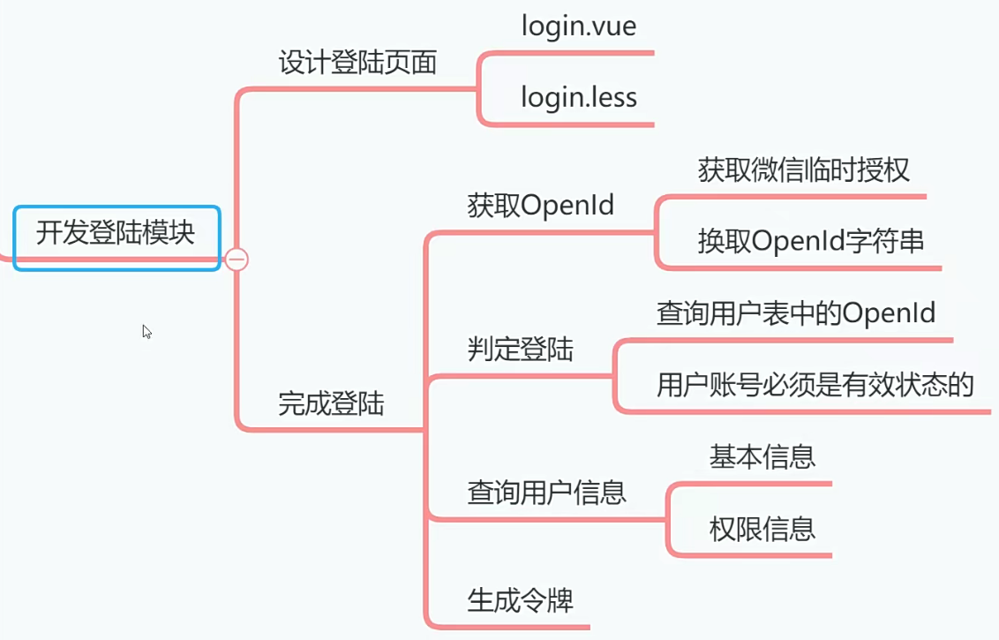
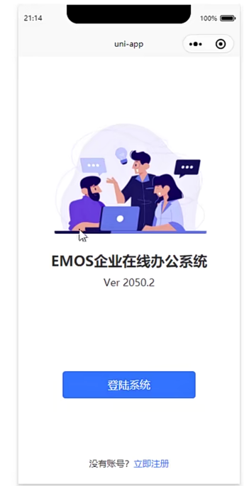
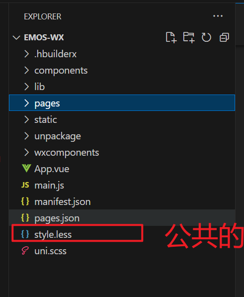

# 创建登陆页面[4-4]



这节课我们要设计的Emos系统登录页面如下，我觉得这个登陆界面设计的还是挺漂亮的。其实开发这么一个登陆页面并不困难，用到的标签和样式也不多，那么这节课咱们就一起来完成这个登陆页面吧。当然了，我们只是先把静态的登陆页面给设计出来，下节课我们往里面添加各种JS代码。



## 01)拷贝所有素材文件

各位同学可以到本课程git项目中，找到微信小程序项目，然后把里面的static文件夹拷贝到当前小程序项目中，也就算是导入了开发小程序用到的各种静态资源。


## 02)创建登陆页面

1. 在小程序中创建login.vue文件，然后把这个文件的注册顺序设置成**第一位**。
2. 创建login.less文件，然后引用到登陆页面中


```less
@import url("../../style.less");

.logo{
	width: 70%;
	margin-left: auto;
	margin-right: auto;
	display: block;
	margin-top: 30%;
}
// 主标题
.logo-title{
	font-size: 48rpx;
	font-weight: bold;
	text-align: center;
	margin-top: 8%;
	color: @font-color;
}

// 副标题
.logo-subtitle{
	font-size: 34rpx;
	text-align: center;
	color: @font-color;
	margin-top: 20rpx;
}

// 按钮
.login-btn{
	width: 60%;
	position: absolute;
	bottom: 20%;
	left: 20%;
	background-color: @background-color;
	color: #fff;
	box-sizing: border-box;
	&:active{
		background-color: @background-color-active;
	}
}

// 
.register-container{
	position: absolute;
	bottom: 50rpx;
	width: 100%;
	text-align: center;
	font-size: 30rpx;
	color: @font-color;
	.register{
		color: @background-color;
	}
}
```


引用样式

```vue
<style lang="less">
	@import url("login.less");
</style>
```

3. 创建style.less文件作为全局样式文件



```less
@font-color: #333;
@desc-color: #999;
@background-color: #3474FF;
@background-color-active: #0052FF;
```

4. 编写login.vue文件

```vue
<template>
	<view>
        <!--  引入图片 -->
		<image src="../../static/logo-1.png" class="logo" mode="widthFix"></image>
        
          <!--  描述文字 -->
		<view class="logo-title">EMOS企业在线办公系统</view>
		<view class="logo-subtitle">Ver 2050.2</view>
        
          <!--  按钮 
                open-type="getUserInfo"  重点：获取用户的信息的
            -->
        <button class="login-btn" open-type="getUserInfo" @tap="login()">登陆系统</button>
        
        
		<view class="register-container">
			没有账号？
			<text class="register" @tap="toRegister()">立即注册</text>
		</view>
	</view>
</template>

<script>
	export default {
		data() {
			return {
				
			}
		},
		methods: {
            
            //登入的页面 要  跳转到注册页面
			toRegister:function(){
				uni.navigateTo({
					url:"../register/register"
				})
			},
            
            
			login:function(){
				let that=this
				uni.login({
					provider:"weixin",
					success:function(resp){
						let code=resp.code
						that.ajax(that.url.login,"POST",{"code":code},function(resp){
							let permission=resp.data.permission
							uni.setStorageSync("permission",permission)
							//跳转到登陆页面
							uni.switchTab({
								url:"../index/index"
							})
							
						})
						
						
					},
					fail:function(e){
						uni.showToast({
							icon:"none",
							title:"执行异常"
						})
					}
				})
			}
		}
	}
</script>

<style lang="less">
	@import url("login.less");
</style>

```


## 02)跳转到注册页面

我们回到登陆页面，编写JS代码，实现从登陆页面跳转到注册页面。

```vue
			toRegister:function(){
				uni.navigateTo({
					url:"../register/register"
				})
			},
```


