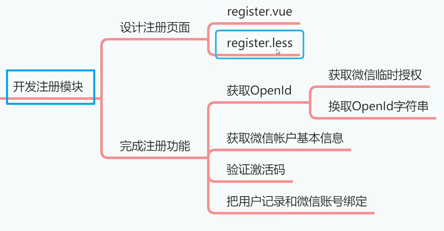
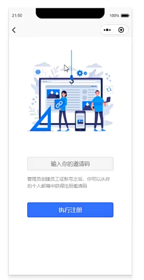
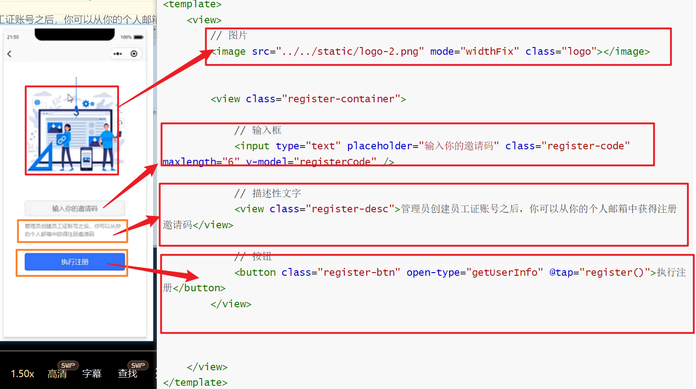

# 创建注册页面[4-5]



上节课我们创建了登陆页面，但是登陆功能是针对老用户的，如果是新用户的话，需要走注册流程，所以这节课我们先设计好注册页面，然后在登陆页面上，添加S代码，就可以跳转到注册页面了。




## 01)创建注册页面

1. 在小程序项目中创建register.vue文件
2. 创建register.less文件，然后引用到页面
3. 编写注册页面代码

```less
@import url("../../style.less");
.logo{
	width: 70%;
	display: block;
	margin-left: auto;
	margin-right: auto;
	margin-top: 80rpx;
}
.register-container{
	width: 70%;
	margin-top: 150rpx;
	margin-left: auto;
	margin-right: auto;
	.register-code{
		border: solid 1rpx #e0e0e0;
		font-size: 34rpx;
		color: @font-color;
		text-align: center;
		background-color: #f5f5f5;
		border-radius: 10rpx;
		margin-bottom: 30rpx;
		height: 80rpx;
		padding: 0 20rpx;
	}
	.register-desc{
		color: @desc-color;
		font-size: 28rpx;
		line-height: 1.5;
		margin-bottom: 80rpx;
	}
	.register-btn{
		background-color: @background-color;
		color: #fff;
		&:active{
			background-color: @background-color-active;
		}
	}
}

```


```vue
<template>
	<view>
        // 图片
		<image src="../../static/logo-2.png" mode="widthFix" class="logo"></image>
        
        
		<view class="register-container">
            
            // 输入框
			<input type="text" placeholder="输入你的邀请码" class="register-code" maxlength="6" v-model="registerCode" />
            
            // 描述性文字
			<view class="register-desc">管理员创建员工证账号之后，你可以从你的个人邮箱中获得注册邀请码</view>
            
            // 按钮
			<button class="register-btn" open-type="getUserInfo" @tap="register()">执行注册</button>
		</view>
        
        
        
	</view>
</template>

<script>
export default {
	data() {
		return {
			registerCode:""
		};
	},
    
    
    //============================
	methods: {
		register: function() {
			let that=this
			if(that.registerCode==null||that.registerCode.length==0){
				uni.showToast({
					icon:"none",
					title:"邀请码不能为空"
				})
				return
			}
			else if(/^[0-9]{6}$/.test(that.registerCode)==false){
				uni.showToast({
					icon:"none",
					title:"邀请码必须是6位数字"
				})
				return
			}
			uni.login({
				provider: 'weixin',
				success: function(resp) {
					console.log(resp.code)
					let code = resp.code;
					uni.getUserInfo({
						provider: 'weixin',
						success: function(resp) {
							let nickName = resp.userInfo.nickName;
							let avatarUrl = resp.userInfo.avatarUrl;
							// console.log(nickName);
							// console.log(avatarUrl);
							let data={
								code:code,
								nickname:nickName,
								photo:avatarUrl,
								registerCode:that.registerCode
							}
							that.ajax(that.url.register,"POST",data,function(resp){
								let permission=resp.data.permission
								uni.setStorageSync("permission",permission)
								console.log(permission)
								//跳转到index页面
								uni.switchTab({
									url:"../index/index"
								})
							})
						}
					});
				}
			});
		}
	}
};
</script>

<style lang="less">
@import url('register.less');
</style>

```




