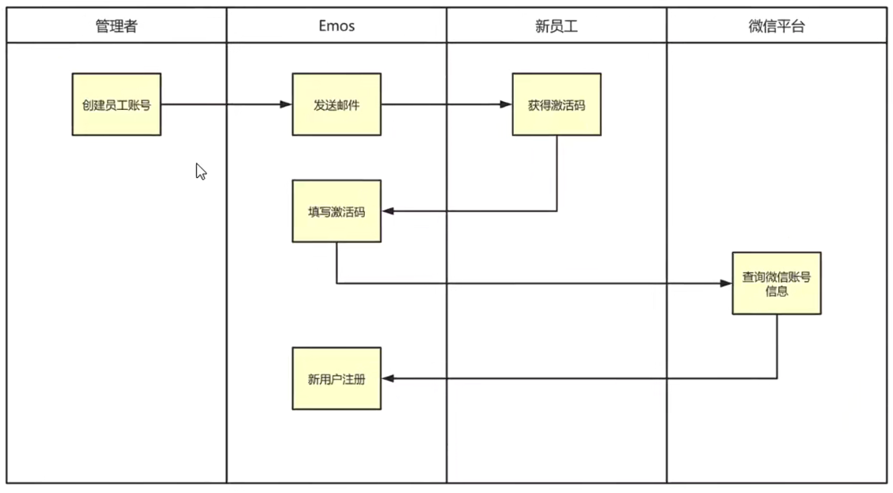
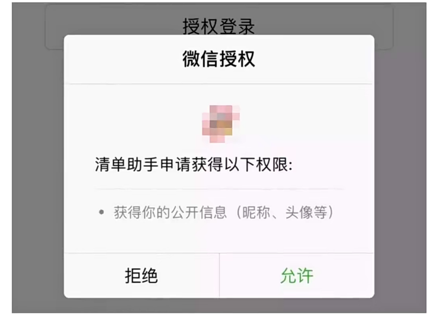
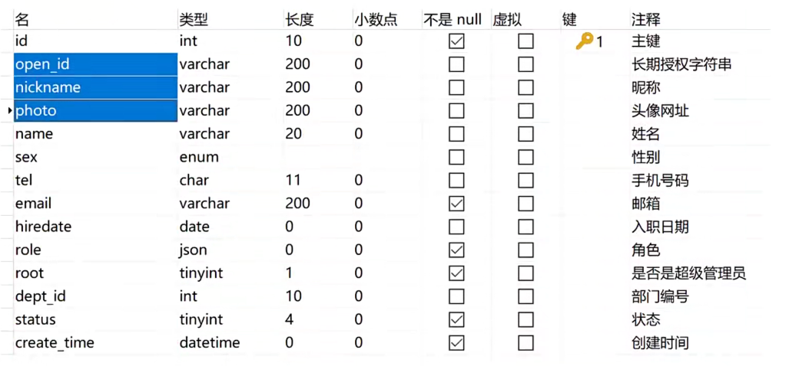

# 注册新用户的业务要点说明[4-6]

上节课我们设计好了注册页面的内容，这节课我们编写JS代码，获取到用户的注册信息，后续的小节，我们会把注册信息提交给后端Java项目，完成新用户注册。

## 01)激活码有什么用途？

首先大家要知道Emos系统并不是完全对外开放的在线办公系统，只有本公司内部人员才可以使用这套系统，所以Emos系统并不完全对外开放注册。




当管理者在Emos系统中创建了新员工记录，然后Emos系统会自动向新员工的邮箱发出Email邮件，邮件中就包含了激活码。当新员工打开Emos小程序之后，在注册页面填写上激活码，于是用户的微信账号就自动跟Emos系统绑定了。以后登录Emos系统的时候，只需要在微信上确认一下，就可以完成登陆。

我设计的Emos系统包含一个内置的超级管理员账号，这个账号的激活码是固定的（默认000000）。公司部署好Emos系统之后，管理者在Emos小程序注册页面填写这个**固定的激活码**，然后就可以让自己的微信账号和超级管理员账号绑定在一起。Emos系统中的超级管理员只有一个，也就是说只能绑定一个微信账号。


## 02)激活码的过期时间

激活码是有过期时间的，它的过期时间就是Redis的过期时间。管理者在Emos系统上面创建新员工帐户之后，Emos系统会把激活码缓存到Redis上面，过期的时候Redis会自动删除缓存的激活码。

- 创建 ==》 缓存 ==》 入库
- 过期 ==》 删除缓存 

## 03)新员工帐户与微信绑定

如果每个员工的记录跟微信帐户绑定的话，那么每名员工登陆的时候，直接在微信上确认就可以登录Emos系统了。



管理者在创建新员工记录的时候，并不知道新员工的微信账号，所以没办法完成绑定，需要新员工自己完成绑定。于是新员工在Emos小程序注册页面，填写激活码之后，Emos小程序获取新员工的微信账号信息，提交给Emos后台系统，后端系统把微信账号与新员工账号关联在一起，然后保存到MySQL数据库。



其实把微信账号与小程序关联在一起很简单，就是把微信基本信息（呢称、头像）和openId，存储到员工记录上面。因为每个微信账号的openId在当前的小程序上面都是唯一的，只要MySQL记录下每名员工微信账号的openId，那么就实现了<font color='red'>员工记录与微信账号</font>的绑定。


## 04)如何获取微信账号的Openld字符串？[后端获取]

首先我们可以从微信APP上面获得用户临时授权字符串<font color='red'>（code）</font>，然后把这个字符串传递给后端Java系统，让Java系统拿着<font color='red'>AppId</font>、<font color='red'>密钥</font>和<font color='red'>Code</font>，提交给<font color='blue'>微信平台</font>换取<font color='red'>OpenId</font>

```java
String url  = "https://api.weixin.qq.com/sns/jscode2session";
HashMap map = new HashMap();
map.put("appid",appId);// 微信小程序的appid
mapput(“secret", appSecret);  // 小程序的密钥
map.put("js_code", code);//微信账号的零时授权
map.put("grant_type","authorization_code");
// post请求：map是参数     
String response = Httputil·post(url,map);
       
// 解析为:json对象
JSONobject json = JSONUtil.parseobj(response);
String openId = json.getStr(“openid");

```


## 什么是openId呢？

- openId的字符串是怎么来的呢？

答：【微信账号的id + 商户的小程序的appid + 密钥】与加密算法之后生成的字符串。

反之：我们不可以使用openId字符串反推回 【微信账号的id + 商户的小程序的appid + 密钥】

::: tip 总结

微信平台不想让我们知道微信账号的id。

没有其他办法吗？

:::


