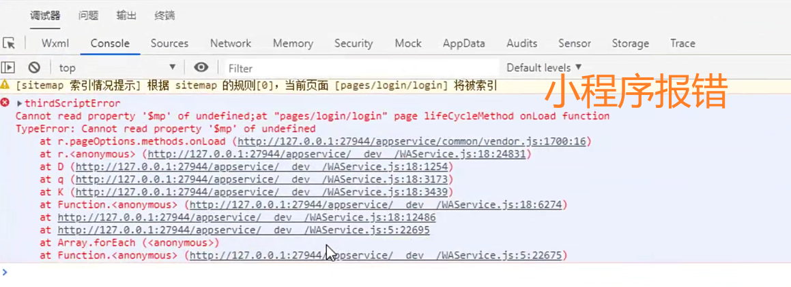

# 获取<font color='red'>临时授权</font>和<font color='red'>微信基本信息</font>[4-7]


上个小节说到了，小程序注册新用户的时候，需要把微信临时授权字符串和微信基本信息提交给后端的Java项目，那么这节课咱们就先来获取临时授权字符串和微信基本信息，这部分内容很简单。


## 01)获取临时授权字符串

在<font color='red'>uni-app</font>框架中，包含了原生微信小程序的<font color='red'>wx</font>对象，我们可以像写原生微信小程序代码一样，通过<font color='red'>wx</font>对象调用各种方法。但是我更推荐大家使用<font color='red'>uni对象</font>，因为这个对象是跨平台的，我们调用uni对象中的方法，HBuilderx在编译代码的时候，会把uni对象翻译成目标平台的对象，比如微信平台就是wx对象，支付宝平台就是<font color='red'>my对象</font>，所以uni对象的跨平台性更好，而且调用更加简单，强烈推荐大家使用。

使用uni对象可以轻松获取微信小程序的<font color='red'>临时授权字符串</font>，这个<font color='red'>临时授权字符串</font>是有时间限定
的，默认有效期是<font color='red'>5分钟</font>。如果过期，就无法换取<font color='red'>OpenId</font>了。


::: tip 总结

- 使用uni对象

:::


**object参数说明**

| 参数名           | 类型         | 必填           | 说明                                                         | 平台差异说明           |
| ---------------- | ------------ | -------------- | ------------------------------------------------------------ | ---------------------- |
| provider【使用】 | String       | 否             | 登录服务提供商，通过uni.getProvider获取，如果不设置则弹出登录列表选择界面 |                        |
| scopes           | String/Array | 见平台差异说明 | 授权类型，默认auth_base。支持<br/>authbase（静默授权）/<br/>auth_user（主动授权）<br/>auth_zhima（芝麻信用） | 支付宝小程序           |
| timeout          | Number       | 否             | 超时时间，单位ms                                             | 微信小程序、百度小程序 |
| success          | Function     | 否             | 接口调用成功的回调                                           |                        |
| fail             | Function     | 否             | 接口调用失败的回调函数                                       |                        |
| complete         | Function     | 否             | 接口调用结束的回调函数<br/>（调用成功、失败都会执行）        |                        |

**success返回参数说明**

| 参数名     | 说明                                                         |
| ---------- | ------------------------------------------------------------ |
| authResult | 登录服务商提供的登录信息，服务商不同返回的结果不完全相同     |
| code       | 小程序专有，用户登录凭证。开发者需要在开发者服务器后台，使用code换取<br/>openid和sessionkey等信息 |
| errMsg     | 描述信息                                                     |

**示例**

```js
uni.login({
    provider:'weixin'
    success:function(resp){
        // 领时授权字符串的
        // 过期时间默认是5分钟
        console.log(resp.code);
    }
});
```




解决：


取临时授权字符串


## 02)获取微信基本信息


::: warning 注意

- 微信小程序端，在**用户未授权**过的情况下调用此接口，不会出现授权弹窗，会直接进入fail回调（详见《微信小程序公告》）。

- 在**用户已授权**的情况下调用此接口，可成功获取用户信息。
  :::


