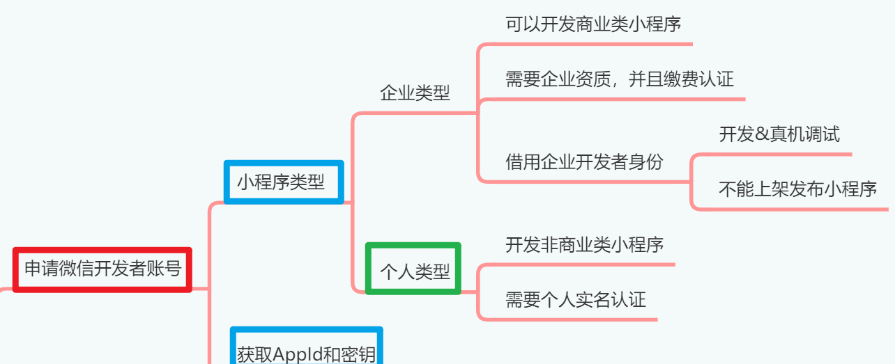
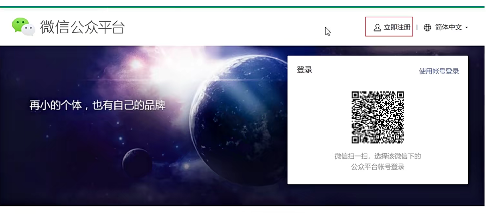
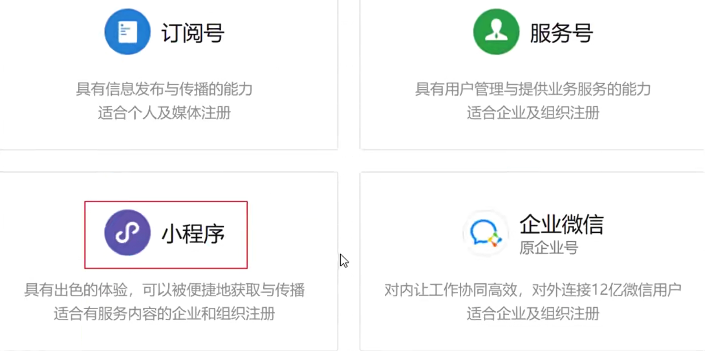
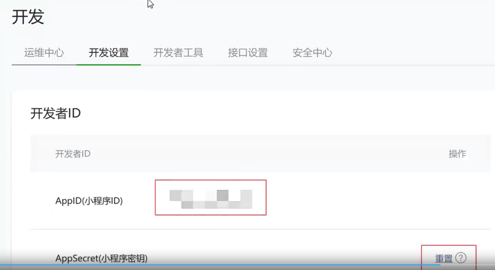

# 申请微信开发者账号[4-1]

虽然开发微信小程序可以使用工具提供的测试号，但是测试号提供的功能极为有限，而且使用测试号
开发的微信小程序不能上架发布。因此说我们想要开发一个可以上架的微信小程序，首先必须要申请
微信开发者账号。大家尽可放心，个人申请和使用微信开发者账号是免费的。如果你要开发的是商用
小程序，那么就需要以企业身份申请微信开发者账号，而且还要缴纳认证费用。

## 01)特殊声明

Emos在线办公小程序，内部包含微信支付和在线视频会议功能，这两项业务，微信平台不对个人小程
序开放。所以等到同学们开发到这两个业务模块的时候，我会借给你企业小程序资质（仅供开发，不
能上架发布），你把小程序项目中的配置文件修改一下，换上我提供的AppID就可以了。

当然了，如果你想上架发布小程序，可以自己注册个人主体的小程序开发者账号，然后把小程序中的
在线会议和支付功能去掉，就可以上架发布了。

## 02)申请微信开发者账号

用浏览器访问微信公众平台，然后点击页面右上角的立即注册链接。

小程序，然后填写好注册信息，然后微信平台会给你发送一封电子邮件。你需要点击帐户类型选择

电子邮件中的激活小程序账号的链接，然后在跳转的页面中，个人详细信息，这样才算是把个人主体
的微信小程序开发者账号给注册下来。

## 03)获取AppID和密钥

开发微信小程序必须要用到AppID和密钥，这两个东西可以在微信开发者平台上面获得。刚才大家已
经成功注册了开发者账号，那么就处在登陆的状态，不用重新登录微信开发者平台。

在网页中找到开发栏目，然后选择开发设置选项卡，在面板中你就能看到自己的小程序对应的AppID和密钥了。如果是刚注册下来的账号，密钥还没有生成，你要手动点击页面上的按钮，生成密钥字符串。如果已经生成过密钥字符串，那么默认情况，页面会隐藏密钥字符串，你只能点击重置按钮，生成新的密钥字符串了。所以强烈建议大家，获取了密钥字符串之后，最好能用文件把密钥字符串保存下来。

