# 创建小程序项目[4-2]

## 01)引言

第二章的时候，我们已经把后端Java项目搭建出来了。为了能让大家对Emos项目开发有更直观的感受，接下来我们就从小程序这一端开始做起。

我们看到小程序的页面设计，自然就知道需要向后端Java项目发出什么请求，提交什么数据，以及后端系统要查询哪些表的记录才能满足客户端的需求接下来咱们就把小程序项目给创建一下。


## 02)创建小程序工程

HBuilderx上面，创建emos-wx项目

**第一步：**

文件 ===》   项目 

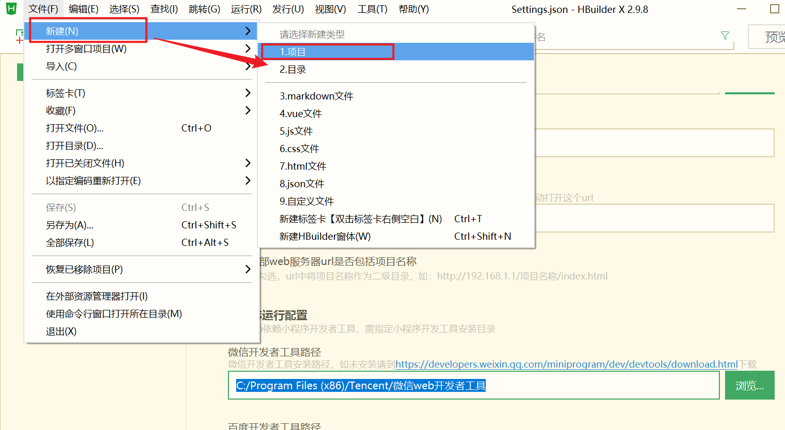


**第二步：**

点击uni-app、使用"默认模板"。

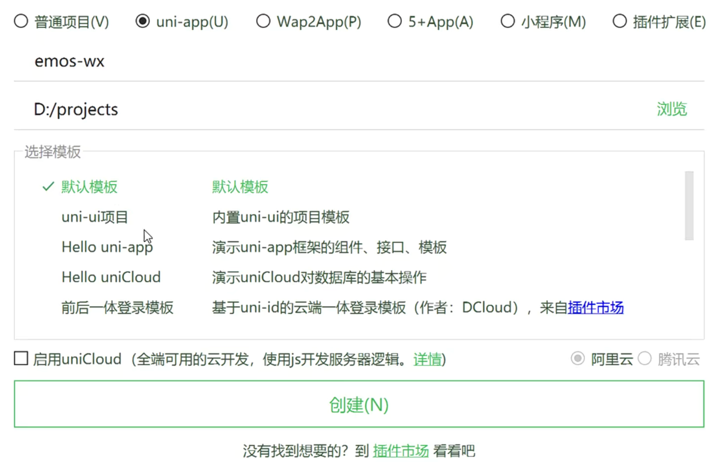

默认的目录结构。如下。

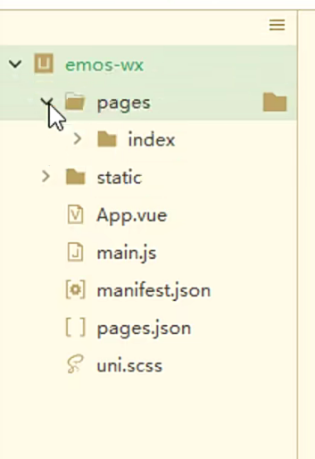


在manifest.json文件中填写你自己注册下来小程序AppID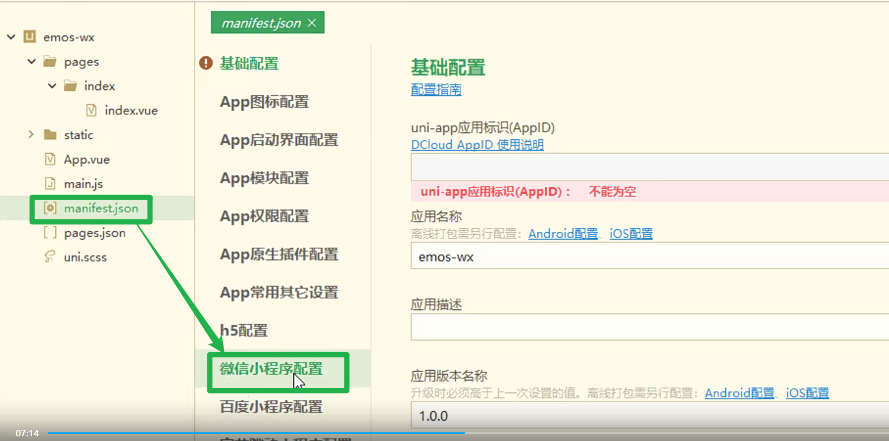


找到微信小程序配置：填写你的微信小程序的appid。


- 微信小程序的appid在哪里找？怎么获取？

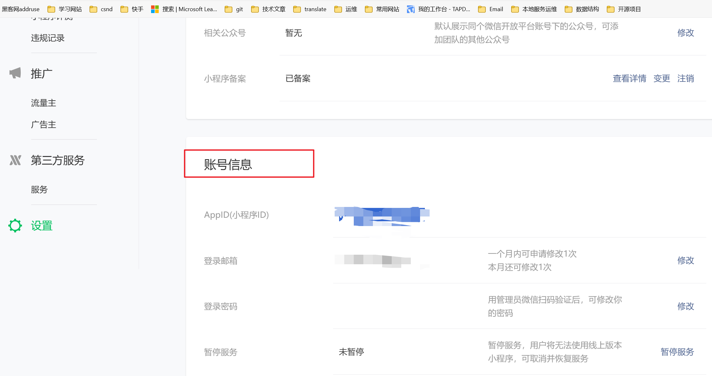


::: tip  详情请看

[01什么是小程序 | 匆匆趣玩 (gitee.io)](https://ground-gun.gitee.io/lyp/小程序/微信小程序/01什么是小程序.html#_01-小程序后台)

:::

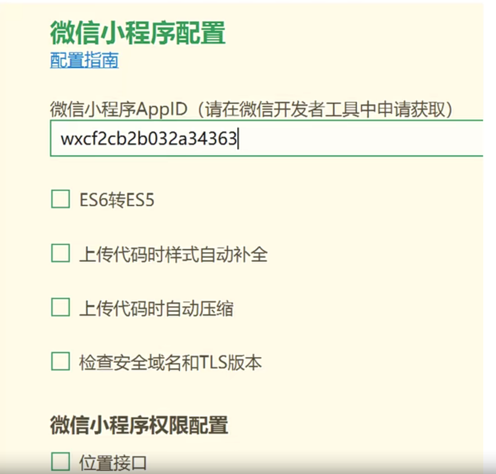

1. 启动微信开发者工具，并且扫码登陆
2. 选择运行微信小程序

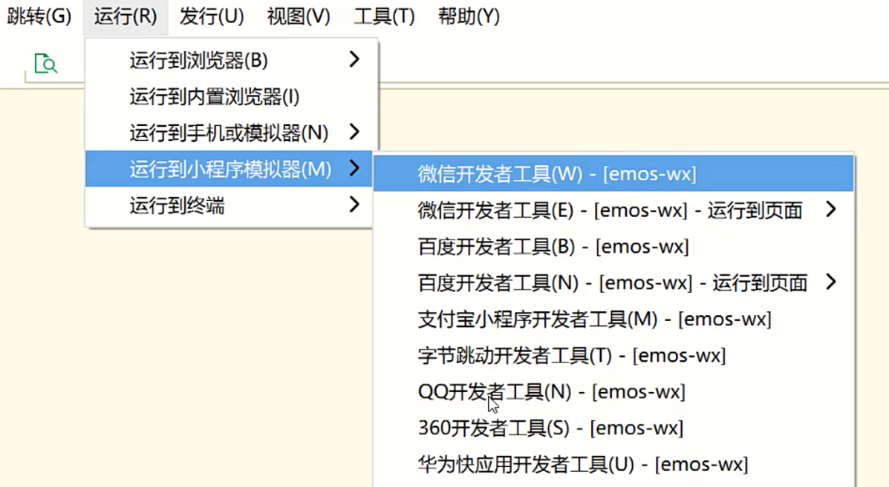


::: danger 使用微信报错解决!

为什么要开启端口号？

- 第一章节有点到，[安装小程序开发工具 | 匆匆趣玩 (gitee.io)](https://ground-gun.gitee.io/lyp/刷脸项目/01阶段-磨刀不费砍柴工/02安装小程序开发工具.html#怎么打开服务端口)

:::

报错效果！

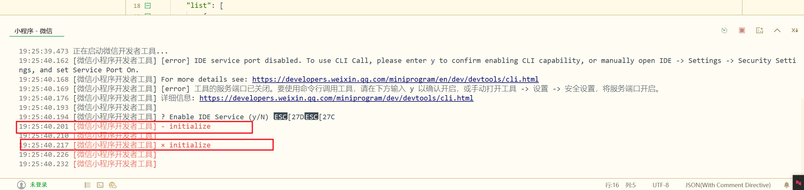


原因是如下端口号没有开启来。

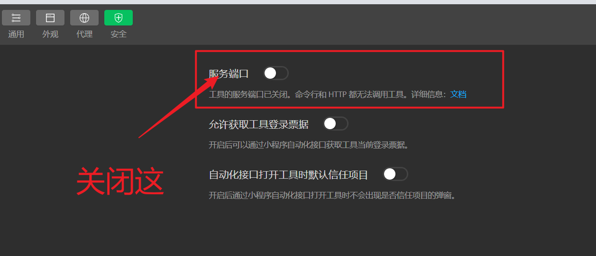


## 03)启动的运行效果

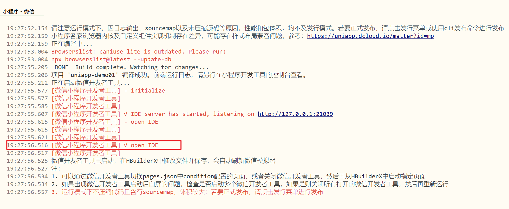

微信开发工具的效果如下图：

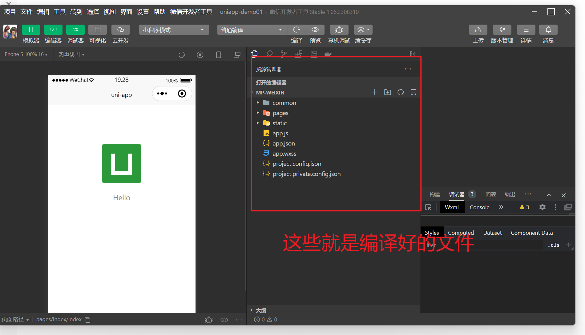


## 04)uni-app目录结构


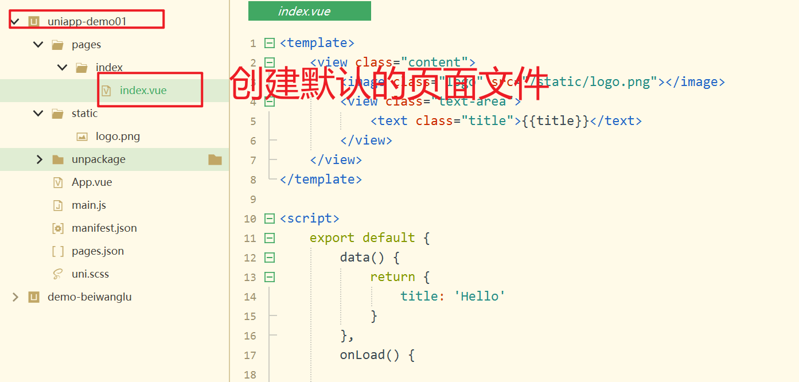

- 视图层的代码

```html
<template>
	<view class="content">
		<image class="logo" src="/static/logo.png"></image>
		<view class="text-area">
           // 插值变量
			<text class="title">{{title}}</text>
		</view>
	</view>
</template>
```

- js代码，是vue格式书写。

```vue
<script>
	export default {
		data() {
			return {
                //插值变量的数据。
				title: 'Hello'
			}
		},
		onLoad() {

		},
		methods: {

		}
	}
</script>
```

- 样式标签代码。和我们前端写vue文件代码是一样的。

```css
<style>
	.content {
		display: flex;
		flex-direction: column;
		align-items: center;
		justify-content: center;
	}

	.logo {
		height: 200rpx;
		width: 200rpx;
		margin-top: 200rpx;
		margin-left: auto;
		margin-right: auto;
		margin-bottom: 50rpx;
	}

	.text-area {
		display: flex;
		justify-content: center;
	}

	.title {
		font-size: 36rpx;
		color: #8f8f94;
	}
</style>

```


## 05)怎么在手机上看效果

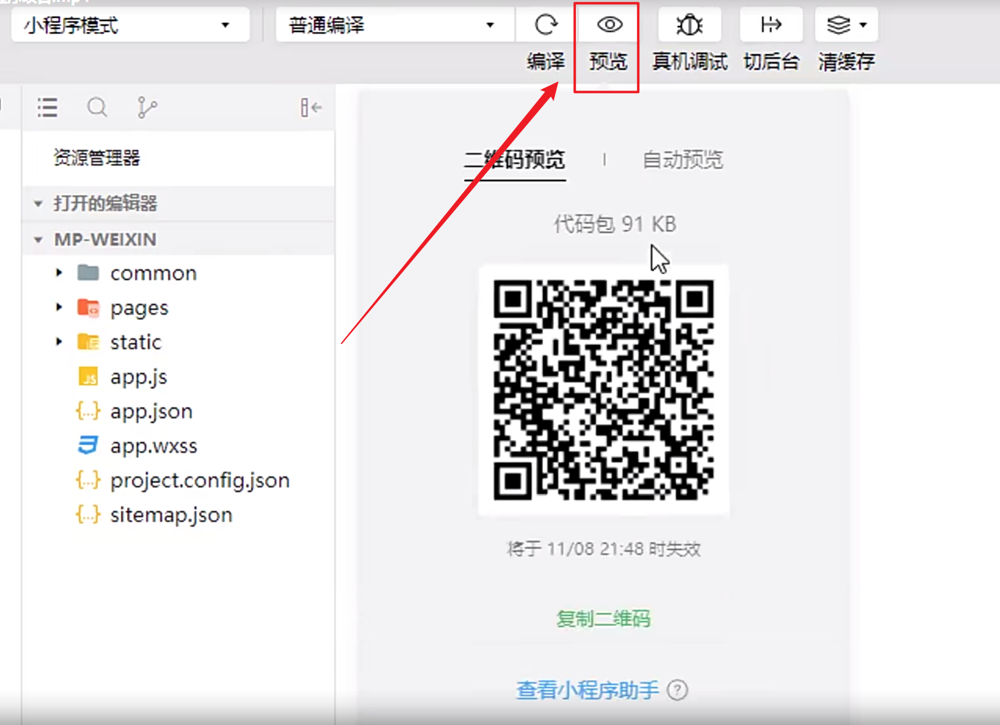

1. 点击：小程序会上传到《微信平台》。
2. 手机微信扫码就可以观看效果。

## 06)uni-app框架简介

::: tip 什么是uni-app呢？下面来解密下！

uni-app是：一个基于VUE语法的跨平台移动端框架，会VUE的人，半天时间就能上手掌握uni-app框架。从项目结构，到页面语法，与<font color='blue'>前端的VUE工程</font>几乎相同。

:::

uni-app框架最让人着迷的地方在于，借助于HBuilderx工具，我们可以把uni-app项目，编译成各种类型的移动端工程。比如说我们可以把uni-app项目编译成：

- 微信小程序、
- 支付宝小程序、
- QQ小程序、
- 今日头条小程序、
- 安卓APP、
- iOS APP、
- H5-app、
- H5网站等。

优点：仅凭这一点，就大大节省了开发团队的人力成本、时间成本和资金成本。

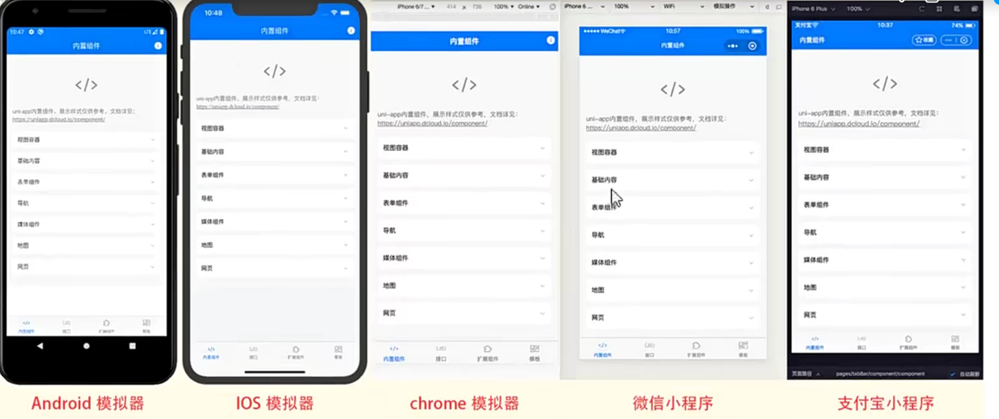


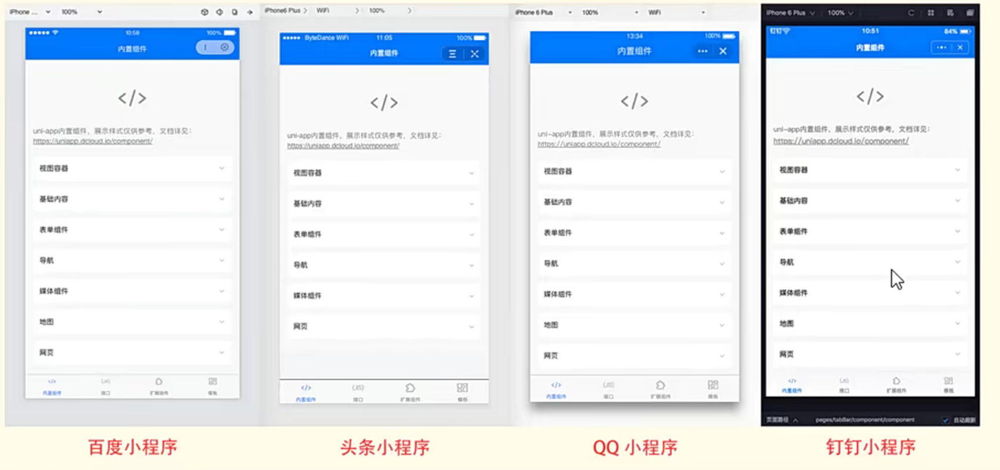

