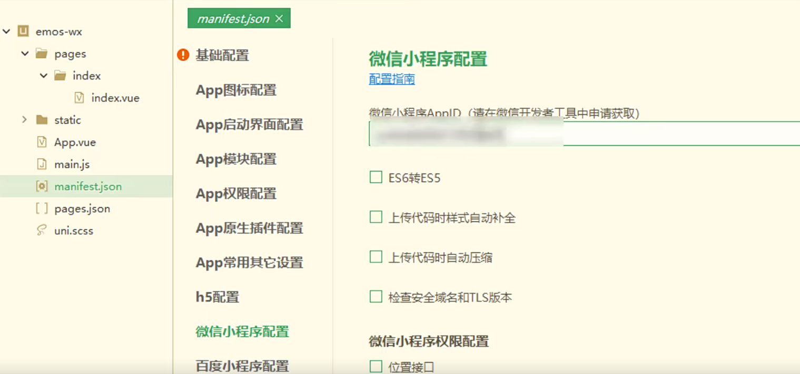

# 创建小程序项目[4-2]

## 01)引言

第二章的时候，我们已经把后端Java项目搭建出来了。为了能让大家对Emos项目开发有更直观的感
受，接下来我们就从小程序这一端开始做起。我们看到小程序的页面设计，自然就知道需要向后端
Java项目发出什么请求，提交什么数据，以及后端系统要查询哪些表的记录才能满足客户端的需求
接下来咱们就把小程序项目给创建一下。

## 02)创建小程序工程

HBuilderx上面，创建emos-wx项目

目录结构。

在manifest.json文件中填写你自己注册下来小程序AppID

启动微信开发者工具，并且扫码登陆
选择运行微信小程序

## 03)uni-app框架简介

uni-app是一个基于VUE语法的跨平台移动端框架，会VUE的人，半天时间就能上手掌握uni-app框架。从项目结构，到页面语法，与前端的VUE工程几乎相同。

uni-app框架最让人着迷的地方在于，借助于HBuilderx工具，我们可以把uni-app项目，编译成各种类型的移动端工程。比如说我们可以把uni-app项目编译成：

微信小程序、支付宝小程序、0Q小程序、今日头条小程序、安卓APP、iOS APP、H5-app、H5网站等。仅凭这一点，就大大节省了开发团队的人力成本、时间成本和资金成本。

