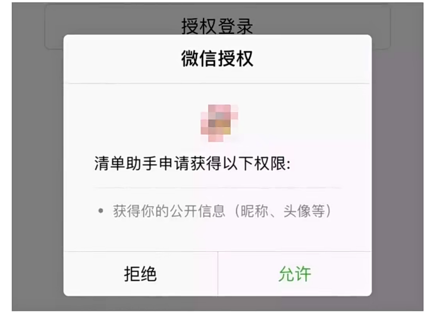
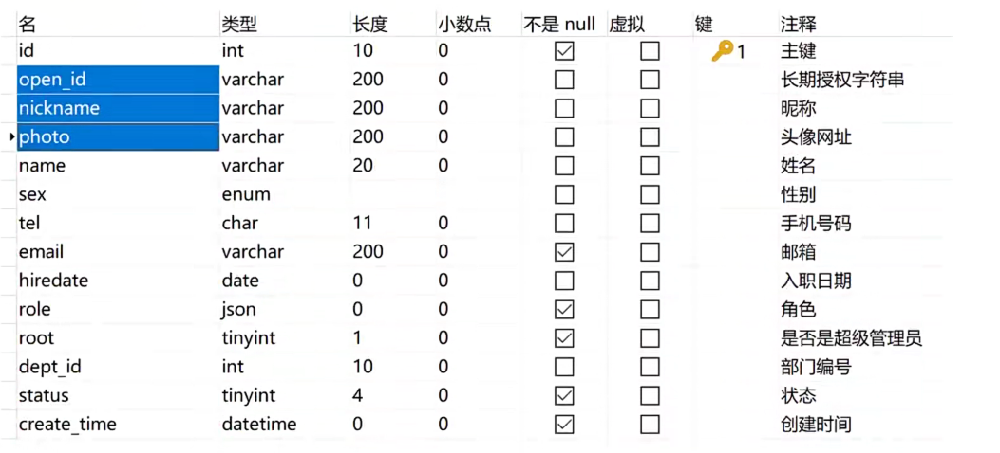

# 注册新用户的业务要点说明[4-6]

- 为什么可以使用微信账号登入？

微信账号登入，小程序点击注册的按钮就是把用户的微信的账号与员工的账号绑定在一起。

- 小程序端要做什么？

小程序要提取微信的用户信息。然后提交给后端的java程序，java程序将这个数据保存在数据库表里面。然后下一次用户就可以使用微信账号进行登入。

- 前一节回顾。

上节课我们设计好了注册页面的内容，这节课我们编写JS代码，获取到用户的注册信息，后续的小节，我们会把注册信息提交给后端Java项目，完成新用户注册。

## 01)激活码有什么用途？

首先大家要知道Emos系统并不是完全对外开放的在线办公系统，只有<font color='red'>本公司内部人员</font>才可以使用这套系统，所以Emos系统并不完全对外开放注册。


1. 当管理者在Emos系统中创建了新员工记录，然后Emos系统会自动向新员工的邮箱发出Email邮件，邮件中就包含了激活码。
2. 当新员工打开Emos小程序之后，在注册页面填写上激活码，于是用户的微信账号就自动跟Emos系统绑定了。
3. 以后登录Emos系统的时候，只需要在微信上确认一下，就可以完成登陆。

- 超级管理员的作用。

我设计的Emos系统包含一个内置的超级管理员账号，这个账号的激活码是固定的（默认000000）。公司部署好Emos系统之后，管理者在Emos小程序注册页面填写这个**固定的激活码**，然后就可以让自己的微信账号和超级管理员账号绑定在一起。Emos系统中的超级管理员只有一个，也就是说只能绑定一个微信账号。


## 02)激活码的过期时间

激活码是有过期时间的，它的过期时间就是Redis的过期时间。管理者在Emos系统上面创建新员工帐户之后，Emos系统会把激活码缓存到Redis上面，过期的时候Redis会自动删除缓存的激活码。

激活码什么时候保存到redis数据库里面？

- 创建新员工帐户之后  ==》 Emos系统会把激活码缓存到Redis上面==》 入库

自动删除缓存数据？

- 过期 ==》 删除缓存 

## 03)新员工帐户与微信绑定

如果每个员工的记录跟微信帐户绑定的话，那么每名员工登陆的时候，直接在微信上确认就可以登录Emos系统了。



管理者在创建新员工记录的时候，并不知道新员工的微信账号，所以没办法完成绑定，需要新员工自己完成绑定。于是新员工在Emos小程序注册页面，填写激活码之后，Emos小程序获取新员工的微信账号信息，提交给Emos后台系统，后端系统把微信账号与新员工账号关联在一起，然后保存到MySQL数据库。



其实把微信账号与小程序关联在一起很简单，就是把微信基本信息（呢称、头像）和openId，存储到员工记录上面。因为每个微信账号的openId在当前的小程序上面都是唯一的，只要MySQL记录下每名员工微信账号的openId，那么就实现了<font color='red'>员工记录与微信账号</font>的绑定。


## 04)如何获取微信账号的Openld字符串？[后端获取]

首先我们可以从微信APP上面获得用户临时授权字符串<font color='red'>（code）</font>，然后把这个字符串传递给后端Java系统，让Java系统拿着<font color='red'>AppId</font>、<font color='red'>密钥</font>和<font color='red'>Code</font>，提交给<font color='blue'>微信平台</font>换取<font color='red'>OpenId</font>

```java
String url  = "https://api.weixin.qq.com/sns/jscode2session";
HashMap map = new HashMap();
map.put("appid",appId);// 微信小程序的appid
mapput(“secret", appSecret);  // 小程序的密钥
map.put("js_code", code);//微信账号的零时授权
map.put("grant_type","authorization_code");
       
       
// post请求：map是参数     
String response = Httputil·post(url,map);
       
// 解析响应为:json对象
JSONobject json = JSONUtil.parseobj(response);
       
// 获取openid属性
String openId = json.getStr(“openid");

```

参数来源说明：

- code：是小程序传递过来的。


## 什么是openId呢？

- openId的字符串是怎么来的呢？

答：【微信账号的id + 商户的小程序的appid + 密钥】+密算法之后生成的字符串【这个字符串就是openid】。

反之：我们不可以使用openId字符串反推回 【微信账号的id + 商户的小程序的appid + 密钥】

::: tip 总结

1. 微信平台不想让我们知道微信账号的id。
2. 微信平台只能让我们得到微信的openid，得不到微信账号的id。

没有其他办法吗？

:::

- openid的作用是什么呢？

1. 区别微信账号。


