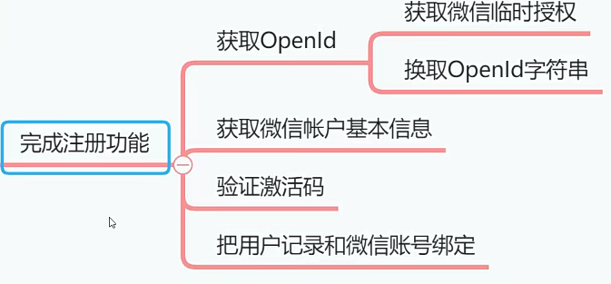

# 获取临时授权和微信基本信息[4-7]




上个小节说到了，小程序注册新用户的时候，需要把微信临时授权字符串和微信基本信息提交给后端的Java项目，那么这节课咱们就先来获取临时授权字符串和微信基本信息，这部分内容很简单。


## 01)获取临时授权字符串

在<font color='red'>uni-app</font>框架中，包含了原生微信小程序的<font color='red'>wx</font>对象，我们可以像写原生微信小程序代码一样，通过<font color='red'>wx</font>对象调用各种方法。但是我更推荐大家使用<font color='red'>uni对象</font>，因为这个对象是跨平台的，我们调用uni对象中的方法，HBuilderx在编译代码的时候，会把uni对象翻译成目标平台的对象，比如微信平台就是wx对象，支付宝平台就是<font color='red'>my对象</font>，所以uni对象的跨平台性更好，而且调用更加简单，强烈推荐大家使用。

- 前端获取临时授权字符串

使用uni对象可以轻松获取微信小程序的<font color='red'>临时授权字符串</font>，这个<font color='red'>临时授权字符串</font>是有时间限定的，默认有效期是<font color='red'>5分钟</font>。如果过期，就无法换取<font color='red'>OpenId</font>了。


::: tip 总结

- 使用uni对象更加好。为什么呢？跨平台。
- 前端传临时授权码到java后端。

:::


**object参数说明**

| 参数名           | 类型         | 必填           | 说明                                                         | 平台差异说明           |
| ---------------- | ------------ | -------------- | ------------------------------------------------------------ | ---------------------- |
| provider【使用】 | String       | 否             | 登录服务提供商，通过uni.getProvider获取，如果不设置则弹出登录列表选择界面 |                        |
| scopes           | String/Array | 见平台差异说明 | 授权类型，默认auth_base。支持<br/>authbase（静默授权）/<br/>auth_user（主动授权）<br/>auth_zhima（芝麻信用） | 支付宝小程序           |
| timeout          | Number       | 否             | 超时时间，单位ms                                             | 微信小程序、百度小程序 |
| success          | Function     | 否             | 接口调用成功的回调                                           |                        |
| fail             | Function     | 否             | 接口调用失败的回调函数                                       |                        |
| complete         | Function     | 否             | 接口调用结束的回调函数<br/>（调用成功、失败都会执行）        |                        |

**success返回参数说明**

| 参数名     | 说明                                                         |
| ---------- | ------------------------------------------------------------ |
| authResult | 登录服务商提供的登录信息，服务商不同返回的结果不完全相同     |
| code       | 小程序专有，用户登录凭证。开发者需要在开发者服务器后台，使用code换取<br/>openid和sessionkey等信息 |
| errMsg     | 描述信息                                                     |

**示例**

```js
uni.login({
    provider:'weixin'
    success:function(resp){
        // 领时授权字符串的
        // 过期时间默认是5分钟
        console.log(resp.code);
    }
});
```


解决：


取临时授权字符串


## 1.1)点击注册打印临时授权码

- 视图按钮，在register.vue文件编写。

```html
			<button class="register-btn" open-type="getUserInfo" @tap="register()">执行注册</button>
```

- 代码逻辑，在register.vue文件编写。

```js
	methods: {
		register: function() {
			uni.login({
				provider: 'weixin',
				success: function(resp) {
					console.log(resp.code);
				}
			});
		}// register end
	}
```

- 运行效果：获取临时授权码


## 02)获取微信基本信息

要调用的方法如下。


::: warning 注意

- 微信小程序端，在**用户未授权**过的情况下调用此接口，不会出现授权弹窗，会直接进入fail回调（详见《微信小程序公告》）。
- 在**用户已授权**的情况下调用此接口，可成功获取用户信息。

:::

**Object参数说明**

| 参数名          | 类型     | 必填 | 说明                                           | 平台差异说明             |
| --------------- | -------- | ---- | ---------------------------------------------- | ------------------------ |
| provider        | String   | 否   | 登录服务提供商，通过uni.getProvider 获取       |                          |
| withCredentials | Boolean  | 否   | 是否带上登录态信息                             | 微信小程序字节跳动小程序 |
| lang            | String   | 否   | 指定返回用户信息的语言，默认为en               | 微信小程序               |
| timeout         | Number   | 否   | 超时时间，单位 ms。                            | 微信小程序               |
| success         | Function | 否   | 接口调用成功的回调                             |                          |
| fail            | Function | 否   | 接口调用失败的回调函数                         |                          |
| complete        | Function | 否   | 接口调用结束的回调函数(调用成功、失败都会执行) |                          |

success 返回参数说明

| 参数          | 类型   | 说明                                                         | 平台差异说明               |
| ------------- | ------ | ------------------------------------------------------------ | -------------------------- |
| userlnfo      | OBJECT | 用户信息对象                                                 |                            |
| rawData       | String | 不包括敏感信息的原始数据字符串用于计算签名。                 |                            |
| signature     | String | 使用 sha1( rawData + sessionkey得到字符串，用于校验用户信息。 | 微信小程序、字节跳动小程序 |
| encryptedData | String | 包括敏感数据在内的完整用户信息的加密数据详细见加密数据解密算法 | 微信小程序、字节跳动小程序 |
| iv            | String | 加密算法的初始向量，详细见加密数据解密算法。                 | 微信小程序、字节跳动小程序 |
| errMsg        | String | 描述信息                                                     |                            |

userInfo 参数说明

|           | 类型   | 说明                 | 平台差异说明  |
| --------- | ------ | -------------------- | ------------- |
| nickName  | String | 用户昵称             |               |
| openld    | String | 该服务商唯一用户标识 | 只有在App平台 |
| avatarUrl | String | 用户头像             |               |

**示例**前端小程序代码

- 切换到注册的页面，视图代码添加一个属性。**open-type="getUserInfo"**

```html
<button class="register-btn" open-type="getUserInfo" @tap="register()">执行注册</button>
```

- 在register.vue文件编写。

```js
	methods: {
		register: function() {
			uni.login({
				provider: 'weixin',
				// 登入回调函数
				success: function(resp) {
					console.log("临时授权字符串:"+resp.code);
					let code = resp.code;
					
					// 获取用户的信息
					uni.getUserInfo({
						provider: 'weixin',
						
						// 获取用户的信息回调函数
						success: function(resp) {
							let nickName = resp.userInfo.nickName;
							let avatarUrl = resp.userInfo.avatarUrl;
							console.log(nickName);
							console.log(avatarUrl);
				
						}
					});
				}
			});
		} // register end
	}
```

打印微信的名字与微信账号的图片地址。效果参数。


- 为什么打印的是微信用户呢？而不是微信账号的名字呢？


