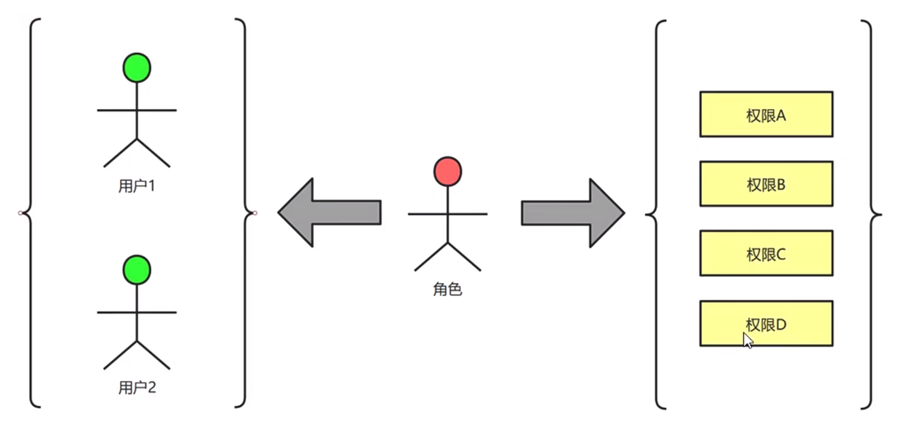
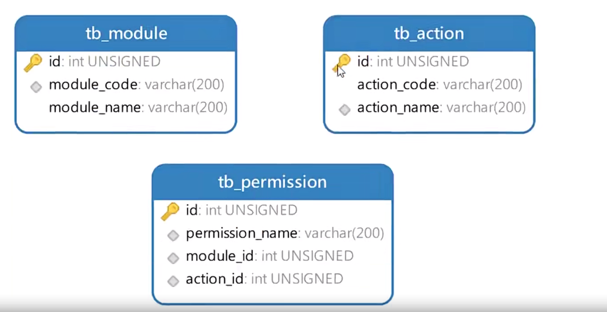
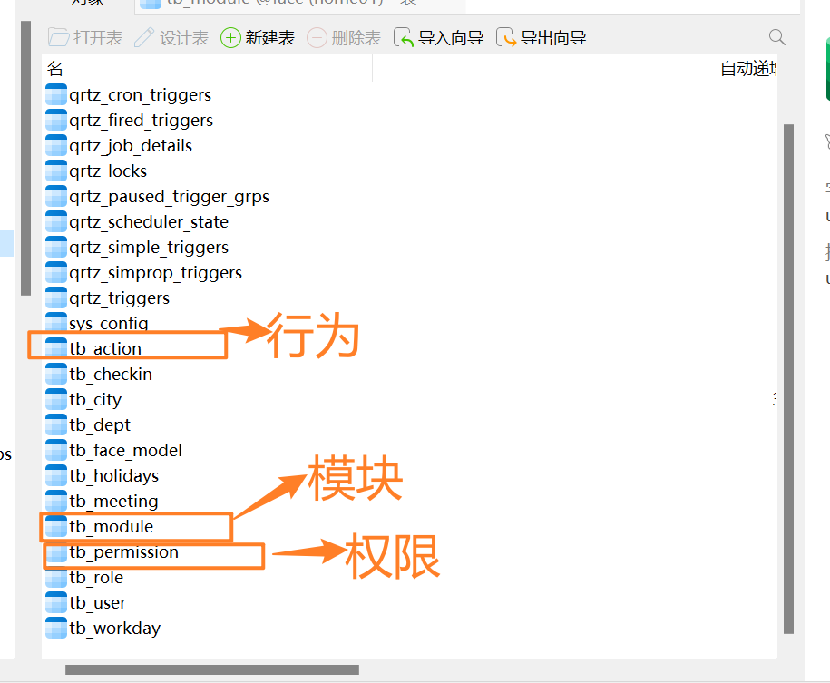
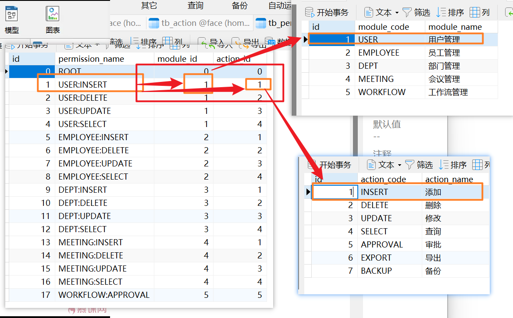
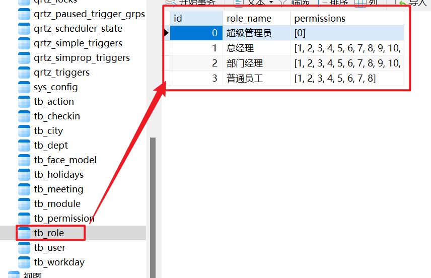
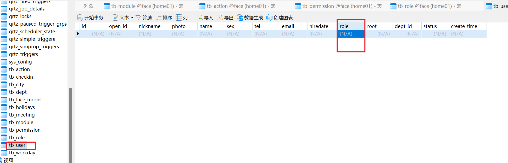

# 掌握RABC权限模型[5-3]

这个小节我们不先不急着写Web层的代码，因为注册成功之后，我们要向客户端返回令牌之外，还要返回用户的权限列表，以后客户端就可以根据权限列表判定用户能看到什么页面内容，以及可以执行什么操作，所以这个小节我们先来学习一下RBAC权限模型。

## 01)RBAC权限模型

RBAC的基本思想是，对系统操作的各种权限不是直接授予具体的用户，而是在用户集合与权限集合之间建立一个角色集合。每一种角色对应一组相应的权限。一旦用户被分配了适当的角色后，该用户就拥有此角色的所有操作权限。这样做的好处是，不必在每次创建用户时都进行分配权限的操作，只要分配用户相应的角色即可，而目角色的权限变更比用户的权限变更要少得多，这样将简化用户的权限管理，减少系统的开销。



RBAC模型中的权限是由模块和行为合并在一起而产生的，在MySQL中，有

- 模块表( tb_module ) 和 行为表 ( tb action ) ，这两张表的记录合并在一起就行程了权限记录，保存在 权限表( tb permission ) 中



::: tip 权限是什么？

- 模块表有、模块的id、模块的编号、模块的名字
- 行为表有、行为的id、动作的编号、动作的名字
- 权限表有、权限id、权限的名字（什么权限）、模块的id、行为的id。

一个权限是什么诞生的？

用户模块的id + 添加用户这个动作 = 添加用户权限。

用户模块的id + 删除用户这个动作 = 删除用户权限。

:::




root权限都有权限。




现在知道了权限记录是怎么来的，下面我们看看怎么把权限关联到角色中。传统一点的做法是创建个交叉表，记录角色拥有什么权限。但是现在 MySQL5.7 之后引入了 JSON 数据类型，所以我在 角色表( tb role ) 中设置的permissions字段，类型是JSON格式的。



到目前为止，JSON类型已经支持索引机制，所以我们不用担心存放在JSON字段中的数据检索速度慢了。MySQL为JSON类型配备了很多函数，我们可以很方便的读写JSON字段中的数据。

接下来我们看看角色是怎么关联到用户的，其实我在用户表（tb user)上面设置role字段，类型依旧是JSON的。这样我就可以把多个角色关联到某个用户身上了。




## 02)前后端权限验证

关于权限验证的工作，前端要做，后端也要做后端的权限验证还好说，shiro框架可以做这个事情己封装函数来验证权限。每个页面在渲染的时候，先但是移动端没有权限验证框架，所以需要我们自的内容。比如说普通员工没有添加新员工的权限，所判断用户拥有什么权限，然后根据权限控制渲沐以界面上就不能出现添加按钮。

移动端做权限判断的前提是必须有当前用户的<font color="red">权限列表</font>，这个权限列表是用户登陆成功 或者<font color="red">注册成功</font>，后端Java项目返回给移动端的移动端保存到本地 <font color="red">storage里面</font>。


## 03)如何查询用户的权限列表

```sql
SELECT DISTINCT p.permission_name
FROM tb_user u
JOIN tb_role r ON JSON_CONTAINS(u.role, CAST(r.id AS CHAR))
JOIN tb_permission p ON JSON_CONTAINS(r.permissions, CAST(p.id AS CHAR))
WHERE u.id=1 AND u.status=1;
```

- Dao层

在 TbuserDao.xml 文件中添加上面的SQL语句，用来查询用户的权限列表

```xml
    <select id="searchUserPermissions" parameterType="int" resultType="String">
        SELECT DISTINCT p.permission_name
        FROM tb_user u
        JOIN tb_role r ON JSON_CONTAINS(u.role, CAST(r.id AS CHAR))
        JOIN tb_permission p ON JSON_CONTAINS(r.permissions, CAST(p.id AS CHAR))
        WHERE u.id=#{userId} AND u.status=1;
    </select>
```

在 TbUserDao.java 接口中声明 searchUserPermissions() 方法

```java
@Mapper
public interface TbUserDao {

    //  方法1 是否有root用户
    public boolean haveRootUser();


    // 员工表插入数据
    public int insert(HashMap param);

    // 通过openid去查询 用户的记录id
    public Integer searchIdByOpenId(String openId);

    // 查询用户的权限
    public Set<String> searchUserPermissions(int userId);
```

- 业务层

在 UserService,iava 接口中声明 searchuserPermissions() 方法

```java
public interface UserService {

    // 用户注册
    public int registerUser(String registerCode,String code,String nickname,String photo);

    // 查询用户的权限
    public Set<String> searchUserPermissions(int userId);
```

在 UserService.java 接门中声明earchUserPermissions() 方法

```java
    @Override
    public Set<String> searchUserPermissions(int userId) {
        Set<String> permissions=userDao.searchUserPermissions(userId);
        return permissions;
    }
```


